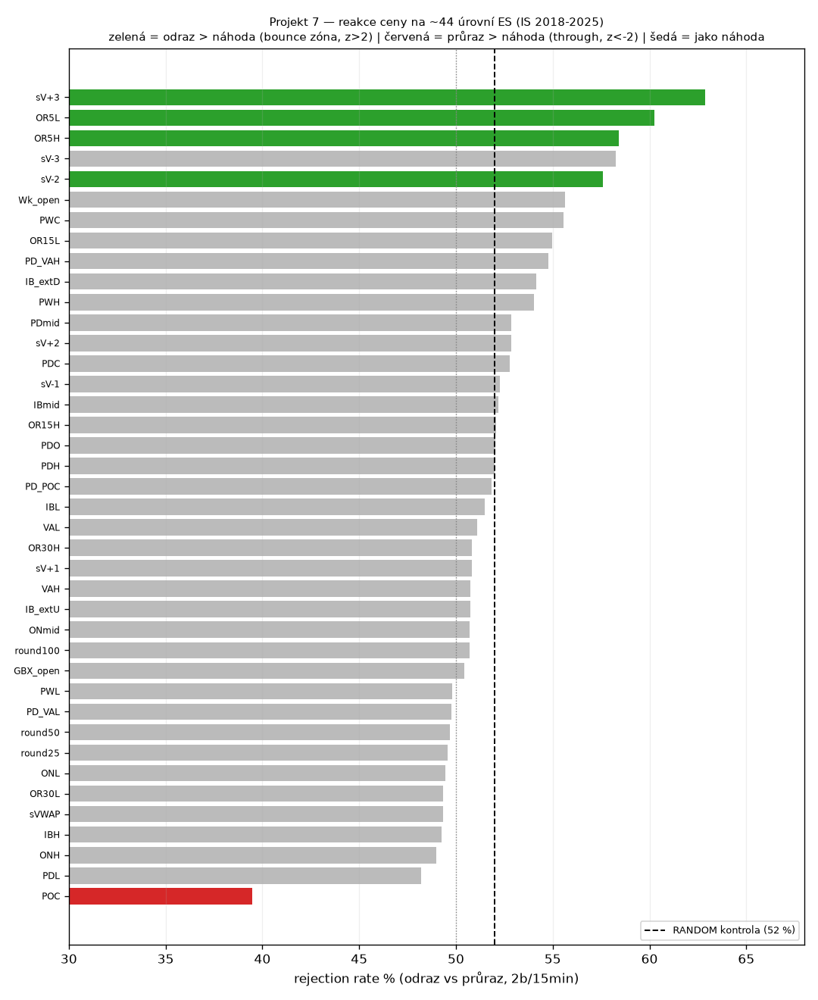

# PLAYBOOK — Projekt 7: Level Edge Study (které úrovně reálně reagují)

**Cíl:** ne mechanická strategie, ale **mapa** — u kterých cenových úrovní cena reaguje víc než náhodně, aby uživatel věděl, **kde má smysl číst order flow** (jeho reálný edge z Projektu 5). ES, IS 2018-2025-09, extended hours. QC 34201573, bt `99afb71544d2931631a9f7b694896126`. **OOS NEDOTČENO.**

**Metoda:** ~44 úrovní. Na PRVNÍ dotek v RTH symetrický závod: odraz (zpět o 2 body) vs průraz (skrz o 2 body) do 15 min → **rejection rate**. Náhodná úroveň = kontrola. Tisíce doteků/úroveň.

**Kontrola RANDOM = 52,0 % rejection** (mechanika má drobný symetrický bias, takže srovnáváme vůči 52 %, ne 50). Významnost = two-proportion z-test vůči kontrole.

## Výsledek: 3 kategorie

### 🟢 BOUNCE zóny (odraz > náhoda → číst flow pro FADE/reverzi)
| úroveň | reject % | z vs kontrola | touch |
|---|---|---|---|
| **OR5L** (5-min opening range low) | **60,3 %** | **+4,5** | 1736 |
| **OR5H** (5-min opening range high) | **58,4 %** | **+3,5** | 1791 |
| sV−2 (session VWAP −2σ) | 57,6 % | +2,7 | 1070 |
| sV+3 (session VWAP +3σ) | 62,9 % | +2,4 | 154 (malý) |

### 🔴 THROUGH zóna (průraz > náhoda → číst flow pro CONTINUATION)
| úroveň | reject % | z | touch |
|---|---|---|---|
| **POC** (session point of control) | **39,5 %** | **−7,0** | 1986 |

### ⚪ Jako náhoda (|z|<2 → nemá cenu si všímat)
round25/50/100, PDH/PDL/PDC/PDO, prior-day VP (POC/VAH/VAL), overnight H/L/mid, IB (H/L/mid/ext), OR15/OR30, weekly (H/L/C/open), sVWAP + většina bandů, VAH/VAL, SMA, globex open.

## Čtení

**Nejsilnější a nejčistší signály (obří vzorek, jasná ekonomická logika):**
- **5-min opening range extrémy (OR5H/L) jsou bounce zóny** — cena, co vykoukne těsně za high/low první 5-min svíčky, se sn*ap*ne zpět častěji než náhoda (~58–60 % vs 52 %). Časná, sledovaná, těsná úroveň → probe & reject. z=+3,5 / +4,5 = daleko za náhodou.
- **POC je through/magnet úroveň** — cena skrz nejobchodovanější cenu **projíždí** (reject jen 39,5 %, z=−7,0). Učebnicový market-profile jev.
- **Session VWAP −2σ** mírný bounce (57,6 %).

**Co NEreaguje (stejně cenné vědět):** round numbers, PDH/PDL, overnight H/L, weekly levels, IB — všechno **folklor bez měřitelné reakce** na ES. Tam order flow číst nemá extra smysl (reaguje tam jako u náhodné ceny).

## K čemu to je (a co to NENÍ)

- **NENÍ to mechanická edge** — biasy (58–60 % vs 52 %) jsou mírné a slepé obchodování by je náklady sežraly. Přesně proto to není strategie.
- **JE to mapa pro tvůj diskréční read** — u OR5H/L a sV−2 se nakláněj k **fade/reverzi**, u POC k **continuation**. Tam má tvůj footprint read nejlepší surovinu; u „náhodných" úrovní ho neplýtvej.
- **Multiple-comparison pozn.:** 44 úrovní → ~2 false-positive při z>2 čekané. Jádro (OR5H/L z=3,5–4,5; POC z=7,0) je hluboko za náhodou = reálné. sV−2/sV+3 jsou marginálnější.

**Reprodukovatelnost:** kód `research/levels/main.py` (cloud 34201573), data `data/cache/levels.json`, figura `results/figures/levels_edge.png`. OOS nedotčeno.

