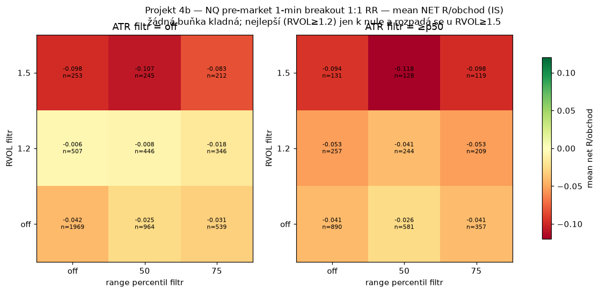

# PLAYBOOK — Projekt 4: Opening Range Breakout (15min, ATR SL/TP)

**Instrument:** ES (E-mini S&P 500) primární + NQ (E-mini Nasdaq-100) robustness, kontinuální kontrakt
**Prostředí:** QuantConnect / LEAN, headless cloud backtest jako compute engine (žádné reálné ordery, simulace NAV)
**In-sample:** 2018-01-02 → 2025-09-30 · **OOS (2025-10-01 → 2026-07-11): ROZHODNUTÍ ODLOŽENO — NESPOTŘEBOVÁNO**
**Zamrazená specifikace:** `orb_frozen_assumptions.md` (potvrzeno uživatelem před psaním kódu)
**Datum:** 2026-07 · Research anchor: Zarattini/Barbon & Aziz ORB studie · projekt QC 34184379, backtestId `095398965b38ac76d201a072dd2c1dcd`

---

## ⛔ EXECUTIVE SUMMARY

> **Opening Range Breakout s konfigurací SL = 2×ATR, TP = 1×ATR nemá na ES ani NQ (2018–2025) kladnou expectancy — všechny čtyři varianty ztrácejí, s CAGR −4,4 % až −6,0 % a záporným Sharpe.** Příčina je přesně ta, na kterou jsem upozornil v Kroku 0: RR 2:1 v neprospěch vyžaduje **hit rate > 66,7 %**, a strategie dodává binární win rate (TP-of-decided) **statisticky nerozeznatelný od právě těch 66,7 %** (Wilson CI všech čtyř variant straddluje 66,7 %). „Sedět na breakeven" před náklady + EOD výstupy = **ztrácet po nich**. Directional edge breakout-continuation na 15-min ES/NQ je tedy prakticky nulový nad rámec toho, co si vynucuje geometrie 2:1.
>
> **News filtr (deterministický 10:00-ET kalendář) situaci nezachrání:** ES marginálně zlepší (CAGR −6,0 → −5,1 %), NQ zhorší (−4,4 → −5,2 %) — **nekonzistentní znaménko napříč instrumenty = šum, ne reálný efekt.** Filtr odebere ~23 % obchodů, aniž by systematicky zvedl edge.
>
> **Hodnotný negativní výsledek, vyvrácený v IS fázi — OOS okno zůstává nedotčené.**

---

## 1. Výsledky (IS 2018-01-02 → 2025-09-30, net_cons 1,2 bps)

| varianta | final NAV (z 100k) | CAGR | Sharpe | MDD | n obchodů | obch./den | net-win % | TP % | **TP-of-decided %** | EOD exits | mean R (gross) |
|---|---|---|---|---|---|---|---|---|---|---|---|
| **ES bez filtru** | 61 801 | **−6,0 %** | −1,01 | −39,0 % | 1963 | 1,01 | 62,3 | 59,2 | **66,6** | 217 | −0,034 |
| ES + news filtr | 66 696 | −5,1 % | −0,96 | −34,6 % | 1513 | 0,78 | 61,9 | 58,6 | **66,2** | 173 | −0,041 |
| **NQ bez filtru** | 70 725 | **−4,4 %** | −0,58 | −31,3 % | 1929 | 0,99 | 63,9 | 60,2 | **68,5** | 235 | −0,007 |
| NQ + news filtr | 65 920 | −5,2 % | −0,80 | −35,2 % | 1488 | 0,76 | 63,2 | 59,7 | **67,6** | 173 | −0,020 |

- **net-win %** = podíl obchodů s kladným net P&L; **TP %** = podíl obchodů ukončených na TP; **TP-of-decided %** = TP/(TP+SL), tj. binární win rate ve framingu, na který se vztahuje 66,7% breakeven práh (EOD výstupy vyloučené).
- **obchodů/den ~1,0** (bez filtru) — v souladu s „max 1 obchod/den" (mírně pod 1, protože OR se ne vždy prorazí).

## 2. Hit ratio vs. 66,7 % breakeven práh (jádro verdiktu)

RR 2:1 v neprospěch (win = +0,5R, loss = −1,0R) ⇒ breakeven binární win rate = **66,7 %**. Wilson 95% CI na TP-of-decided:

| varianta | TP-of-decided | Wilson 95% CI | vůči 66,7 % |
|---|---|---|---|
| ES bez filtru | 66,6 % (n=1746) | [64,4; 68,8] | **straddluje** |
| ES + filtr | 66,2 % (n=1340) | [63,6; 68,7] | **straddluje** |
| NQ bez filtru | 68,5 % (n=1694) | [66,3; 70,7] | **straddluje** (dolní mez 66,3 < 66,7) |
| NQ + filtr | 67,6 % (n=1315) | [65,0; 70,1] | **straddluje** |

**Ani jedna varianta není statisticky nad 66,7 %.** Nejlepší (NQ base 68,5 %) má dolní mez CI pod prahem. Directional edge continuation je tedy **nerozeznatelný od přesného breakeven** — a to je *před* dvěma tahači dolů:
1. **EOD výstupy** (~12 % obchodů, 217–235 ks): obchody, které do 16:00 netrefí TP ani SL, se zavřou na close — v průměru mírně ztrátové, mimo binární framing.
2. **Náklady** (1,2 bps round-turn × ~1900 obchodů): samotné náklady ukrojí řádově ~20 % NAV za období.

Výsledek: gross mean R lehce záporné (NQ base −0,007 = prakticky flat gross), po nákladech + EOD jasně záporná NAV.

## 3. Per-year net P&L ($, start 100k) — stabilně špatné, ne režimové

| rok | ES base | ES filt | NQ base | NQ filt |
|---|---|---|---|---|
| 2018 | −8 001 | −6 318 | −14 208 | −10 848 |
| 2019 | −8 501 | −8 376 | −535 | −2 452 |
| 2020 | −6 074 | −6 562 | −4 724 | −10 683 |
| 2021 | −1 362 | −2 195 | +1 384 | +3 504 |
| 2022 | −1 580 | −2 105 | −1 917 | −3 934 |
| 2023 | +817 | +1 281 | −1 936 | −103 |
| 2024 | −5 392 | −5 368 | +802 | −4 467 |
| 2025 | −3 597 | +297 | −3 992 | −1 110 |
| **ziskové roky** | **1/8** | 2/8 | 2/8 | 1/8 |

Žádná varianta nemá víc než 2 ziskové roky z 8. Není to „edge, který zmizel v jednom režimu" — je to **konzistentně ztrátové napříč lety** (2018–2020 obzvlášť, ale i jinde). Ojedinělé kladné roky (NQ 2021) nevytvářejí trend.

## 4. News filtr — verdikt: nepomáhá

- Odebere 451 (ES) / 445 (NQ) obchodů (~23 % — sedí na 23,6 % news dní v kalendáři).
- **ES:** CAGR −6,0 → −5,1 % (marginální zlepšení). **NQ:** −4,4 → −5,2 % (zhoršení).
- **Nekonzistentní znaménko napříč dvěma instrumenty ⇒ není to reálný efekt, jen redukce vzorku + šum.** Filtr byl testován jako refinement, ne jako load-bearing komponenta — a jako refinement selhává. (Pozn.: kalendář je deterministický subset 10:00-ET releasů — ISM Mfg/Svc + CB Consumer Confidence + UoM prelim/final; i kdyby úplnější kalendář filtr mírně vylepšil, nezmění to záporný základ strategie.)

## 5. Verdikt dle Kroku 0

- **Podpořeno** vyžadovalo: net_cons expectancy kladná, hit ratio prokazatelně nad 66,7 %. **Nesplněno** — NAV záporná u všech variant, hit ratio statisticky na breakeven.
- **Design condition z Kroku 0 se naplnila přesně:** „hit ratio pod 67 % s touhle konfigurací = automaticky ztrátová i před náklady." Strategie dodala ~66–68 % (na breakeven), tedy po EOD výstupech a nákladech ztrátovou. **Nejde o překvapení — jde o potvrzení předem identifikované náročné podmínky.**

## 6. Co by případně mohlo pomoct (budoucí směry, mimo tuto zamrazenou spec)

Tohle NEjsou úpravy k „doladění" současné strategie (to by byl overfitting na IS) — jsou to jiné hypotézy, které by si vyžádaly vlastní frozen spec:
- **Symetrické nebo příznivé RR** (TP ≥ SL): breakeven pak padá na ≤ 50 %, což je dosažitelnější — ale otázka je, jestli continuation dojede dost daleko (širší TP = nižší hit rate). Trade-off, ne free lunch.
- **Filtr kvality breakoutu** (objem/volatilita OR, šířka OR vs ATR): obchodovat jen „čisté" průrazy, ne každý.
- **Jiný TP/exit management** než fixní ATR násobek (trailing, R-multiple scale-out) — ale pozor na lekci z Projektu 3 TP-gridu (fixní TP ničí trend edge).
- **Jiný opening-range interval** (5min, 30min, 60min) — Zarattini ORB studie typicky používají 5-min OR na akciích/ETF, ne 15-min na futures.

## 7. OOS status

**OOS okno 2025-10-01 → 2026-07-11: ROZHODNUTÍ ODLOŽENO — NESPOTŘEBOVÁNO.** Protože žádná varianta nemá kladnou IS expectancy, kterou by šlo validovat, **není co na OOS testovat** — okno zůstává nedotčené (stejně jako u Projektu 1). Případný budoucí (jiný) ORB design by potřeboval vlastní frozen spec a teprve pak, s dostatečnou IS oporou, gated jednorázový OOS. Okno navíc už bylo spotřebováno 2× (Projekt 2b Fáze E, Projekt 3 R3), takže laťka pro jeho třetí použití je vysoká.

## 8. Reprodukovatelnost

- Log: `results/RESULTS.md` (sekce PROJEKT 4). Kód: `research/orb/main.py` (compile engine, 4 simy). Config: `research/orb/config.json` (cloud-id 34184379).
- Zamrazená spec: `orb_frozen_assumptions.md`. News kalendář: `data/cache/econ_calendar_1000et.csv` (460 dní, deterministicky generovaný, embedovaný v algoritmu).
- Metriky: `results/orb_is.json`. NAV série: `data/cache/orb_nav.csv`. Figura: `results/figures/orb_equity.png`.

**Metodická poznámka:** Krok-0 design note (RR 2:1 → potřeba >67 %) fungoval jako **falzifikovatelná předpověď před během** — a data ji potvrdila. Přesně proto se náročná podmínka pojmenovává předem: výsledek pak není „zklamání", ale čisté ověření hypotézy.

---

## Varianta B (explorativní) — fixní TP 10 bodů, SL = opačná strana OR

**Změna vůči zamrazené spec:** TP = entry ± 10 bodů (fixní), SL = opačná strana 30-min OR (long → OR_low, short → OR_high). Riziko = |entry − opačná strana OR| (mění se se šířkou range). Vše ostatní stejné. Explorativní IS-only, OOS nedotčeno. backtestId `9d05d4329fbbe1c84359695aded49e17`.

| varianta | final NAV (100k) | CAGR | Sharpe | MDD | n | **win %** | TP-of-decided % [CI95] | EOD | mean R |
|---|---|---|---|---|---|---|---|---|---|
| ES bez filtru | 79 194 | **−3,0 %** | −0,56 | −24,6 % | 1963 | 63,2 | 68,3 | 295 | −0,020 |
| ES + filtr | 82 954 | −2,4 % | −0,51 | −22,8 % | 1513 | 62,8 | 68,4 | 239 | −0,022 |
| NQ bez filtru | 75 698 | **−3,5 %** | −1,04 | −25,7 % | 1929 | **87,9** | **91,2** | 80 | −0,013 |
| NQ + filtr | 73 790 | −3,9 % | −1,23 | −27,2 % | 1488 | 87,0 | 90,8 | 69 | −0,023 |

**VERDIKT: pořád ztrátové na všech čtyřech — ale méně než varianta A** (A: ES −6,0 % / NQ −4,4 %; B: ES −3,0 % / NQ −3,5 %). Fixní 10-bodový TP se trefuje častěji → mělčí ztráta, ale ne kladná expectancy.

**NQ = učebnicové „picking pennies" (predikce z Kroku potvrzená přesně):** 10 bodů na NQ (~5 bps) se trefí skoro vždy → **win rate 87,9 %, TP-of-decided 91,2 %** — a přesto **−3,5 % CAGR**. Jen 162 SL z 1929 obchodů, ale ty stopy jsou na opačné straně celé NQ range (desítky bodů, ~30–50 bps) → jedna ztráta smaže ~6–10 výher. Mean R gross −0,013. Nejhorší Sharpe ze všech (−1,04) — vysoký win rate = vysoká, ale záporná jistota. **Toto je nejčistší ukázka lekce „win rate ≠ ziskovost" z celého výzkumu** (vedle VWAP TP-gridu, který ukázal opačný pól: nízký win rate + kladná expectancy).

**ES:** win 63 %, TP-of-decided 68,3 % (nad 66,7 %, ale to je breakeven jen pro RR 2:1 — tady je RR proměnlivé). Riziko = plná šířka OR (~15–30 bodů) proti fixnímu 10-bodovému zisku → na širokorozsahových dnech nepříznivé; mean R −0,020 → net záporné.

**News filtr:** opět ES marginálně zlepší (−3,0 → −2,4 %), NQ zhorší (−3,5 → −3,9 %) — **nekonzistentní znaménko = šum** (stejně jako u varianty A).

**Per-year:** 2–4 ziskové roky z 8 (o něco lepší než A, ale žádná varianta ne většinově kladná; 2019/2020/2024 stabilně ztrátové napříč instrumenty).

**Souhrn Projekt 4:** Ani ATR-based (varianta A), ani fixní-TP/range-SL (varianta B) konfigurace 15-min ORB nemá na ES/NQ 2018–2025 kladnou net expectancy. Dvě protilehlé RR geometrie (A: RR 2:1 v neprospěch, nízký win; B: malý fixní TP, vysoký win) skončily obě záporně — směrový edge continuation po 15-min OR průrazu je na těchto indexových futures prakticky nulový. **OOS zůstává nedotčené.** Data varianty B: `results/orb_b_is.json`, `data/cache/orb_b_nav.csv`, figura `results/figures/orb_b_equity.png`.

### Varianta B — průměrná velikost stopu (uzavírající datapoint)

Stop = opačná strana 30-min OR; průměr přes všechny obchody (bt `71be46272e93e3d2147c0da04e84f1c6`):

| varianta | prům. stop (body) | prům. stop (%) | TP 10b / stop | efektivní RR | breakeven WR | actual TP-of-dec |
|---|---|---|---|---|---|---|
| ES base | 24,31 | 0,551 % | 41,1 % | ~1:2,4 | 70,6 % | 68,3 % → pod |
| ES filt | 24,13 | 0,548 % | 41,4 % | ~1:2,4 | 70,6 % | 68,4 % → pod |
| NQ base | 120,77 | 0,820 % | 8,3 % | ~1:12 | 92,3 % | 91,2 % → pod |
| NQ filt | 119,74 | 0,816 % | 8,4 % | ~1:12 | 92,3 % | 90,8 % → pod |

**Mechanismus záporné expectancy exaktně:** fixní 10-bodový TP je jen **8 % (NQ) resp. 41 % (ES)** průměrné vzdálenosti stopu → efektivní RR silně v neprospěch → breakeven win rate 92 % (NQ) / 71 % (ES). Skutečná úspěšnost je u obou **těsně pod** svým breakevenem → obě ztrácejí. NQ má širší relativní OR (0,82 % vs ES 0,55 %), tedy ještě horší poměr TP/stop → nejvyšší win rate a zároveň nejhorší Sharpe. **Toto je numericky uzavřené vysvětlení picking-pennies charakteru varianty B.**

### Varianta B — MAE analýza (jak hluboko ve stopu je trade ztracený?)

Otázka: existuje frakce vzdálenosti ke stopu, za kterou se trade už skoro nevrací na TP → dala by se tam dát těsnější SL a zmenšit ztráty? Metoda: pro každý obchod změřen MAE (max adverse excursion) jako frakce R = |entry−SL|, histogram 25 binů dle výsledku; recovery křivka `P(nakonec TP | MAE ≥ f)` + counterfactual expectancy pro těsnější stop @ k×R (pozice stejná = „posun stopu dovnitř"). IS, bt `d3b1839e32bf7690b3060441ee7cded2`. **In-sample diagnostika — jakýkoli práh je fitovaný parametr, deploy se nemění.**

| | recovery <40 % od | recovery <25 % od | nejlepší IS stop | mean net R (nejlepší) | baseline |
|---|---|---|---|---|---|
| **ES** (TP=10b ≈ 41 % R) | **MAE ≈ 0,24R** | MAE ≈ 0,44R | k ≈ 0,60R | **−0,029** | −0,051 |
| **NQ** (TP=10b ≈ 8 % R) | MAE ≈ 0,52R | MAE ≈ 0,68R | k ≈ 0,88R | −0,029 | −0,033 |

**Odpověď se liší podle instrumentu — a důvod je poměr TP/R:**
- **ES:** jakmile je trade ~¼ cesty ke stopu, šance na návrat na TP klesá pod 40 %, za ~½ pod 25 %. Trady, co zajdou ~0,4–0,5R proti, se **skoro nevracejí**. → Zkrácení stopu na ~0,5–0,6R **reálně zlepší expectancy** (−0,051 → −0,029 R/obchod, tj. skoro půlka ztráty pryč). Tvoje intuice na ES **platí**.
- **NQ:** recovery zůstává **vysoká** hluboko do stopu (>40 % až do 0,52R, >25 % až do 0,68R) — protože TP je jen 8 % R, takže i trade hluboko v mínusu se často „ťukne" zpět o těch pár bodů na TP. → Zkrácení stopu na NQ **spíš škodí** (utne vítěze, co se vraceli); nejlepší k=0,88R je prakticky současný stop, zlepšení nulové.

**Klíčový (přenositelný) závěr:** MAE-based zkrácení stopu pomáhá **jen když je TP dost daleko**, aby se adverse trade nevrátil náhodou (ES). Když je TP mrňavý vůči riziku (NQ picking-pennies), hluboké MAE se pořád vracejí a těsnější stop je kontraproduktivní. **A v OBOU případech i nejlepší zkrácený stop zůstává net záporný** — zmenší to krvácení (ES −0,051 → −0,029), ale strategii to nedělá ziskovou. Data: `data/cache/orb_mae.json`, figura `results/figures/orb_mae.png`.

### Varianta C — ES grid: zkrácený stop × RR-based TP (test příznivého RR)

Motivace: A (2:1 proti) i B (mrňavý TP) byly nepříznivé RR. Zde test **příznivého RR** (jediná nevyzkoušená geometrie): SL = sךířka_OR, TP = m×stop_dist (RR 1:m). ES, IS, měřeno v net R/obchod. bt `4d7be54fd8da19a0b719ab3c33a714e0`, data `data/cache/orb_grid.json`, heatmapa `results/figures/orb_grid_heatmap.png`.

**RR trend (průměr mean-net-R přes všechna s, dle m) — směrově REÁLNÝ:**

| m (RR 1:m) | breakeven WR | avg mean-net-R |
|---|---|---|
| 1.0 | 50 % | −0,0755 |
| 1.5 | 40 % | −0,0665 |
| 2.0 | 33 % | −0,0492 |
| 3.0 | 25 % | **−0,0292** |

→ Širší TP monotónně zlepšuje expectancy (−0,076 → −0,029). **Hypotéza „příznivé RR pomáhá" potvrzena** — pro slabě-směrový continuation chceš široký TP, ne těsný. Velmi těsný stop (s=0,3) je naopak nejhorší (náklad v R roste + noise vystopuje).

**ALE dojede to jen k nule, ne do plusu.** Jen **3 z 24 buněk** mají kladné total net R, všechny na m=3,0:

| buňka | mean net R | t-stat | p | totR | kladných let |
|---|---|---|---|---|---|
| **s=0,6 m=3,0 (nejlepší)** | +0,0139 | **+0,39** | **0,70** | +27,4 | 4/8 |
| s=0,8 m=3,0 | +0,0071 | +0,23 | 0,82 | +13,9 | 4/8 |
| s=1,0 m=3,0 | +0,0031 | +0,11 | 0,91 | +6,0 | 3/8 |

**Verdikt: žádný robustní edge.** Nejlepší buňka (s=0,6, m=3,0) má **t=0,39, p=0,70** — statisticky **nerozeznatelná od nuly**. Navíc **není to ostrov**: sousedé jsou záporní (s=0,5 m=3 → −0,025; s=0,6 m=2 → −0,010). Kladná buňka bliká kolem nuly mezi zápornými = klasický overfitting podpis, ne stabilní oblast. Per-trade Sharpe nejlepší buňky +0,009 (≈ šum).

**Moje doporučení (na tvou žádost „ideální stop + nejlepší TP"):** Z dat je nejobhajitelnější **s≈0,7 (střed ploché nej-oblasti 0,6–0,8), m=3,0** — tedy stop ~70 % šířky OR a TP = 3× stop. Ale s výslovným závěrem: **je to ~breakeven, ne validovaný edge.** Point estimate +0,007 až +0,014 R/obchod je neodlišitelný od nuly (p≥0,7).

**Rozhodnutí o OOS: NE.** Tohle nepřekračuje laťku pro spotřebování jednorázového OOS okna — dát coin-flip (p=0,70) na precious OOS by bylo plýtvání. Příznivé RR zachránilo ES-ORB z „jasně ztrátové" na „přibližně nula", což je poučné (RR intuice platí), ale ne tradeable. **Souhrn Projektu 4: 15-min ORB continuation na ES/NQ nemá po nákladech kladnou expectancy v žádné ze tří testovaných RR geometrií (A/B/C); nejlepší dosažitelné je ~nula s příznivým RR. OOS nedotčeno.**

---

# VARIANTA 4b — pre-market range, 1-min breakout, 1:1 RR + filtry (NQ)

**Odlišná varianta, ne náhrada Projektu 4.** Spec: `orb_4b_frozen_assumptions.md` (potvrzeno). NQ, extended hours, projekt QC 34193719, bt `28397134653b59965d07549cce9c720d`. IS 2018-01-02→2025-09-30. **OOS ROZHODNUTÍ ODLOŽENO — NESPOTŘEBOVÁNO.**

Pravidla: range = high/low jediné svíčky 9:15–9:30 ET (před cash-open); breakout = 1-min close venku z range (od 9:31), první za den; vstup open další 1-min svíčky; SL = opačná strana range; TP = 1:1 (=|entry−SL|); max 1/den; EOD flat 16:00; net_cons 1,2 bps; metrika net R/obchod. Filtry: range percentil {off,50,75} × RVOL {off,1.2,1.5} × denní-ATR percentil {off,≥p50} = 18 kombinací.

## Výsledek: NEPODPOŘENO — 0 z 18 kombinací kladná

| kombinace | n | obch/den | TP-of-decided % | mean net R | t | p | kladných let |
|---|---|---|---|---|---|---|---|
| **baseline (vše off)** | 1969 | 1,02 | 51,3 % [49,1;53,5] | −0,0422 | −1,87 | 0,06 | 3/8 |
| RVOL≥1,2 (nejlepší) | 507 | 0,26 | 52,0 | **−0,0059** | −0,13 | 0,89 | 4/8 |
| RVOL≥1,2 + range≥p50 | 446 | 0,23 | 51,7 | −0,0081 | −0,17 | 0,86 | 5/8 |
| RVOL≥1,5 | 253 | 0,13 | 47,0 | −0,0982 | −1,58 | 0,12 | 3/8 |
| range≥p50 | 964 | 0,50 | 51,1 | −0,0254 | −0,79 | 0,43 | 2/8 |
| ATR≥p50 | 890 | 0,46 | 50,9 | −0,0415 | −1,23 | 0,22 | 4/8 |

- **Žádná z 18 kombinací nemá kladné total net R.** Nejlepší (RVOL≥1,2 sólo) je −0,006 R/obchod: **statisticky nula** (t=−0,13, p=0,89), a pořád záporné.
- **Baseline binární win rate 51,3 % [49,1; 53,5]** — Wilson CI **straddluje 50 %** breakeven → directional edge 1-min breakoutu je hod mincí. Po nákladech (1,2 bps na těsný strukturální stop = nezanedbatelný náklad v R) → záporné.

## Marginální efekty filtrů

- **RVOL ≥ 1,2:** jediný filtr s věcně smysluplným efektem — odstraní low-participation breakouty, posune expectancy z −0,042 na −0,006 (≈ breakeven). **ALE:** (a) pořád záporné, (b) p=0,89 (= nula), (c) **RVOL≥1,5 to obrátí** na −0,098 (win rate spadne na 47 %) → efekt **není monotónní**, je fragilní. Vzorek navíc padá z 1969 na 507 (−74 %).
- **Range percentil:** slabý, nekonzistentní (p50 −0,025, p75 −0,031) — nezvedá edge.
- **ATR ≥ p50 (pro-volatilitu):** neutrální až škodlivý (baseline slice se nezlepší, kombinace s ním jsou horší). Směr „pro volatilitu" nepomohl; testovat opačný (strop) nemá po tomhle smysl — základ je záporný tak jako tak.

## Island check (D2-disciplína) — fragilní, ne stabilní

Nejlepší buňky (RVOL=1,2, ATR=off, přes P) jsou sice vedle sebe (−0,006 / −0,008 / −0,018), ALE jejich sousedé v jiných osách **prudce padají**: RVOL→1,5 srazí na −0,10; ATR→p50 zhorší na −0,041/−0,053. **Není to stabilní ostrov — je to hřeben na hraně útesu.** Přesně optimizer's-curse signatura: „nejlepší" buňka obklopená výrazně horšími sousedy.

## Verdikt 4b

**NEPODPOŘENO.** Pre-market 1-min breakout s 1:1 RR nemá na NQ (2018–2025) po nákladech kladnou expectancy v žádné z 18 filtrových kombinací. Binární win rate je hod mincí (51,3 %, CI straddluje 50 %). Jediný směrově smysluplný filtr (RVOL≥1,2) dovede expectancy jen k nule, statisticky nerozeznatelně, a rozpadá se u přísnější prahu. **Konzistentní s nezávislou MNQ falsifikační studií** (ORB varianty na mikro-NQ FAIL po frikci) i s Projektem 4 (A/B/C). **OOS nedotčeno** — není robustní kandidát k validaci.

**Reprodukovatelnost:** kód `research/orb_4b/main.py`, config `research/orb_4b/config.json` (cloud-id 34193719), data `data/cache/orb_4b_grid.json`, figura `results/figures/orb_4b_heatmap.png`, spec `orb_4b_frozen_assumptions.md`.
