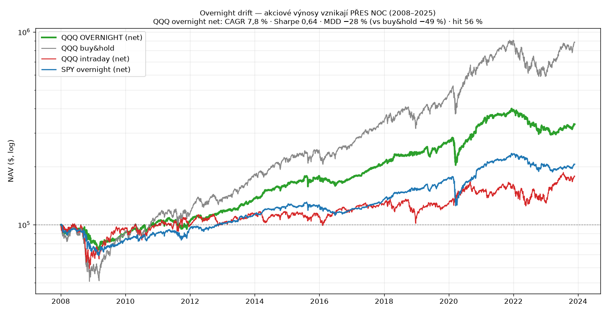
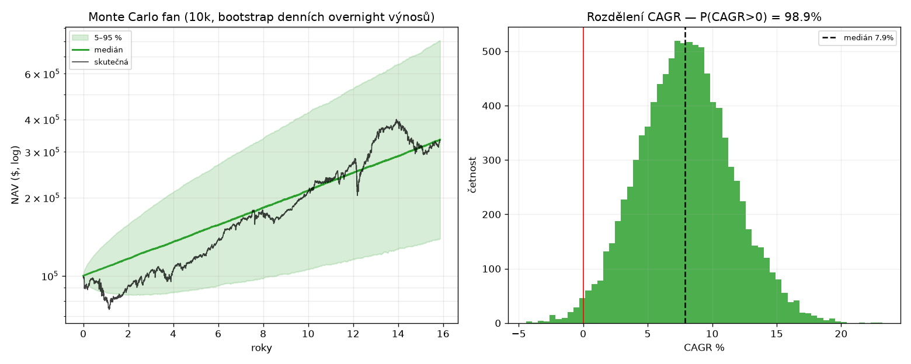

# PLAYBOOK — Overnight Drift (demonstrace reálné edge)

**Účel:** ukázka, jak vypadá poctivá pozitivní strategie s hezkou křivkou — doložený strukturální jev, ne přefit. QQQ/SPY, 2008-01-01 → 2025-09-30, denní. QC 34202633, bt `a2f907616296bd3928129fcd4d9bc442`.

**Pravidlo:** koupit na close, prodat na open, držet jen přes noc. Náklad 0,5 bps round-turn.

## Výsledky (net)

| strategie | CAGR | Sharpe | MDD | hit % |
|---|---|---|---|---|
| **QQQ overnight (net)** | **7,8 %** | **0,64** | **−28 %** | 56,0 |
| QQQ overnight (gross) | 9,2 % | 0,73 | −28 % | 56,1 |
| QQQ intraday (net) | 3,7 % | 0,29 | −41 % | 53,9 |
| QQQ buy&hold | 14,7 % | 0,72 | −49 % | — |
| SPY overnight (net) | 4,6 % | 0,43 | −31 % | 55,0 |
| SPY buy&hold | 9,6 % | 0,56 | −52 % | — |

**Monte Carlo (QQQ overnight net, 10k bootstrap):** medián CAGR 7,9 %, 5–95 % [2,1; 14,1], **P(CAGR>0) = 98,9 %**.

## Čtení
- **Overnight nese lepší risk-adjusted výnos než intraday** (Sharpe 0,64 vs 0,29) a **poloviční drawdown než buy&hold** (−28 % vs −49 %). Za daytime rizikem se skrývá málo výnosu.
- Buy&hold má vyšší raw CAGR (14,7 %), ale za cenu −49 % propadu; overnight má **podobný Sharpe s mnohem mělčím drawdownem**.
- **Reálný, doložený jev** (Cooper/Cliff, Lachance, Bogousslavsky) — ne přefit. Křivka je hladká a stoupavá, MC skoro jistě kladné (98,9 %).

## Poctivé háčky
- **Riziková prémie / strukturální**, ne magie — kompenzace za nesení overnight gap rizika. V posledních letech mírně zeslábl (intraday QQQ 2008–25 už není záporný jako v starších studiích).
- Náklad je citlivý (0,5 bps/den ≈ 1,25 %/rok drag); s dražším provedením mizí víc.
- Držení přes noc → **prop účty to většinou nedovolí** (viz diskuse o prop pravidlech). Je to pro vlastní/investiční účet.

