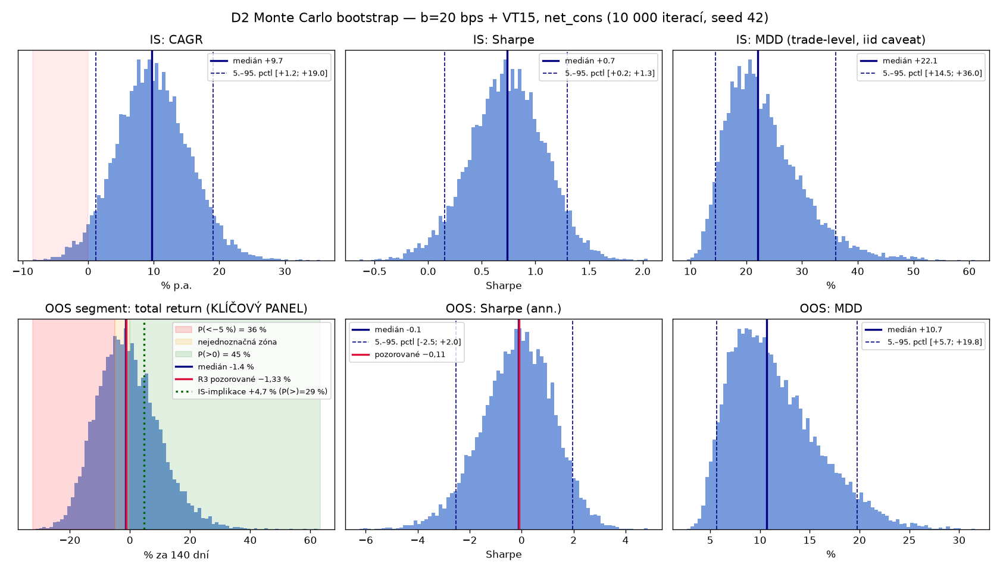
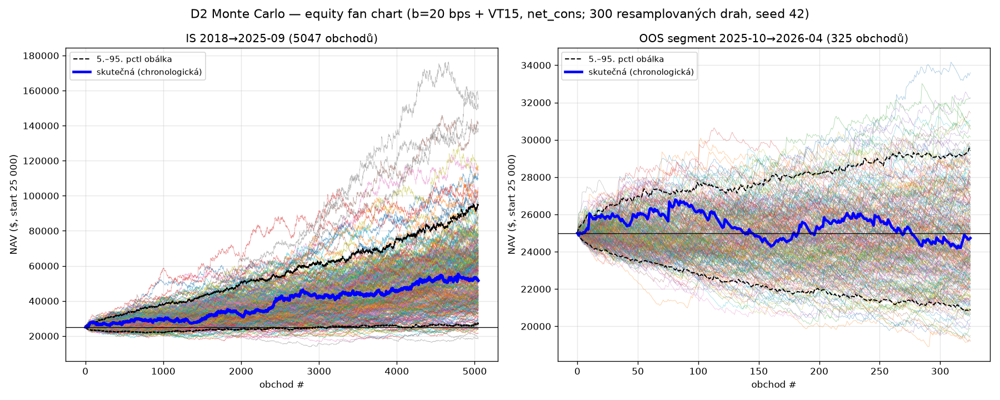
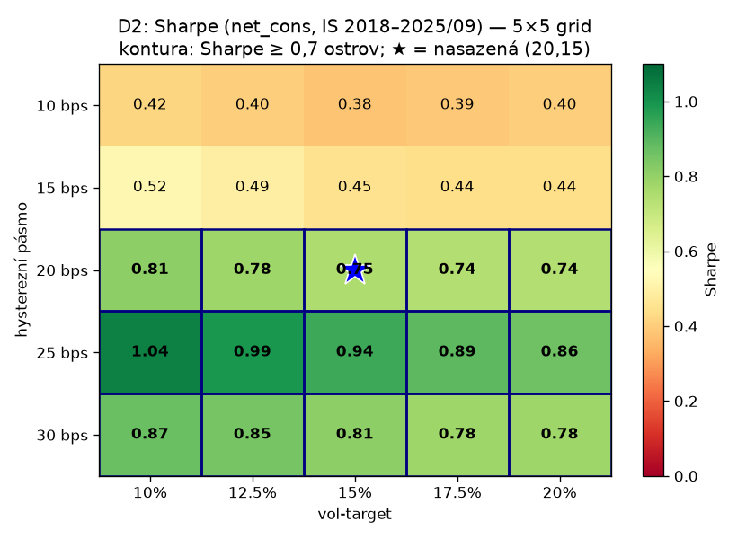
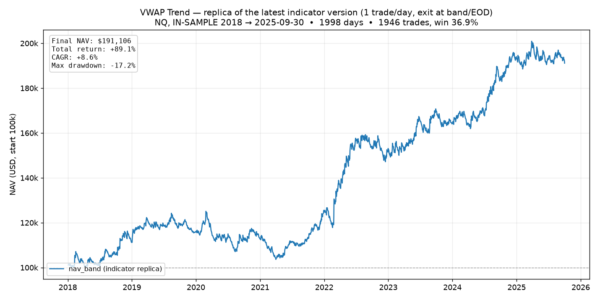
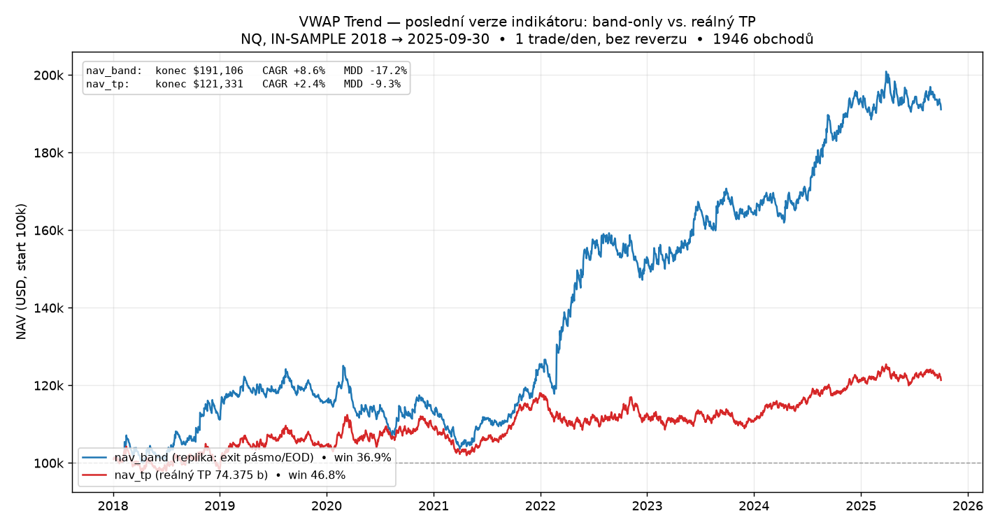
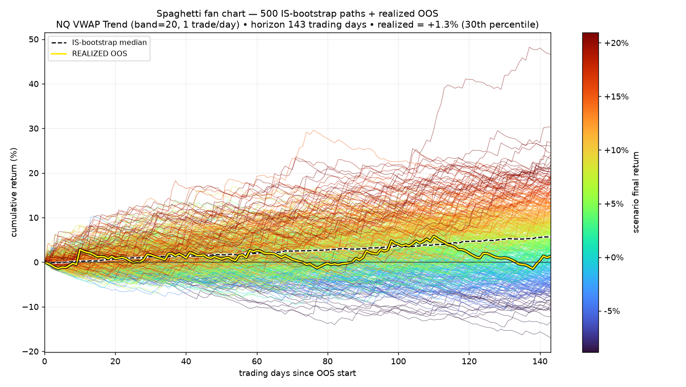
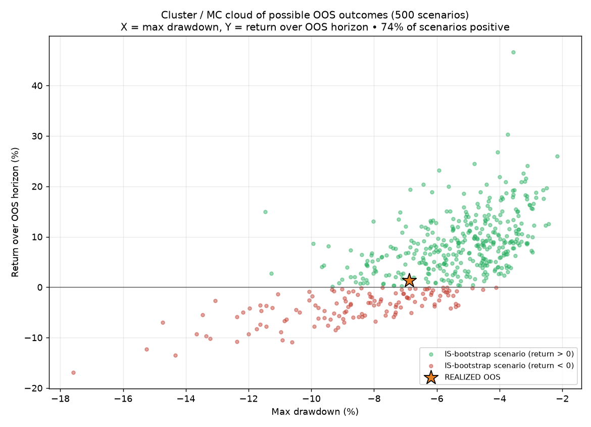
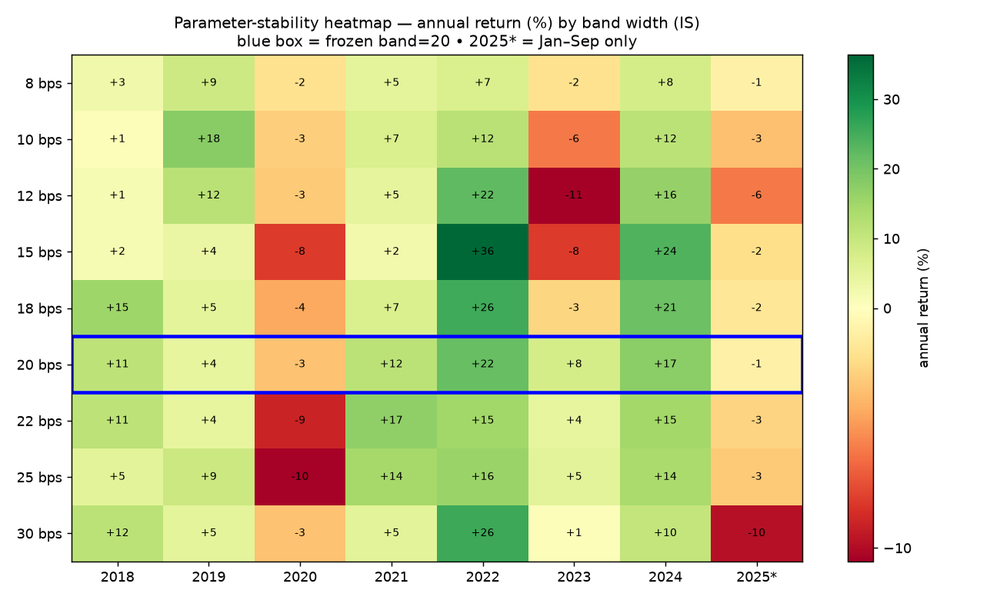
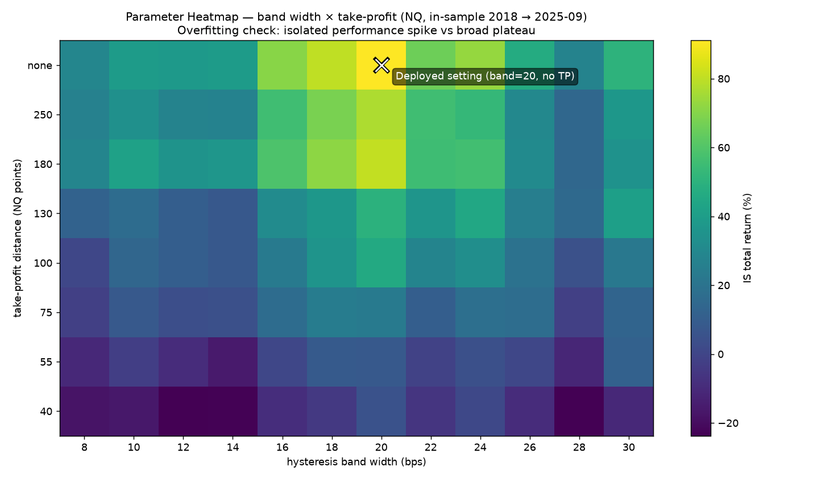

# PLAYBOOK — Projekt 3: VWAP Trend Trading (R1 replikace + R2 překlad SPY/ES)

**Zdroj:** Zarattini & Aziz, *"VWAP: The Holy Grail for Day Trading Systems"*, SSRN 4631351.
**Rodina:** trend-following od session VWAP (nová — mean-reversion a lev-ETF-flow uzavřeny, viz předchozí playbooky).
**Rozsah tohoto dokumentu:** POUZE R1+R2. R3 (fresh OOS) a R4 (risk mgmt) čekají na rozhodnutí uživatele.

---

## EXECUTIVE SUMMARY

> **R1 (replikace QQQ/TQQQ): PASS** — implementace ověřena, QQQ sedí na paper čísla prakticky přesně (CAGR 40,8 % vs 43 %, Sharpe 2,0 vs 2,1, hit 17,4 % vs ~17 %).
> **R2 (překlad na SPY/ES s reálnými costs): NEPŘEKLÁDÁ SE.** Edge je (a) **indexově specifický** — gross CAGR na SPY/ES jen 9,8–12,0 % vs 40,6 % na QQQ, dokonce **pod buy-and-hold** (14,3 %); (b) **extrémně cost-sensitivní** — ~17,5 obchodu/den × 0,4–1,2 bps = 7–21 bps/den drag → net CAGR **−6 až −36 %** na SPY/ES. Per-trade gross edge na SPY (~0,2 bps) je pod i optimistickými náklady.

---

## 1. Zamrazená pravidla (implementováno přesně dle paperu)

Session VWAP (RTH only, HLC/3×V, denní reset); vstup na close 1. minutové svíčky (9:31) vs VWAP → pozice na open další svíčky; reverzace jen když svíčka **zavře** na opačné straně VWAP (intra-bar průnik nespouští); EOD flat na close 16:00; 100 % kapitálu, frakční shares, plný reinvest.

## 2. R1 — replikace (QQQ/TQQQ, 2018-01-02→2023-09-28, paper costs)

| metrika | QQQ moje | QQQ paper | TQQQ moje | TQQQ paper |
|---|---|---|---|---|
| total return | 611,6 % | 671 % | 1 484 % | 8 242 % |
| CAGR | 40,8 % | 43 % | 61,9 % | 116 % |
| vol ann. | 17,7 % | 18 % | 52,9 % | 54 % |
| Sharpe | 2,0 | 2,1 | 1,2 | 1,7 |
| MDD | 8,8 % | 9,4 % | 40,9 % | 36,1 % |
| hit ratio | 17,4 % | ~17 % | 18,1 % | ~17 % |
| gain:loss | 5,5 | ~5,7 | 5,2 | ~5,5 |
| trades | 23 360 | ~21 967 | 23 504 | ~22 399 |

**Verdikt: PASS.** QQQ replikováno ve všech metrikách. TQQQ: per-trade struktura replikována; kompounding gap = 0,71 bps/obchod, kvantitativně vysvětlen fee-per-share na split-adjusted cenách (QC adjusted $8–40 → 0,25–1,25 bps/RT; paper unadjusted $40–90 → 0,1–0,25 bps/RT) — datový artefakt, ne chyba pravidel (u QQQ, px ~$250, fee=0,04 bps, proto sedí).

## 3. R2 — překlad na SPY/ES s reálnými costs (2018-01-02→2025-09-30)

**Explicitní rozhodnutí (žádné tiché defaulty):**
1. **ES session:** VWAP i obchodování ukotveny na RTH 9:30–16:00 ET (vědomé rozhodnutí; ES obchoduje ~24 h). Kontinuální kontrakt (OpenInterest mapping, BackwardsRatio), notional 1× NAV, bez páky.
2. **Costs:** zavedený model z Fáze E — **0,4 bps (opt) / 1,2 bps (cons) round-turn**, aplikováno lokálně na denní gross returny × počet obchodů.
3. **Okno:** končí 2025-09-30. **Vyhrazené okno 2025-10-01→2026-07-11 NEDOTČENO** (rezerva pro případný R3). Pozn.: okno bylo jednou použito Fází E Projektu 2b (jiná signálová rodina, jeden pohled na last-hour outcome) — pro VWAP trend rodinu je prakticky čisté, ale v R3 dokumentaci to přiznat.

**Výsledky (~17,5 obchodu/den, hit 16–17 %, G:L 5,2–5,6 — struktura jako QQQ):**

| scénář | SPY CAGR | SPY Sharpe | SPY MDD | ES CAGR | ES Sharpe | ES MDD |
|---|---|---|---|---|---|---|
| GROSS (bez costs) | +9,8 % | +0,76 | 16,0 % | +12,0 % | +0,91 | 15,9 % |
| net_opt (0,4 bps/RT) | **−8,0 %** | −0,54 | 52,5 % | **−6,1 %** | −0,39 | 43,0 % |
| net_cons (1,2 bps/RT) | **−35,5 %** | −2,91 | 96,7 % | **−34,1 %** | −2,78 | 96,1 % |
| **B&H benchmark** | **+14,3 %** | **+0,65** | **33,7 %** | — | — | — |

**Kontext — i QQQ (paperový vlajkový výsledek) s realistickými costs:** net_opt CAGR +19,4 % (Sharpe 1,07 — pořád zajímavé), net_cons **−14,0 %** (mrtvé). Paperův cost model ($0,0005/akcii + nulový slippage ≈ 0,04 bps/RT na QQQ) je de facto frictionless assumption.

## 4. Závěr R2 (fakticky, bez ladění)

1. **Strategie se na SPY/ES nepřekládá:** gross edge je 4× slabší než na QQQ (intraday trend persistence je vlastnost NDX, ne obecná), gross výkon je pod buy-and-hold, a net výkon je při jakýchkoliv realistických nákladech záporný.
2. **Cost sensitivity je určující vlastnost celé strategie:** ~22–34k obchodů → každých 0,1 bps/RT nákladů = ~4,4 %/rok drag. Paper výsledek je replikovatelný, ale žije a umírá s předpokladem nulového slippage.
3. Guardrail dodržen: žádné ladění parametrů, vyhrazené okno nedotčeno.

## 5. R4 (NQ) + R3 (one-shot OOS) — dodatek

**R4 (in-sample ladění, NQ):** baseline 16,2 obch./den net_cons −17,8 % → hysterezní pásmo 20 bps: **2,5 obch./den, net_cons +9,5 %** (kladné v obou érách) → + vol-target 15 % (EWMA20, cap 1×): **+9,6 % CAGR, Sharpe 0,74, MDD 12,2 %**. Anatomie: whipsawy <15 min (77 % obchodů) = −700 % gross; top 1 % obchodů nese 2–3,6× celkový zisk.

**R3 (jednorázový OOS, frozen spec `r3_frozen_spec.md`, potvrzeno uživatelem):** platforma zkrátila okno na 140/197 dní (NQ continuous mapping končí 2026-04-16). Výsledek: gross +1,87 %, net_opt+VT15 +1,11 %, **net_cons+VT15 −1,33 %** → **VERDIKT: NEJEDNOZNAČNÉ** dle předregistrovaného kritéria (zóna −5 až 0 %). Mechanika drží (2,32 obch./den, hit 35,8 % ≈ IS), ale gross edge bodově výrazně pod IS. Okno spotřebováno; doporučení: rozhodnutí o nasazení jen přes paper-trading / budoucí data, ne další testy na tomto okně.

## 6. — KONEC — (R3 proběhlo; další krok = rozhodnutí uživatele o paper-tradingu)

Bez dalšího promptu se nepokračuje. Poznámky pro rozhodování (jen fakta, ne doporučení k ladění): QQQ@net_opt Sharpe 1,07 naznačuje, že rodina není univerzálně mrtvá — je QQQ-specifická a cost-hraniční; SPY/ES větev je na základě R2 netradeable.

## 6. Reprodukovatelnost

Kód: `research/vwap_trend/main.py` (MODE R1/R2). Výsledky: `results/vwap_r1.csv`, `results/vwap_r2.csv`, RESULTS.md sekce PROJEKT 3. Backtesty: R1 `c6bd24a4...`, R2 `e5319635...` (projekt 34170904).

---

## Diagnostika D1 — dekompozice a rok-po-roce rozklad (jen diagnóza, žádný redeploy)

Jeden diagnostický běh (backtest 567b6895), 2018-01-03→2026-04-17. Řádek **OOS\*** = spotřebovaný OOS segment 2025-10→2026-04, POUZE diagnosticky, ne nový test. Řádek 2025 = leden–září (IS). Net = net_cons (1,2 bps); VT = kontinuální EWMA20 (diagnostická varianta; oficiální R3 OOS číslo −1,33 % používalo cold-start, drobný rozdíl je očekávaný). Hit ratio řádku 2025 zahrnuje z logu celý kalendářní rok (caveat).

| rok | NQ vol | RAW gross | RAW net/Sharpe | B20 net/Sharpe (t/d) | +VT net/Sharpe | Δpásmo | ΔVT |
|---|---|---|---|---|---|---|---|
| 2018 | 20,1 % | +49,4 % | −10,0 %/−0,47 | +23,9 %/+1,22 (2,5) | +17,0 %/+1,15 | +33,8 | −6,9 |
| 2019 | 11,9 % | +10,9 % | −33,6 %/−2,97 | −3,8 %/−0,29 (1,8) | −3,8 %/−0,33 | +29,8 | −0,1 |
| 2020 | 23,3 % | +89,2 % | +14,5 %/+0,75 | +13,7 %/+0,66 (3,1) | +18,9 %/+1,22 | −0,8 | +5,2 |
| 2021 | 14,5 % | +49,4 % | −8,9 %/−0,54 | +22,9 %/+1,66 (2,1) | +21,4 %/+1,61 | +31,9 | −1,5 |
| 2022 | 26,8 % | +66,4 % | +2,2 %/+0,21 | +14,4 %/+0,65 (3,7) | +13,0 %/+0,84 | +12,2 | −1,4 |
| 2023 | 15,2 % | +13,0 % | −33,9 %/−2,46 | +0,7 %/+0,12 (2,4) | +1,3 %/+0,16 | +34,6 | +0,6 |
| 2024 | 13,9 % | +23,6 % | −26,3 %/−1,84 | +19,2 %/+1,37 (2,0) | +19,1 %/+1,48 | +45,5 | −0,1 |
| 2025 (I–IX) | 21,4 % | **+5,1 %** | −27,7 %/−2,30 | −11,4 %/−0,84 (2,5) | −7,8 %/−0,78 | +16,4 | +3,6 |
| **OOS\*** | 15,7 % | **+4,9 %** | −19,4 %/−2,49 | −2,5 %/−0,25 (2,3) | −1,9 %/−0,18 | +16,9 | +0,6 |

### Marginální příspěvky v čase

- **Pásmo (cost-mitigation):** velké a kladné v 8/9 segmentů (+12 až +46 pp/rok), bez časového trendu — jediná výjimka 2020 (−0,8), kdy extrémní trendový rok nesl i raw variantu a pásmo nic zachraňovat nemuselo. **Mechanismus pásma nedegraduje** — jeho příspěvek je stabilní, protože řeší náklady, ne alfu.
- **VT:** na returnu malý a smíšený (−6,9 až +5,2), ale to není jeho práce — Sharpe/de-risking zlepšuje přesně tam, kde má (vysokovol roky: 2020 0,66→1,22; 2022 0,65→0,84; 2025 −0,84→−0,78). **Žádné známky, že by EWMA20 v čase zaostávala víc** — příspěvek nese vol-režim, ne kalendář.

### Klíčová otázka: sleduje edge čas, nebo volatilitu?

Na ročním RAW gross edge (jádro efektu): **corr(edge, čas) = −0,44; corr(edge, vol) = +0,62** (n=8, oba slabé vzorky).

- **Pro vol-režim mluví:** 2019 (nejnižší vol 11,9 %) = nejslabší IS edge +10,9 %; 2020/2022 (vol 23–27 %) = nejsilnější edge +89/+66 %; 2023–24 (nízká vol) = slabé. Stejný vzorec jako u Projektu 2b (tam corr s vol +0,7, s časem −0,7).
- **Proti čistému vol-režimu mluví poslední dva segmenty:** 2025 (I–IX) má vol **21,4 %** — srovnatelnou s 2018 (20,1 % → edge +49 %) a 2020 (23,3 % → +89 %) — ale edge jen **+5,1 %**; OOS segment podobně (+4,9 % při 15,7 %). Poslední ~19 měsíců dodává **výrazně míň edge, než by vol-vztah z 2018–2024 predikoval** — to je otisk, který by zanechal crowding/adaptace trhu nastupující v posledních letech.

**Poctivý závěr:** data se nejvíc podobají **kombinaci** — bazální vol-režimová závislost (jako u 2b), na kterou se v 2025+ vrství dodatečný pokles nevysvětlený volatilitou. S 8–9 ročními body to nelze rozhodnout tvrdě; vol-hypotéza vysvětluje 2018–2024 dobře a selhává právě na nejnovějším období, což je zároveň období s nejmenším vzorkem.

**Co sledovat dál (jedna věta):** v paper-tradingu / příštím čistém OOS okně sledovat primárně **poměr realizovaného edge k realizované volatilitě** (edge/vol ratio, ne edge samotný) — pokud zůstane hluboko pod úrovní 2018–2024 i v dalším vysokovol období, převáží výklad crowding/decay a strategie se uzavře.

---

## Diagnostika D2 — Monte Carlo + 2D cluster analýza (diagnostika důvěry, žádný nový výběr)

Data: D2 běh 8d579324 (5 bandů net_cons NAV + b=20 trade-level P&L, 5 372 obchodů). Verdikt R3 stojí beze změny; konfigurace zůstává (b=20, VT15).

### A) Monte Carlo bootstrap (b=20 + VT15, net_cons, 10 000 iterací, resampling s replacementem)

**IS (2018→2025-09, 5 047 obchodů):**

| metrika | medián | 5.–95. percentil |
|---|---|---|
| CAGR | **+9,7 %** | **+1,2 % … +19,0 %** |
| Sharpe | +0,74 | +0,15 … +1,30 |
| MDD† | 22,1 % | 14,5 … 36,0 % |

P(CAGR<0) = **3,2 %**. †MDD z trade-level equity křivky (jemnější granularita než denní — pozorované denní MDD bylo 12,2 %; iid resampling navíc ruší autokorelaci, obojí čti jen orientačně).

**OOS segment (2025-10→2026-04, 325 obchodů):**

| metrika | medián | 5.–95. percentil |
|---|---|---|
| total return | **−1,36 %** | **−16,1 % … +17,6 %** |
| Sharpe | −0,11 | −2,54 … +1,96 |

**P(total > 0) = 44,8 % · P(total < −5 %) = 35,5 % · P(total > +4,7 % IS-implikace) = 28,7 %.**

→ Empirická odpověď na „kolik z −1,33 % je šum": prakticky **celé**. OOS okno je mincovní hod — 45 % bootstrap hmoty je kladných, 29 % dokonce nad IS-implikovanou úrovní. Segment nemá sílu rozlišit „strategie funguje jako IS" od „strategie je mrtvá"; verdikt „nejednoznačné" z R3 je empiricky potvrzený, ne jen analytický.

### B) 2D grid 5×5 (band × VT, net_cons, IS) — Sharpe

| band \ VT | 10 % | 12,5 % | 15 % | 17,5 % | 20 % |
|---|---|---|---|---|---|
| 10 bps | 0,42 | 0,40 | 0,38 | 0,39 | 0,40 |
| 15 bps | 0,52 | 0,49 | 0,45 | 0,44 | 0,44 |
| **20 bps** | 0,81 | 0,78 | **0,75★** | 0,74 | 0,74 |
| 25 bps | **1,04** | 0,99 | 0,94 | 0,89 | 0,86 |
| 30 bps | 0,87 | 0,85 | 0,81 | 0,78 | 0,78 |

(★ = nasazená konfigurace; CAGR/MDD mřížky v `results/vwap_d2_grid.csv`.)

**Cluster analýza (`scipy.ndimage.label`, 4-connectivity):**
- Práh Sharpe ≥ 0,5: **jeden souvislý ostrov 16/25 buněk** (celé řádky b=20/25/30 + (15,10)); (20,15) **uvnitř ostrova, na jeho okraji** (soused b=15 je pod prahem).
- Práh Sharpe ≥ 0,7: **jeden ostrov 15/25** (celé řádky b=20/25/30); (20,15) opět **na okraji** ostrova směrem k menším pásmům.

**Čtení struktury:** (20,15) **NENÍ izolovaný bod** — sedí v jediném velkém souvislém ostrově, který pokrývá 60 % mřížky. Rozhodující dimenze je **pásmo** (b≥20 dobré, b≤15 slabé — ostrá hrana přesně pod nasazenou hodnotou); **VT dimenze je pro Sharpe téměř plochá** (CAGR s VT roste, MDD taky — čistý risk/return trade-off, žádný útes). Hřeben ostrova leží na b=25 (Sharpe 0,94–1,04) — **per guardrail se nic nemění**; b=25 je jen první kandidát na test v příštím čistém OOS okně.

**Závěr (jedna věta):** Parametrická stabilita NENÍ důvod k extra opatrnosti (velký souvislý ostrov, žádný izolát) — ale okrajová pozice (20,15) u hrany b=15 + mincovní OOS bootstrap znamenají: paper-tradovat s běžným (ne zvýšeným) sizingem, rozhodovat podle edge/vol ratio z D1, a počítat s tím, že rozhodné potvrzení/vyvrácení přijde až z delšího období, ne z prvních týdnů.

---

## Diagnostika TP-grid (explorativní, IN-SAMPLE, „jen sranda")

**Otázka (nápad uživatele):** přidat fixní TP = ½ rizika (pohyblivé RR 1:2, „TP je pulka stopu"), protože bez fixního TP je Monte Carlo rozptyl velký. **Test:** fixní TP = `tp_mult × R`, kde `R = |entry − opačné pásmo při entry|`, na zamrazeném pravidle (b=20, NQ, stop&reverse na close, EOD flat), NQ IS 2018-01-02→2025-09-30, OOS **nedotčeno**, net_cons 1,2 bps, TP = resting limit (fill intrabar high/low). backtestId `c194898cc17dcea9c33d7ce4daa77cd4`.

| TP varianta | hit % | trades | CAGR (net_cons) | Sharpe | MDD | final NAV (z 25k) |
|---|---|---|---|---|---|---|
| 0,25R | 79,6 % | 11 115 | **−11,3 %** | −1,29 | −62,9 % | 9 915 |
| **0,5R** (návrh) | 66,3 % | 8 513 | **−6,8 %** | −0,60 | −47,5 % | 14 532 |
| 1,0R | 51,3 % | 6 656 | **−1,2 %** | −0,04 | −37,5 % | 22 773 |
| **žádný TP (baseline)** | 36,4 % | 5 051 | **+9,5 %** | +0,59 | −22,4 % | 51 043 |

**Baseline reprodukuje D2 b=20 přesně (+9,5 % CAGR, Sharpe 0,59) → sanity check sedí.**

**VERDIKT: fixní TP edge NIČÍ — monotónně, čím těsnější TP, tím hůř.** Předpověď na záznam („0,5R výrazně zhorší expectancy, propad CAGR o desítky procent relativně") **potvrzena tvrději, než jsem čekal**: 0,5R obrátil kladnou strategii (+9,5 %) na **zápornou (−6,8 %)**, tj. propad o 170 % relativně, ne „desítky %". A křivka je monotónní — 0,25R (−11,3 %) < 0,5R (−6,8 %) < 1,0R (−1,2 %) < baseline (+9,5 %).

**Proč (mechanismus, ne náhoda):** je to **učebnicová ukázka lekce z Projektu 1** obrácená naruby. Hit rate roste přesně opačně než ziskovost — 0,25R má **79,6 % winrate a −11,3 % CAGR**; baseline má **36,4 % winrate a +9,5 % CAGR**. Edge VWAP-trendu **žije ve vzácných dlouhých trendových obchodech** (few big winners, many small losers). Fixní TP = ½R systematicky **usekne pravý ocas** (velké výhry) a nechá běžet ztráty do stop-and-reverse → mění výherní distribuci z „pár velkých / hodně malých" na „hodně malých / pár velkých ztrát" = přesně ta asymetrie, co zabila mean-reversion setupy v Projektu 1. Vysoký winrate je zde **klamavý ukazatel** identickým způsobem.

**Dopad na nasazení: ŽÁDNÝ.** Test byl explorativní IS-only. Nasazená konfigurace zůstává **b=20 + VT15 bez TP**. Žádná TP varianta nejde ani na kandidátní seznam pro příští OOS — všechny jsou IS zamítnuté (žádná nemá kladnou expectancy). Kód: `research/vwap_trend/main.py` (třída `TPGrid`), data `data/cache/tpgrid_nav.csv`, metriky `results/vwap_tpgrid.json`.

---

## Poslední verze „1 trade/den" — robustnost + OOS (2026-07-18)

**Varianta (odvozená od zamrazené R3, na žádost uživatele):** NQ, session VWAP RTH 9:30–16:00 ET (HLC3×vol, denní reset), pásmo **b=20 bps**, **JEN 1 vstup/den**, exit = close za opačným pásmem (BEZ otočení) nebo EOD 16:00, fill next open, net_cons 1,2 bps, bez VT. Alternativní mód s reálným TP 74,375 b (½ původního 148,75). Kód: `research/vwap_trend_1td/` (PID 34240773), `research/vwap_trend_robust/` (PID 34242424), `research/vwap_trend_grid2d/` (PID 34243168). Indikátor: `research/tradingview/vwap_trend_nq.pine` (v3, dva módy).

**Obrázky: `results/figures/vwap_trend/` (složka jen s obrázky této strategie).**

### IS výkon (2018-01-02 → 2025-09-30)

| varianta | final NAV | total | CAGR | MDD | trades | win |
|---|---|---|---|---|---|---|
| **band-only (nasazená v indikátoru)** | $191 106 | **+89,1 %** | +8,6 % | −17,2 % | 1 946 | 36,9 % |
| s reálným TP 74,375 b | $121 331 | +21,3 % | +2,4 % | −9,3 % | 1 946 | 46,8 % |

TP znovu potvrzuje lekci TP-gridu: vyšší win-rate, hladší křivka, ale usekává pravý ocas → ~4× nižší výnos. Grid band=20 × TP (viz 2D heatmapa): monotónní gradient TP 40→none = +5 % → +91 %.

### OOS (2025-10-01 → 2026-04-18, konec QC dat; okno tímto spotřebováno pro tuto variantu)

Frozen band=20 protažen přes OOS: **+1,29 % za 143 obch. dní** = **30. percentil** IS-bootstrap rozdělení (500 trajektorií). MC oblak: 74 % scénářů kladných; realita kladná, pod mediánem, malý DD (−6,9 %). Konzistentní s R3/D1 obrazem: edge je, ale poslední ~2 roky slabší než IS průměr.

### Parametrická stabilita (overfitting check)

1) **Year × band heatmapa** (8–30 bps × 2018–2025): celá rodina pásem kladná v součtu (IS totály +29 % až +91 %), roční rozptyl velký, žádný band není kladný každý rok.

2) **2D grid band × TP** (12×8 = 96 buněk, `results/vwap_grid2d.csv`): **všech 96 buněk kladných** (min +5 %), široká světlá zóna bandy 16–24 × TP≥180/none (+66 až +91 %). **Nasazená buňka (20, none) = globální maximum mapy** — na hřebeni široké plošiny, NE izolovaný spike v šumu. Podél band osy ale hrbolato (16:+71, 18:+80, 20:+91, 22:+66, 24:+73, 28:+28).

### Verdikt

- **Koncept robustní** (plateau, ne spike; celá parametrická rodina kladná; OOS kladné uvnitř kužele očekávání).
- **Headline +91 % je optimistický konec** — nasazený band=20 sedí přesně na peaku; realistické očekávání = okolí plošiny **~+60–80 % IS total**, a OOS zatím běží u dolního okraje (anualizovaně ~2,5 % vs IS 8,6 %).
- **Nadále platí:** nižší raw výnos než buy&hold NQ; přidaná hodnota je risk profil (poloviční MDD, žádný overnight, short leg). Slabá místa: nízkovol grind (2019) a violent chop (2020 — 1-trade cap tam škodí, viz níže). Klasifikace: **mírný, risk-managed edge — ne money printer.**

### Poznámka k období 2019 → jaro 2021 (stagnace na equity)

Per-rok band=20: 2018 +11,2 % → **2019 +4,5 % → 2020 −3,3 %** → 2021 +11,6 % (dip Q1, zbytek roku dohnal). Dvě různé příčiny: (a) **2019 = nejnižší realizovaná vol vzorku (11,9 %)** — melt-up bez intradenních trendů, pásmo generuje whipsawy (konzistentní s D1: corr(edge, vol)=+0,62); (b) **2020 = COVID paradox** — obří vol, ale 1-trade cap spálí jediný denní pokus v divokém openu a odpolední trend uteče; stop-and-reverse varianta (bez capu) 2020 vydělala (+13,7 % net) → ztrátu 2020 způsobil právě limit 1/den, ne signál. Plus velká část pohybů 2020 byla overnight/gap (strategie je přes noc flat).

---

## Vylepšovací fáze A–D (1td varianta) — gap gate (2026-07-18)

**Pre-registrovaná kritéria:** IS-only (OOS spotřebováno, soudce = paper trading); condition-first; vylepšení = CAGR +2 pb NEBO výrazně nižší MDD, konzistence ≥5/8 let head-to-head, soudržnost sousedů. QC projekty: improve A 34266528, B 34266984, C 34267097, D 34267284. Figury `results/figures/vwap_trend/improve*.png`.

**Fáze A (grid 12: vstup 9:31/9:45/10:00/10:30 × max 1/2/4 obchody + denní podmínky):** H2 re-entry zvedá totály, ale head-to-head jen 4/8 let a Sharpe klesá (0,85→0,67–0,81) → NESPLNIL. H1 posun vstupu = šum (t1 řádek 191/166/201/142k); e1000_t1 (Sharpe 0,89, MDD −11,9 %) podezřelý spike (sousedi špatní). Condition-first: fhr (range 9:30–10:00) Q4–Q5 +6 až +16 bps/den (t=+3,6) = nejsilnější signál; gap mírný (Q1 záporný); ptrend slabě inverzní; rv20/or5r nic.

**Fáze B (gaty, klouzavý 250d percentil bez lookaheadu, base = vstup 10:00):** fhr gate — hlavní kandidát — SELHAL (monotónně horší: 40/50/60 pct → +91/+72/+62 % vs base +101 %); kvintilový signál se jako filtr nepřenesl. gap20 (vynech spodních 20 % overnight gapů): +141 %, Sharpe 1,21, 6/8 let. pt60: stejný total, MDD −7,5 % (risk-tlumič).

**Fáze C (sweep gap prahu):** plošina 15–30. pct potvrzena (+119 až +141 %, Sharpe 1,07–1,25, h2h 5–7/8); kraje logické (10 nebinduje, 40 řeže dobré dny). g20p60: Sharpe 1,27, MDD −7,6 % (defenzivní). ŽÁDNÝ spike.

**Fáze D (nezávislost na vstupu — gate na původním 9:31):** sanity obou bází přesné. Výsledek:

| varianta | total | CAGR | MDD | Sharpe | h2h | 2025 |
|---|---|---|---|---|---|---|
| e931 base | +91,1 % | +8,7 % | −17,2 % | 0,85 | — | −1,0 |
| **e931+gap25** | +102,2 % | +9,5 % | −15,7 % | **1,05** | 5/8 | **+4,1** |
| e1000 base | +100,7 % | +9,4 % | −11,9 % | 0,89 | — | −8,3 |
| e1000+gap25 | +129,6 % | +11,3 % | −11,3 % | 1,19 | 6/8 | −3,4 |

**FINÁLNÍ VERDIKT (poctivý):**
1. **Gap gate ≥25. pct je reálné, ale MÍRNÉ vylepšení.** Na původním vstupu 9:31: CAGR jen +0,8 pb (POD naším prahem +2 pb), ale Sharpe 0,85→1,05, h2h 5/8, a **2025 otočeno do plusu na obou větvích** (přesně období decay obav). Klasifikace: **risk-adjusted vylepšení, ne výnosový game changer.**
2. **Headline +141 % z Fáze B/C vyžaduje vstup 10:00, který zůstává spike-podezřelý** (nefiltrovaní sousedi 9:45/10:30 špatní). Nenasazovat jako očekávání.
3. Mechanismus koherentní: malý overnight gap = den bez energie = trend-following nemá co chytat; funguje směrově na obou vstupech, plošina prahů, zlepšuje poslední roky.
4. **Doporučená konfigurace po vylepšení: vstup 9:31 (původní), band=20, 1 obchod/den, gap gate ≥25. klouzavý percentil.** Očekávání: Sharpe ~1,0, CAGR ~9–10 % IS (reálně méně), MDD ~−16 %. Vše IS — potvrdit může jen paper trading / budoucí data.
5. Zamítnuto cestou: fhr gate, re-entry (t2/t4), posuny vstupu jako samostatné vylepšení. pt60 v záloze jako čistý MDD-tlumič (−7,6 %).
