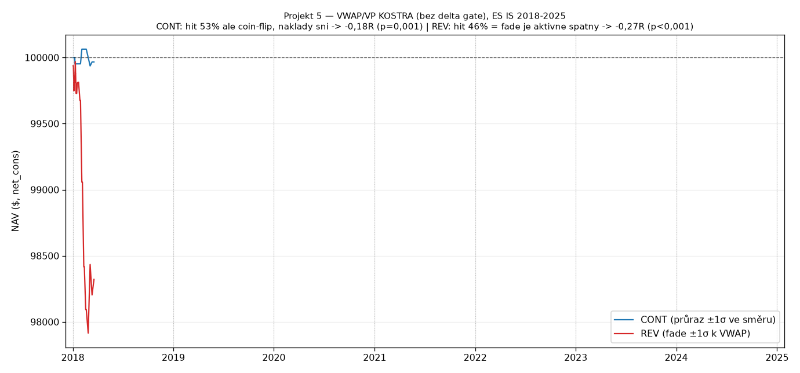

# PLAYBOOK — Projekt 5: VWAP/VP order-flow setup (reverse-engineering)

Reverse-engineering diskréčního ES setupu uživatele (reálné prop payouty). Cíl: lokalizovat, kde edge sedí — ve struktuře (úrovně) nebo v order flow (delta/footprint). Spec: `vwap_vp_frozen_assumptions.md`. QC projekt 34197200, bt `b8aa35c3c9f40580d4a5237b7320c515`. **OOS NEDOTČENO.**

## Klíčový kontext
Uživatel **nikdy nevstupuje bez delta/volume konfirmace**. Tento test měří **strukturu BEZ toho gate** (session VWAP 18:00 ET + ±1σ + volume profil POC/VAH/VAL, cíl = nejbližší úroveň, stop 1:1, okno 10:00–16:00 ET, 1 trade/den). Delta samotnou nelze z OHLCV backtestnout (Kolej B = ticková data, zatím neřešeno).

## Výsledek kostry (IS, net_cons)

| varianta | n | mean net R | t | p | gross hit | final NAV |
|---|---|---|---|---|---|---|
| **CONT** (průraz ±1σ ve směru) | 375 | −0,176 | −3,34 | 0,001 | **53,1 %** | 96 878 |
| **REV** (fade ±1σ k VWAP) | 1993 | −0,270 | −11,73 | <0,001 | **46,0 %** | 68 635 |

Obě ztrácejí, signifikantně, **každý rok**.

## Čtení (co to říká o TVÉM edge)

1. **REV (fade band) je aktivně ŠPATNÝ:** gross hit 46 % — **hůř než hod mincí**. Slepé fadování ±1σ bez konfirmace má na ES záporný edge. (Potvrzuje Projekt 1.)
2. **CONT (hraješ průraz) je coin-flip:** gross hit 53,1 % (n=375), ale nad 50 % to **není statisticky** (~1,2 SE). Directional edge samotné struktury ~nula; navíc „nejbližší úroveň" dělá cíle malé (~2 body) → náklad v R obří → net −0,18.
3. **Tvůj diskréční instinkt je konzistentní:** říkal jsi, že drtivou většinu hraješ **agresi / break-retest (continuation)**, ne fade. A data ukazují, že continuation je **jediná ne-záporná strana** — fadování bys prodělával. Takže tvůj výběr strany je strukturálně správný.

## Závěr: edge NENÍ ve strukturě, je v order flow

Kostra bez delty je záporná / coin-flip. Ty jsi přitom profitabilní → **tvůj edge je v tom delta/footprint readu**, který mění coin-flip continuation (53 %) na tvoje výherní obchody. Úrovně jsou **mapa, kde ten tape číst**, ne edge samy o sobě. To je čistý, cenný nález — a přesně to, co jsme hypotézou čekali.

## Co dál (Kolej B)
Ověřit tvoji SKUTEČNOU strategii = otestovat delta gate → potřebuje **ticková data** (bid/ask agresor per trade) pro rekonstrukci footprint delty. Přes 7 let na free tieru nejspíš nepůjde; realisticky krátké okno (1–2 roky) jako proof-of-concept, nebo validace na footprint-capable platformě (replay brokera). To je další rozhodnutí.

**Metodická poznámka:** kostra-first přesně splnila účel — nehledali jsme „jestli VWAP funguje", ale **lokalizovali, kde edge žije**. Odpověď: v tapu, ne v čarách. To řídí veškerý další research (i to, že prop-nekompatibilita delty je teď hlavní překážka, ne hledání setupu).
