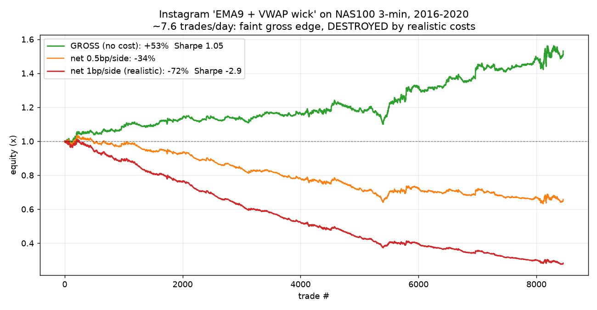
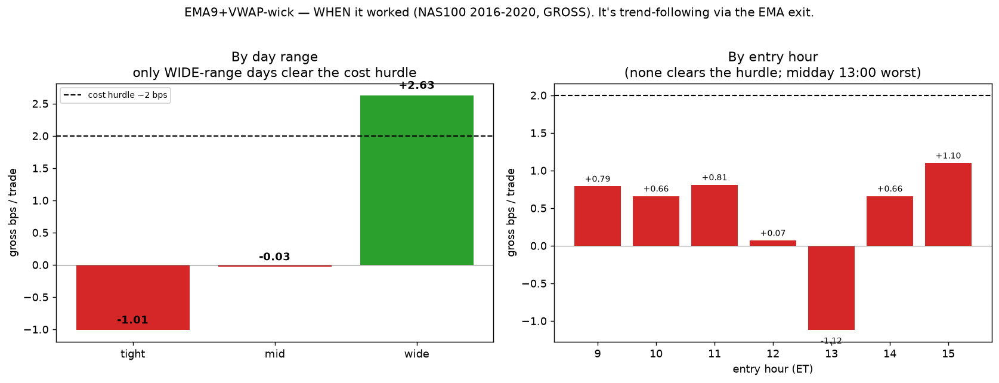
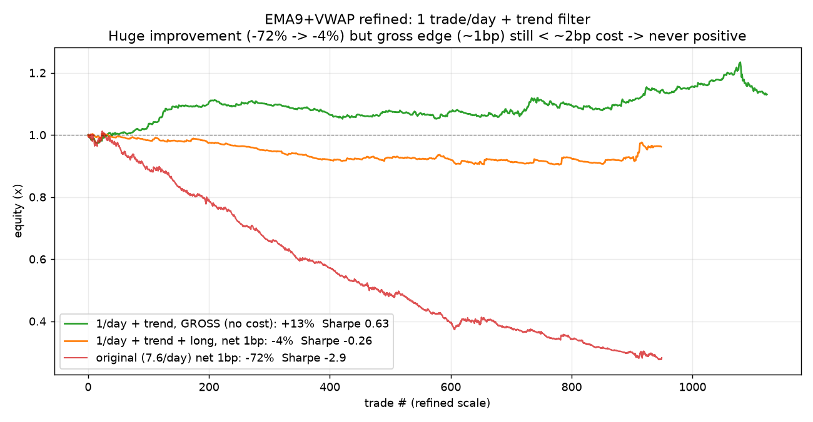

# Exponát: „EMA(9) + VWAP wick" — anatomie instagramové strategie

*Projekt Strong Chicken Journal • NQ futures • pobočný test, 2016–2020*
*Psáno ve stylu deníku — pro úplné začátečníky, poctivě, i s hřbitovem nápadů.*

---

## 1. Odkud to je

Z transkriptu instagramového videa. Autor tvrdí, že je to *„nejlepší strategie na
day trading, jakou kdy použil"*. Pravidla (doslova, jak zazněla):

> Přidej indikátory EMA a VWAP. EMA délka **9**. Zdroj VWAP nastav na **(O+H+L+C)/4**.
> Vstup i výstup na **3-minutovém** grafu. **Vstup**, když svíčka *knotem probodne
> VWAP*. **Výstup**, když svíčka *prorazí EMA*.

Jako vždycky u Instagramu: zní to sebejistě a je to **vágní**. Než se dá cokoliv
otestovat, musíme za autora doplnit, co přesně myslel — a hlavně to, co **zamlčel**.

## 2. Překlad do jednoznačných pravidel

- **VWAP**: sezónní (denní) VWAP z ceny OHLC4, reset každé ráno v 9:30.
- **EMA(9)**: klouzavý průměr z 3-min close.
- **Vstup (odraz):** svíčka *knotem* zajede za VWAP, ale *zavře zpět* — knot dole +
  close nad VWAP → **long**; knot nahoře + close pod VWAP → **short**.
- **Výstup:** svíčka **zavře za 9-EMA** proti pozici; jinak konec dne (16:00).
- ⚠️ **Žádný stop-loss.** Autor ho neuvádí. To je první červená vlajka — otestoval
  jsem i verzi se stopem na knotu.

Test: NAS100 (proxy na NQ, má objem pro VWAP), 3-min, 2016–2020, ~1 124 dní.

## 3. První test — a nákladová past

| varianta | náklady | obchody | win% | avg bps | celkem | Sharpe | MDD |
|---|---|---|---|---|---|---|---|
| odraz, bez stopu (jak popsáno) | 0 (gross) | 8 454 | 38 % | +0,53 | **+53 %** | 1,05 | −11 % |
| **odraz, bez stopu** | **1 bps/side** | 8 454 | 30 % | **−1,47** | **−72 %** | **−2,93** | −73 % |
| odraz + stop na knotu | 1 bps | 9 296 | 25 % | −1,67 | −79 % | −3,97 | −80 % |
| breakout čtení | 1 bps | 5 358 | 30 % | −1,39 | −53 % | −2,03 | −57 % |

**Diagnóza:** gross tam *náznak* výhody je (+0,53 bps/obchod). Ale strategie dělá
**~7,6 obchodů denně**. Round-trip náklad (~2 bps, a to je optimistické — plníš na
rychlém knotu, kde je skluz největší) je **4× větší než ten edge**. Net výsledek:
**−72 % a záporný v každém roce**. Stop to zhorší, breakout čtení taky ztrácí.

> **Lekce č. 1 potvrzena:** *Náklady rozhodují. U vysokofrekvenčních strategií
> rozhodují o životě a smrti. Backtest bez realistických nákladů je pohádka.*

## 4. Kdy to historicky fungovalo nejlíp (condition-first)

Místo ladění parametrů jsme se — přesně jako u VWAP Trend — zeptali **kdy** edge žije.
Rozklad **gross** výnosu podle podmínek přinesl **protiintuitivní** výsledek:

| podmínka | gross bps | net (−2 bps) |
|---|---|---|
| **den typu**: range (chop) | −0,37 | −2,4 |
| **den typu**: trend | **+1,98** | ~0 |
| **denní rozsah**: úzký | −1,01 | −3,0 |
| **denní rozsah**: široký | **+2,63** | **+0,63** ✅ |
| hodina 13:00 (nejhorší) | −1,12 | −3,1 |
| hodina 15:00 (nejlepší) | +1,10 | −0,9 |
| long vs short | +0,71 vs +0,34 | |

Čekal jsem, že „odraz od VWAP" = mean-reversion → poroste v chopu. **Opak je pravda:
funguje na TRENDOVÝCH, širokých, volatilních dnech.** Proč? Protože ten **výstup**
(„zavři, až svíčka prorazí 9-EMA") je **trend-following exit**. Skutečný mechanismus
tedy je: *„kup pullback k VWAP a jeď trend, dokud se nezlomí rychlá EMA."* Na
trendovém dni odraz nastartuje velký pohyb a EMA-exit ho nechá běžet; v chopu odraz
zhasne a EMA-exit ustřihne malou ztrátu × mnohokrát = smrt.

**Poctivá výhrada:** „široký rozsah" je jediná podmínka, co překoná náklady — ale
**není ex-ante** (ráno nevíš, že den bude širokorozsahový). Ex-ante proxy (včerejší
volatilita) laťku nepřekoná.

## 5. Nejlepší konfigurace: 1 trade/den + trend + čas

Poznámka na úvod: **1 trade/den sám o sobě nezachrání** — náklad 2 bps je *per
obchod*, ne za den. Zachránit to může jen **selekce** lepších obchodů. Tak jsme vzali
jen **první signál dne** + **ex-ante trend filtr** (obchoduj jen ve směru trendu):

| | avg/obchod | celkem | Sharpe | MDD |
|---|---|---|---|---|
| původní (7,6/den) | −1,47 bps | −72 % | −2,9 | −73 % |
| **1/den + trend + long** | −0,38 bps | **−4 %** | −0,26 | **−10 %** |
| tytéž trady GROSS | **+1,13 bps** | **+13 %** | +0,63 | — |

Selekce **zdvojnásobila gross edge** (0,53 → 1,13 bps) a proměnila profil (Sharpe
−2,9 → −0,26, drawdown −73 % → −10 %). Ale gross ~1,1 bps **pořád nedosáhne na ~2 bps
náklady**, takže místo katastrofy jen pomalu krvácí.

## 6. Verdikt

**Edge je reálný, ale nemonetizovatelný.** Gross je kladný (Sharpe 0,63), takže tam
opravdu *něco* je — proto ten influencer „cítí", že to funguje (a nejspíš nepočítá
náklady nebo obchoduje diskrečně). Ale per-trade edge (~1 bps) je **poloviční oproti
realistickým NQ nákladům** (~2 bps). Selekcí obchodů se nedá přeskočit nákladová
laťka, která je 2× větší než edge.

**Kde by to *mohlo* přežít:** na skoro nulových nákladech — prop firma s rebaty,
super-likvidní levný nástroj, execution bez skluzu. Ale to je „kdyby".

**Nejzajímavější poznatek:** je to **trend-following v přestrojení**, které nejlíp
žije přesně tam, kde už máš lepší nástroj — **VWAP Trend strategii** (taky trend přes
VWAP, ale 2,5 obchodu/den místo 7,6, takže náklady přežije). Rozdíl není v nápadu, ale
v **exit-managementu a frekvenci**.

## 7. Lekce do deníku

1. **Náklady × frekvence = život a smrt.** Tenký edge (~1 bps) na 7 obchodech denně =
   spolehlivý prodělek, i když je gross kladný.
2. **Testuj, nevěř intuici.** „Odraz od VWAP" zní jako mean-reversion, ale exit z toho
   dělá trend-following. Mechanismus pozná až data, ne název.
3. **Selekce ≠ všelék.** 1 trade/den + filtr posunul Sharpe o 2,6 bodu, ale edge pod
   nákladovou laťkou zůstane pod ní.
4. **„Best strategy ever" z internetu** je marketing. Poctivý test za odpoledne ukázal,
   proč — a zároveň co by z toho šlo (levné náklady + trendový filtr).

---

*Kód testů: `sp500-futures-research/strategy/ema_vwap/` (ema_vwap_test.py,
ema_vwap_conditions.py, ema_vwap_1td.py). Data: OANDA NAS100 1-min 2016–2020, proxy
na NQ. Výsledky jsou historická simulace, ne investiční rada.*
