# Velký test 20 vnitrodenních strategií — NQ (NAS100 proxy)

*Projekt Strong Chicken • 1-min data • **IS 2005–2017 (13 let)** • OOS 2018–2020/05 schováno*

## Metodika

- **Data:** OANDA NAS100 1-min (proxy na NQ), regular trading hours 9:30–16:00 ET, 2005–2017 = **3 270 obchodních dní**.
- **Náklady:** **1 bps za stranu** (2 bps round-trip) — konzervativní pro index futures, aplikováno na každý obchod.
- **Sizing:** 1 jednotka nominálu na obchod (bez páky). Denní výnos = součet výnosů obchodů toho dne; equity se skládá denně. Díky tomu jsou strategie s různou frekvencí **přímo porovnatelné**.
- **Řazení:** primárně podle **Sharpe ratio** (výnos na jednotku kolísání) — ne podle výnosu, protože ten jde vždy nafouknout pákou.
- **Monte Carlo:** 500 bootstrapových cest po 250 obchodních dní (fan chart) + 400 scénářů výnos×drawdown (oblak).
- **OOS:** roky 2018 – 2020/05 nebyly použity a zůstávají čisté pro finální ověření vybrané strategie.

## Žebříček (od nejlepší po nejhorší)

| # | strategie | rodina | Sharpe | CAGR | MaxDD | Calmar | PF | win% | obchodů | MC kladných |
|---|---|---|---|---|---|---|---|---|---|---|
| 1 | **VWAP pásmo + gap gate + trend gate** | trend / breakout | **0.69** | 4.7 % | -12.5 % | 0.37 | 1.20 | 39 % | 1534 | 76 % |
| 2 | **Overnight hold (close → open)** | časová / sezónní | **0.43** | 4.1 % | -26.2 % | 0.16 | 1.09 | 53 % | 3356 | 68 % |
| 3 | **Fade otevíracího gapu** | mean reversion | **0.37** | 2.2 % | -13.2 % | 0.16 | 1.07 | 49 % | 2098 | 65 % |
| 4 | **VWAP hysterezní pásmo (20 bps)** | trend / breakout | **0.15** | 1.0 % | -34.3 % | 0.03 | 1.03 | 36 % | 3228 | 54 % |
| 5 | **ORB 5 min (10R cíl)** | trend / breakout | **0.06** | 0.2 % | -31.6 % | 0.01 | 1.01 | 20 % | 3226 | 51 % |
| 6 | **EMA 9/21 kříž (5min)** | trend / breakout | **0.02** | -0.2 % | -25.6 % | -0.01 | 1.00 | 32 % | 4957 | 48 % |
| 7 | **ORB 30 min (bez cíle, exit EOD)** | trend / breakout | **-0.06** | -1.3 % | -38.6 % | -0.03 | 0.99 | 34 % | 3288 | 46 % |
| 8 | **Intradenní momentum (noise band)** | trend / breakout | **-0.24** | -3.4 % | -53.6 % | -0.06 | 0.95 | 48 % | 2369 | 43 % |
| 9 | **Odpolední reverze** | mean reversion | **-0.26** | -2.4 % | -33.1 % | -0.07 | 0.93 | 47 % | 1798 | 35 % |
| 10 | **Průraz včerejšího high/low** | trend / breakout | **-0.27** | -4.1 % | -46.3 % | -0.09 | 0.95 | 47 % | 2953 | 33 % |
| 11 | **ORB 15 min (3R cíl)** | trend / breakout | **-0.37** | -3.9 % | -50.1 % | -0.08 | 0.94 | 32 % | 3273 | 35 % |
| 12 | **Polední fade (12:00→14:00)** | časová / sezónní | **-0.41** | -2.7 % | -36.8 % | -0.07 | 0.90 | 47 % | 1915 | 33 % |
| 13 | **Donchian kanál 20 (5min)** | trend / breakout | **-0.63** | -6.7 % | -60.0 % | -0.11 | 0.91 | 38 % | 6315 | 25 % |
| 14 | **Průraz rozpětí první hodiny** | trend / breakout | **-0.64** | -7.9 % | -67.2 % | -0.12 | 0.88 | 46 % | 3155 | 26 % |
| 15 | **Power hour momentum (15:00→16:00)** | časová / sezónní | **-0.83** | -6.8 % | -61.3 % | -0.11 | 0.83 | 45 % | 3241 | 20 % |
| 16 | **Bollinger fade (5min, 20/2)** | mean reversion | **-1.82** | -15.0 % | -88.1 % | -0.17 | 0.77 | 58 % | 7038 | 3 % |
| 17 | **No Wick (Instagram)** | instagram (kontrolní vzorek) | **-2.07** | -23.5 % | -97.0 % | -0.24 | 0.89 | 50 % | 30093 | 0 % |
| 18 | **RSI(2) vnitrodenní reverze** | mean reversion | **-2.40** | -16.6 % | -90.6 % | -0.18 | 0.77 | 58 % | 14462 | 0 % |
| 19 | **EMA9 + VWAP knot (Instagram)** | instagram (kontrolní vzorek) | **-3.48** | -31.9 % | -99.3 % | -0.32 | 0.75 | 28 % | 26803 | 0 % |
| 20 | **VWAP reverze (fade extrému)** | mean reversion | **-3.94** | -41.1 % | -99.9 % | -0.41 | 0.80 | 34 % | 31140 | 0 % |
| — | *Benchmark: prosté držení NAS100* | benchmark | *0.62* | *11.2 %* | *-53.9 %* | *0.21* | — | — | — | — |

> **Jak číst tabulku:** Sharpe > 1 je slušné, > 1,5 velmi dobré. Calmar = CAGR ÷ |MaxDD| (kolik výnosu na jednotku bolesti). PF (profit factor) > 1 = strategie vydělává; < 1 = prodělává. „MC kladných“ = kolik procent Monte Carlo scénářů skončilo v zisku.

## Hlavní zjištění

**1. Jen 5 z 20 strategií je po nákladech v plusu.** Konkrétně: *VWAP pásmo + gap gate + trend gate*, *Overnight hold (close → open)*, *Fade otevíracího gapu*, *VWAP hysterezní pásmo (20 bps)*, *ORB 5 min (10R cíl)*. Zbylých 15 prodělává. To je realistický poměr — většina „známých“ vnitrodenních strategií po započtení nákladů nefunguje.

**2. Vítězem je VWAP pásmo s branami** (Sharpe 0,69) — jediná strategie, která má zároveň slušný Sharpe, malý drawdown (−12,5 %) a profit factor 1,20. Potvrzuje se, co ukázal samostatný výzkum VWAP Trend: **samotné pásmo je průměr (Sharpe 0,15), teprve brány z něj dělají použitelnou strategii** — vynechání dní bez ranní energie zvedne Sharpe 4×.

**3. Mean-reversion rodina je masakr.** Všechny čtyři „učebnicové“ reverzní strategie (VWAP reverze, Bollinger fade, RSI(2), odpolední reverze) skončily hluboko v mínusu, tři z nich s drawdownem přes −85 %. Důvod je pokaždé stejný: obchodují často (RSI(2) 14 tisíc obchodů, VWAP reverze 31 tisíc) a jejich hrubá výhoda je menší než náklady. **Vnitrodenní mean reversion na indexu je nákladová past.**

**4. Frekvence zabíjí.** Podívej se na korelaci: strategie s méně než 200 obchody ročně jsou v čele, strategie s tisíci obchody v ocase. Není to náhoda — každý obchod stojí 2 bps a téměř žádný vnitrodenní signál nemá edge větší než pár bps.

**5. Dvě „zadarmo“ anomálie fungují líp než většina aktivních strategií.** Overnight hold (2. místo) a fade gapu (3. místo) nevyžadují žádný indikátor — jen držet přes noc, respektive vsadit na zaplnění gapu. Overnight efekt je akademicky dobře zdokumentovaný a náš test ho potvrzuje i na Nasdaqu.

**6. Ale pozor — benchmark.** Prosté držení NAS100 dalo za stejné období CAGR 11.2 % při Sharpe 0.62. Žádná z 20 strategií ho neporazila na absolutním výnosu; vítěz má sice nižší drawdown (-12.5 % vs -54 %), ale vydělal méně. Hodnota vnitrodenních strategií tedy neleží v honbě za výnosem, ale v **nízkém drawdownu, nulovém nočním riziku a nekorelovanosti** — tedy jako doplněk portfolia, ne jako náhrada indexu.

### ⚠️ Chycený bug (a proč je to důležité)

Při prvním běhu vyšla strategie **Průraz včerejšího high/low** jako jasný vítěz: **Sharpe 2,11 a CAGR 34 %**. Podle pravidla „Sharpe 2+ je podezřele skvělý“ jsem to prověřil — a našel chybu: strategie plnila vstup přesně na úrovni včerejšího maxima, jenže **ve 22 % dní trh otevírá už nad touto úrovní** (a ve 13,6 % pod včerejším minimem). Na takových dnech se za tu cenu nikdy neobchodovalo — šlo o *look-ahead*, nákup v ceně, která nebyla k mání. Po opravě (plnění na openu, pokud trh gapnul přes úroveň) spadla strategie na **Sharpe −0,27 a CAGR −4,1 %** a v žebříčku je na 10. místě. Rozdíl mezi „nejlepší strategií v testu“ a „ztrátovou strategií“ byl jediný řádek kódu.

---

## Detailní závěry ke každé strategii

### 1. VWAP pásmo + gap gate + trend gate — ✅ **funguje**

**Rodina:** trend / breakout  
**Parametry:** jako #04, navíc: neobchoduj když |overnight gap| < 25. percentil 250 dní, nebo když včerejší trendovost > 60. percentil

**Co to je:** Finální konfigurace VWAP Trend z tvého výzkumu. Brány vynechají dny bez ranní energie a dny po vyčerpávajícím trendu.

**Proč by to mělo fungovat:** Trend-following potřebuje pohyb. Malý gap = den bez katalyzátoru; po silně trendovém dni přichází konsolidace.

| metrika | hodnota | | metrika | hodnota |
|---|---|---|---|---|
| CAGR | **4.70 %** | | celkový výnos | 81.6 % |
| Sharpe | **0.69** | | Calmar | 0.37 |
| Max drawdown | **-12.55 %** | | profit factor | 1.20 |
| win rate | 39.2 % | | průměr / obchod | 4.09 bps |
| počet obchodů | 1534 | | obchodů / rok | 118 |
| MC: kladných scénářů | 76 % | | MC: medián výnosu | 4.6 % |
| MC: 5. percentil výnosu | -6.2 % | | MC: medián MaxDD | -4.7 % |

**Roční výnosy:** 2005: -2.9% · 2006: +9.3% · 2007: -6.4% · 2008: +26.4% · 2009: +15.1% · 2010: +0.2% · 2011: +0.7% · 2012: +6.3% · 2013: -8.6% · 2014: +4.7% · 2015: +1.7% · 2016: +8.4% · 2017: +10.9%  
**Kladných let:** 10/13

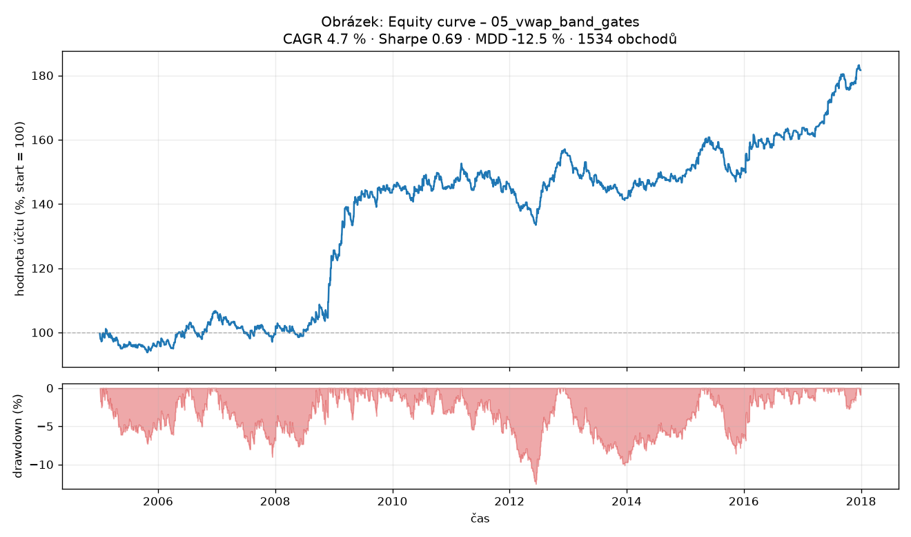

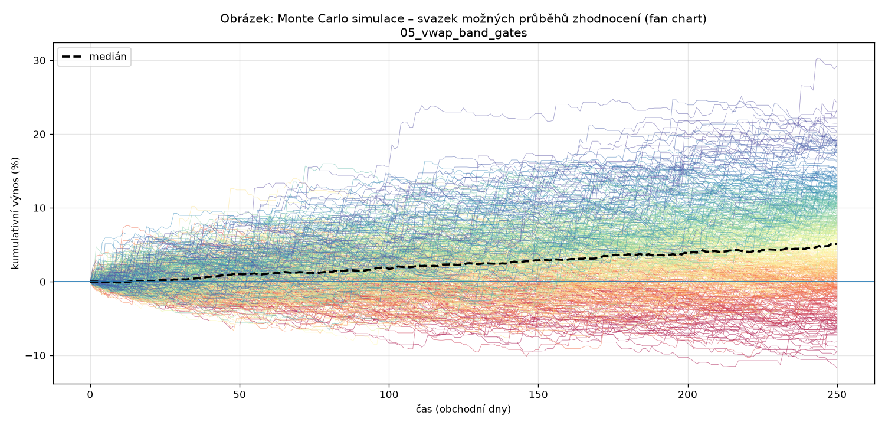

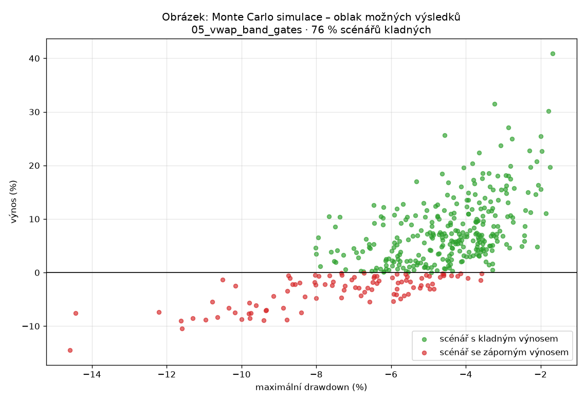

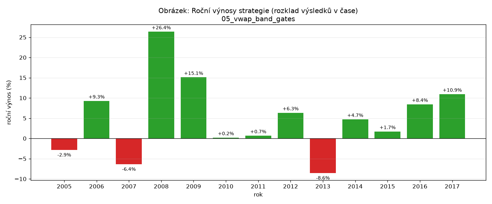

---

### 2. Overnight hold (close → open) — ✅ **funguje**

**Rodina:** časová / sezónní  
**Parametry:** nákup na close v 16:00, prodej na openu v 9:30 následujícího dne; každý den; žádný stop

**Co to je:** Slavná akademická anomálie: většina výnosu akciových indexů vzniká přes noc, ne během dne.

**Proč by to mělo fungovat:** Riziková prémie za držení přes noc (nelze reagovat na zprávy) + systematické nakupování při otevření.

| metrika | hodnota | | metrika | hodnota |
|---|---|---|---|---|
| CAGR | **4.11 %** | | celkový výnos | 68.6 % |
| Sharpe | **0.43** | | Calmar | 0.16 |
| Max drawdown | **-26.17 %** | | profit factor | 1.09 |
| win rate | 53.5 % | | průměr / obchod | 1.77 bps |
| počet obchodů | 3356 | | obchodů / rok | 258 |
| MC: kladných scénářů | 68 % | | MC: medián výnosu | 4.3 % |
| MC: 5. percentil výnosu | -11.1 % | | MC: medián MaxDD | -8.9 % |

**Roční výnosy:** 2005: +11.0% · 2006: +5.0% · 2007: +11.9% · 2008: -17.3% · 2009: +5.8% · 2010: +9.1% · 2011: -2.0% · 2012: +4.9% · 2013: +13.2% · 2014: +9.3% · 2015: +5.3% · 2016: -9.9% · 2017: +12.4%  
**Kladných let:** 10/13

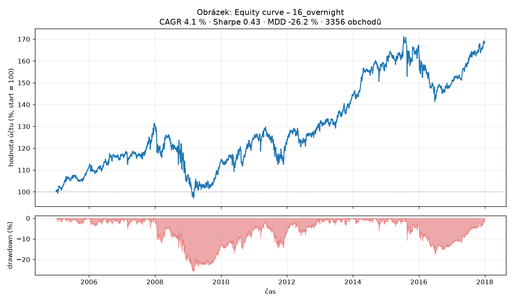

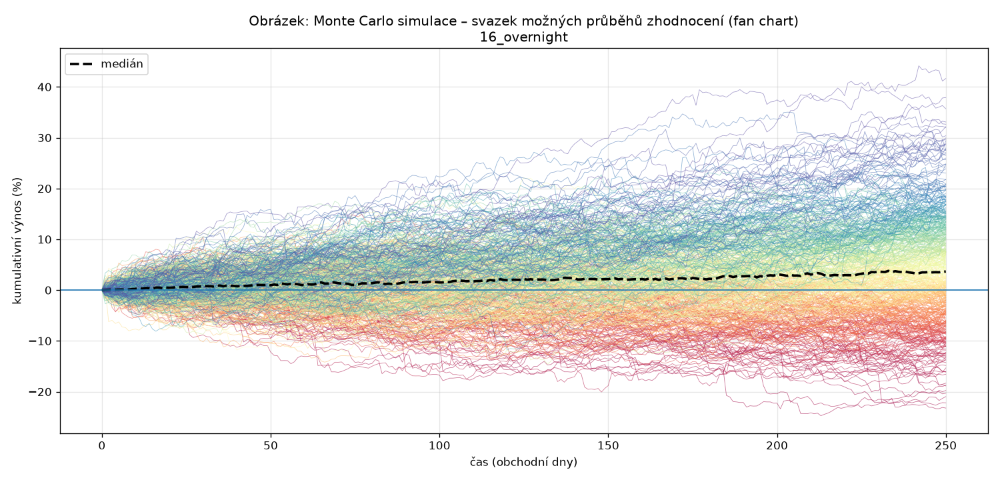

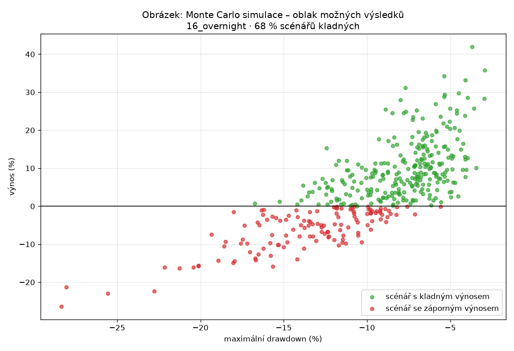

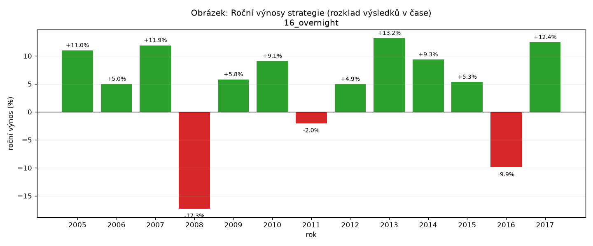

---

### 3. Fade otevíracího gapu — ✅ **funguje**

**Rodina:** mean reversion  
**Parametry:** pouze dny s |gap| > 20 bps; vstup proti gapu na openu; cíl = zaplnění gapu (včerejší close); stop 40 bps; exit 16:00

**Co to je:** Klasika: 'gapy se zaplňují'. Obchoduje proti nočnímu pohybu.

**Proč by to mělo fungovat:** Overnight pohyb bez objemu často přestřelí; RTH likvidita ho koriguje zpět.

| metrika | hodnota | | metrika | hodnota |
|---|---|---|---|---|
| CAGR | **2.17 %** | | celkový výnos | 32.1 % |
| Sharpe | **0.37** | | Calmar | 0.16 |
| Max drawdown | **-13.16 %** | | profit factor | 1.07 |
| win rate | 48.8 % | | průměr / obchod | 1.45 bps |
| počet obchodů | 2098 | | obchodů / rok | 162 |
| MC: kladných scénářů | 65 % | | MC: medián výnosu | 2.2 % |
| MC: 5. percentil výnosu | -7.2 % | | MC: medián MaxDD | -5.4 % |

**Roční výnosy:** 2005: +8.2% · 2006: +0.4% · 2007: +9.1% · 2008: +10.8% · 2009: -6.7% · 2010: +8.1% · 2011: -3.8% · 2012: -0.5% · 2013: +4.1% · 2014: +8.1% · 2015: -5.2% · 2016: -2.9% · 2017: +0.7%  
**Kladných let:** 8/13

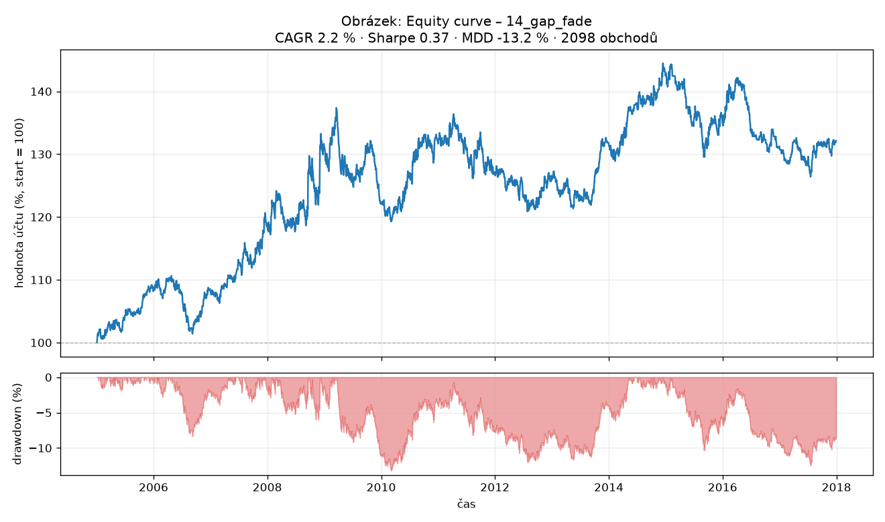

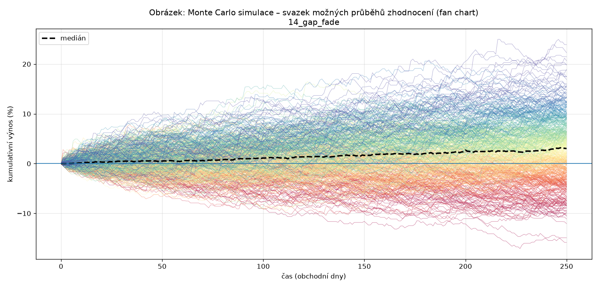

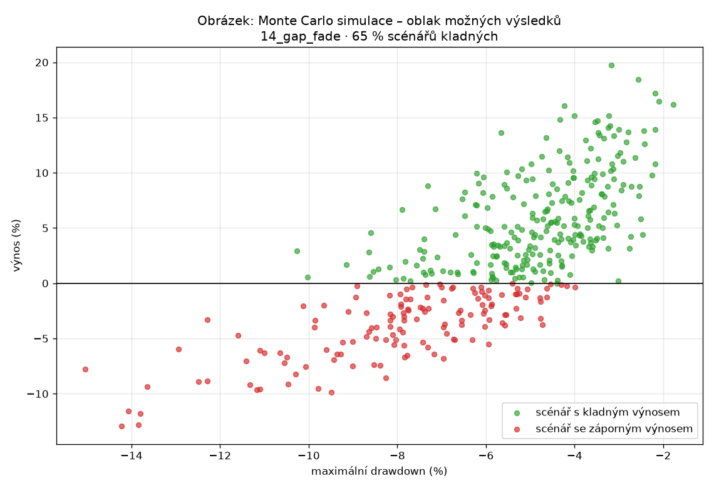

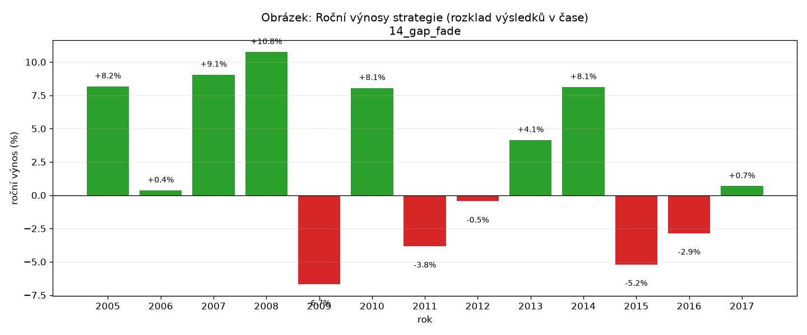

---

### 4. VWAP hysterezní pásmo (20 bps) — 🟡 **hraniční / na nule**

**Rodina:** trend / breakout  
**Parametry:** session VWAP (HLC3); vstup když 1min close zavře za VWAP ±20 bps; exit close za opačným pásmem nebo 16:00; 1 obchod/den

**Co to je:** Jádro strategie Strong Chicken VWAP Trend. Hystereze (mrtvé pásmo) filtruje whipsawy kolem VWAP.

**Proč by to mělo fungovat:** VWAP je vnitrodenní rovnovážná cena. Trvalý odklon = nerovnováha v order flow; pásmo brání reagovat na šum.

| metrika | hodnota | | metrika | hodnota |
|---|---|---|---|---|
| CAGR | **1.04 %** | | celkový výnos | 14.4 % |
| Sharpe | **0.15** | | Calmar | 0.03 |
| Max drawdown | **-34.31 %** | | profit factor | 1.03 |
| win rate | 36.1 % | | průměr / obchod | 0.60 bps |
| počet obchodů | 3228 | | obchodů / rok | 249 |
| MC: kladných scénářů | 54 % | | MC: medián výnosu | 0.8 % |
| MC: 5. percentil výnosu | -12.4 % | | MC: medián MaxDD | -8.9 % |

**Roční výnosy:** 2005: -12.2% · 2006: -9.4% · 2007: -9.8% · 2008: +54.8% · 2009: +12.5% · 2010: -13.2% · 2011: -1.5% · 2012: +9.3% · 2013: -2.9% · 2014: +3.9% · 2015: -5.0% · 2016: +5.0% · 2017: -2.7%  
**Kladných let:** 5/13

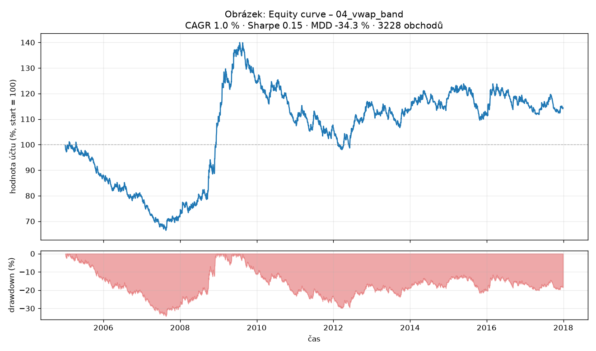

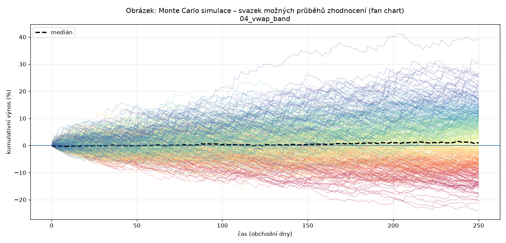

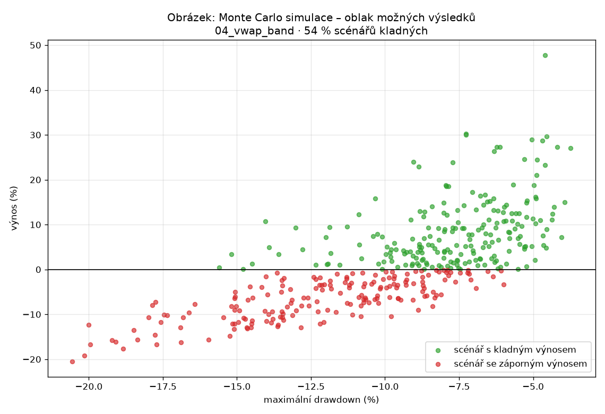

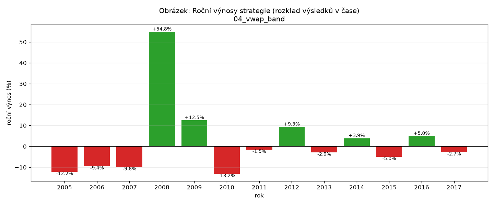

---

### 5. ORB 5 min (10R cíl) — 🟡 **hraniční / na nule**

**Rodina:** trend / breakout  
**Parametry:** opening range = první 5min svíčka (9:30–9:35); směr dle té svíčky; stop na opačném extrému OR; cíl 10R; jinak exit 16:00; 1 obchod/den

**Co to je:** Klasický Opening Range Breakout z paperu Zarattini & Aziz (SSRN 4416622). Vsadí na to, že směr prvních 5 minut udává směr dne.

**Proč by to mělo fungovat:** Ranní otevření nese největší informační tok (přes noc nasbírané zprávy). Průraz počátečního rozpětí značí, že jedna strana převládla.

| metrika | hodnota | | metrika | hodnota |
|---|---|---|---|---|
| CAGR | **0.16 %** | | celkový výnos | 2.1 % |
| Sharpe | **0.06** | | Calmar | 0.01 |
| Max drawdown | **-31.55 %** | | profit factor | 1.01 |
| win rate | 19.9 % | | průměr / obchod | 0.22 bps |
| počet obchodů | 3226 | | obchodů / rok | 248 |
| MC: kladných scénářů | 51 % | | MC: medián výnosu | 0.2 % |
| MC: 5. percentil výnosu | -12.7 % | | MC: medián MaxDD | -8.3 % |

**Roční výnosy:** 2005: -15.0% · 2006: -10.5% · 2007: -6.4% · 2008: +44.5% · 2009: +10.6% · 2010: -10.1% · 2011: -0.3% · 2012: -1.8% · 2013: +4.5% · 2014: +4.9% · 2015: -13.1% · 2016: +11.4% · 2017: -4.1%  
**Kladných let:** 5/13

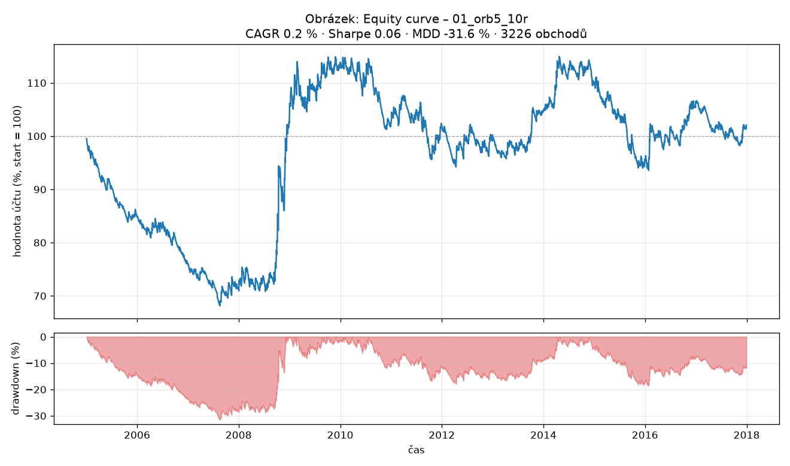

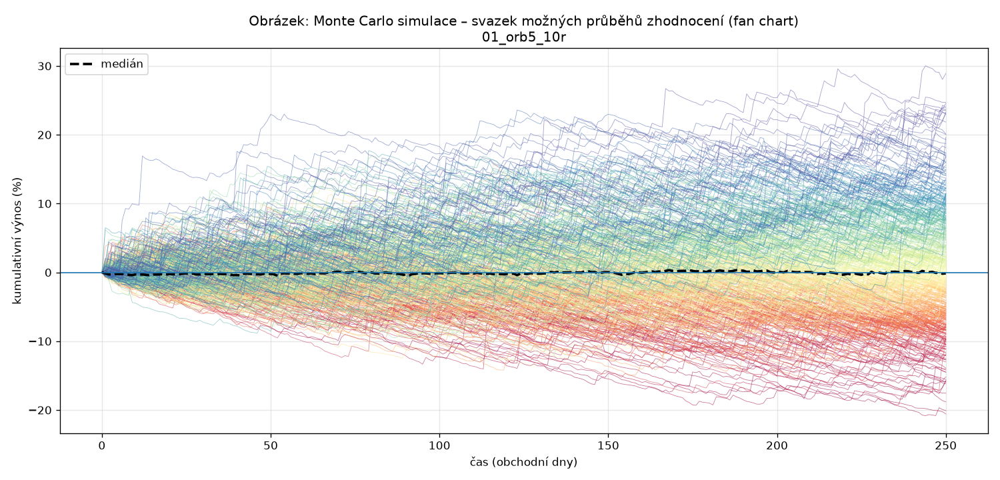

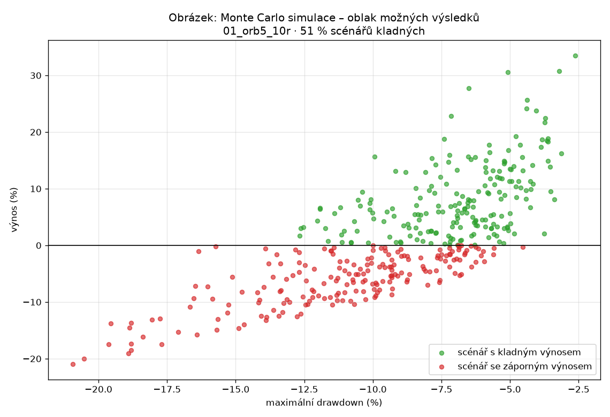

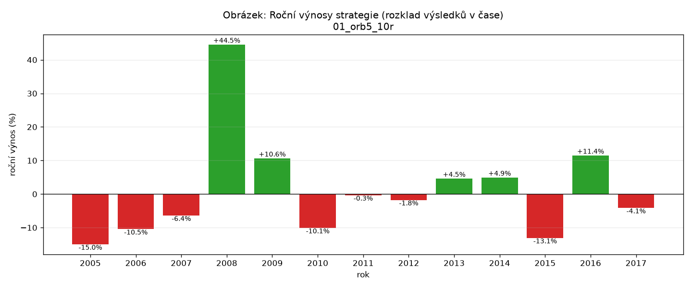

---

### 6. EMA 9/21 kříž (5min) — 🟡 **hraniční / na nule**

**Rodina:** trend / breakout  
**Parametry:** 5min bary; křížení EMA9 nad/pod EMA21 = vstup; opačný kříž nebo 16:00 = exit

**Co to je:** Nejznámější indikátorová strategie na světě. Kontrolní vzorek: funguje vůbec ještě klouzavý průměr intradenně?

**Proč by to mělo fungovat:** Kříž rychlého a pomalého průměru má detekovat změnu režimu. Na vnitrodenních datech je ale zpožděný.

| metrika | hodnota | | metrika | hodnota |
|---|---|---|---|---|
| CAGR | **-0.18 %** | | celkový výnos | -2.4 % |
| Sharpe | **0.02** | | Calmar | -0.01 |
| Max drawdown | **-25.59 %** | | profit factor | 1.00 |
| win rate | 31.8 % | | průměr / obchod | 0.05 bps |
| počet obchodů | 4957 | | obchodů / rok | 382 |
| MC: kladných scénářů | 48 % | | MC: medián výnosu | -0.5 % |
| MC: 5. percentil výnosu | -12.5 % | | MC: medián MaxDD | -8.0 % |

**Roční výnosy:** 2005: -3.2% · 2006: +3.5% · 2007: -7.2% · 2008: +38.8% · 2009: -12.0% · 2010: -5.1% · 2011: +7.6% · 2012: -4.7% · 2013: -4.4% · 2014: -1.5% · 2015: +11.1% · 2016: -9.3% · 2017: -6.9%  
**Kladných let:** 4/13

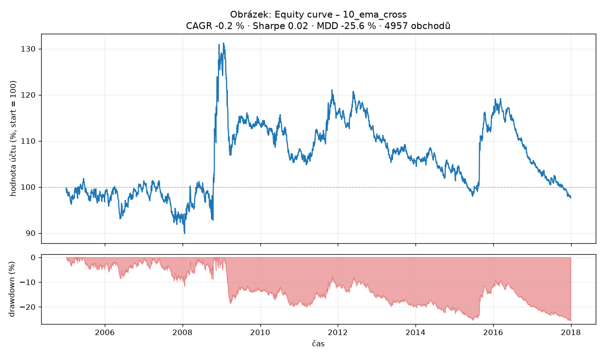

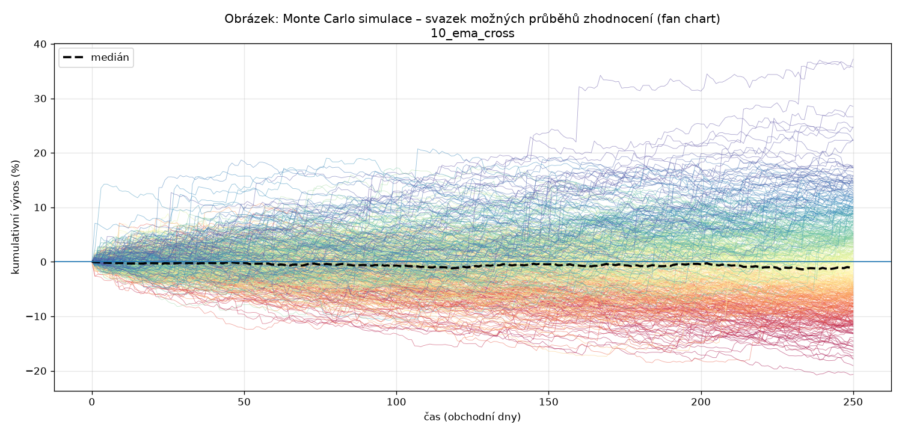

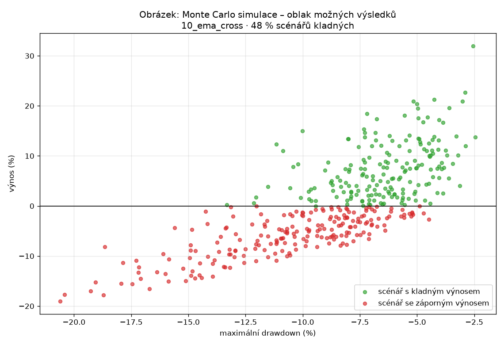

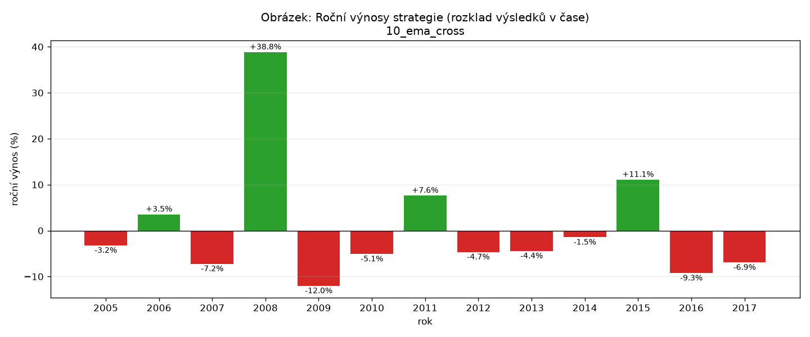

---

### 7. ORB 30 min (bez cíle, exit EOD) — ❌ **nefunguje**

**Rodina:** trend / breakout  
**Parametry:** opening range = 9:30–10:00; stop opačný extrém; žádný TP; exit 16:00; 1 obchod/den

**Co to je:** Nejpomalejší ORB — nechává vítěze běžet celý den.

**Proč by to mělo fungovat:** Kombinuje filtraci šumu (30 min) s trend-following exitem (nechat běžet).

| metrika | hodnota | | metrika | hodnota |
|---|---|---|---|---|
| CAGR | **-1.32 %** | | celkový výnos | -15.9 % |
| Sharpe | **-0.06** | | Calmar | -0.03 |
| Max drawdown | **-38.58 %** | | profit factor | 0.99 |
| win rate | 34.1 % | | průměr / obchod | -0.28 bps |
| počet obchodů | 3288 | | obchodů / rok | 253 |
| MC: kladných scénářů | 46 % | | MC: medián výnosu | -0.9 % |
| MC: 5. percentil výnosu | -17.8 % | | MC: medián MaxDD | -10.9 % |

**Roční výnosy:** 2005: -11.3% · 2006: +4.1% · 2007: -5.1% · 2008: +41.9% · 2009: -15.2% · 2010: -2.7% · 2011: +3.8% · 2012: +4.7% · 2013: -7.0% · 2014: +2.8% · 2015: -9.2% · 2016: -6.8% · 2017: -6.7%  
**Kladných let:** 5/13

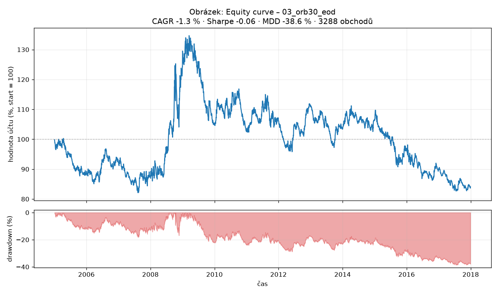

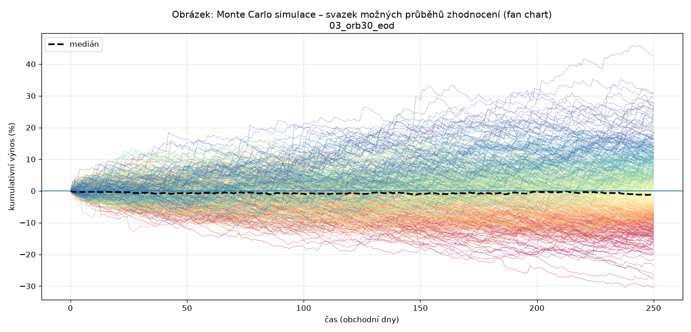

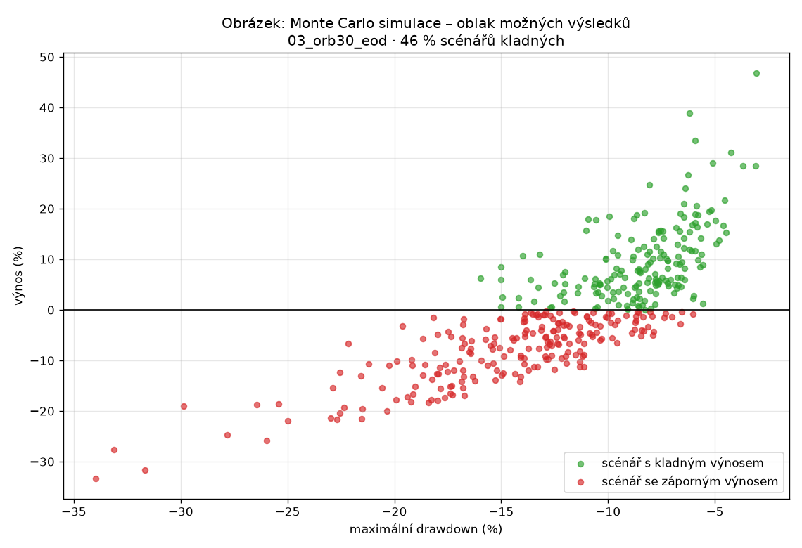

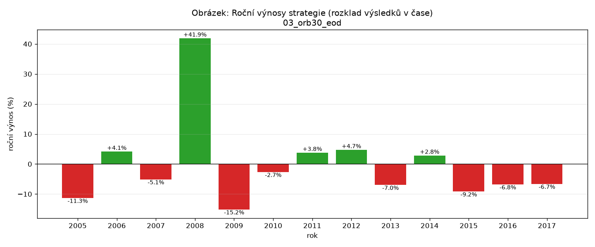

---

### 8. Intradenní momentum (noise band) — ❌ **nefunguje**

**Rodina:** trend / breakout  
**Parametry:** pásmo = 14denní průměr |close−open| kolem dnešního openu; průraz nahoru = long, dolů = short; exit EOD

**Co to je:** Zjednodušená replikace Zarattini 'Beat the Market' (SSRN 4824172) — obchoduje abnormální vychýlení proti běžnému dennímu rozsahu.

**Proč by to mělo fungovat:** Když se cena vzdálí od openu víc, než je pro daný trh běžné, jde o skutečnou nerovnováhu, ne šum.

| metrika | hodnota | | metrika | hodnota |
|---|---|---|---|---|
| CAGR | **-3.37 %** | | celkový výnos | -36.0 % |
| Sharpe | **-0.24** | | Calmar | -0.06 |
| Max drawdown | **-53.63 %** | | profit factor | 0.95 |
| win rate | 47.6 % | | průměr / obchod | -1.52 bps |
| počet obchodů | 2369 | | obchodů / rok | 182 |
| MC: kladných scénářů | 43 % | | MC: medián výnosu | -1.7 % |
| MC: 5. percentil výnosu | -19.8 % | | MC: medián MaxDD | -11.8 % |

**Roční výnosy:** 2005: -5.0% · 2006: +3.6% · 2007: -2.8% · 2008: +10.9% · 2009: -18.3% · 2010: -11.3% · 2011: +1.1% · 2012: +3.9% · 2013: -5.3% · 2014: +0.3% · 2015: -8.5% · 2016: -6.2% · 2017: -2.7%  
**Kladných let:** 5/13

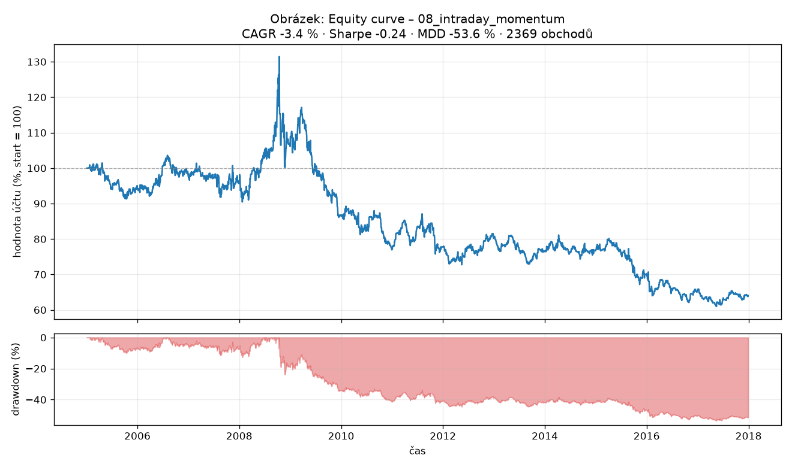

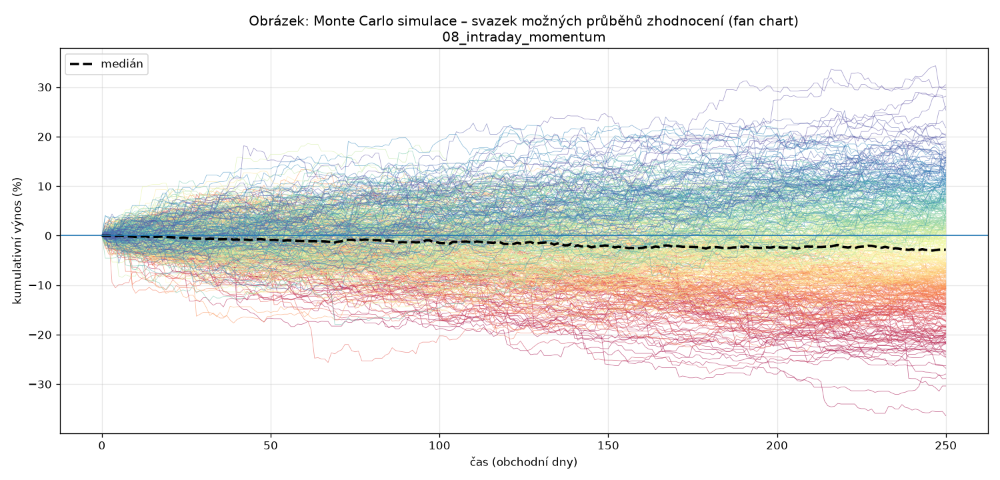

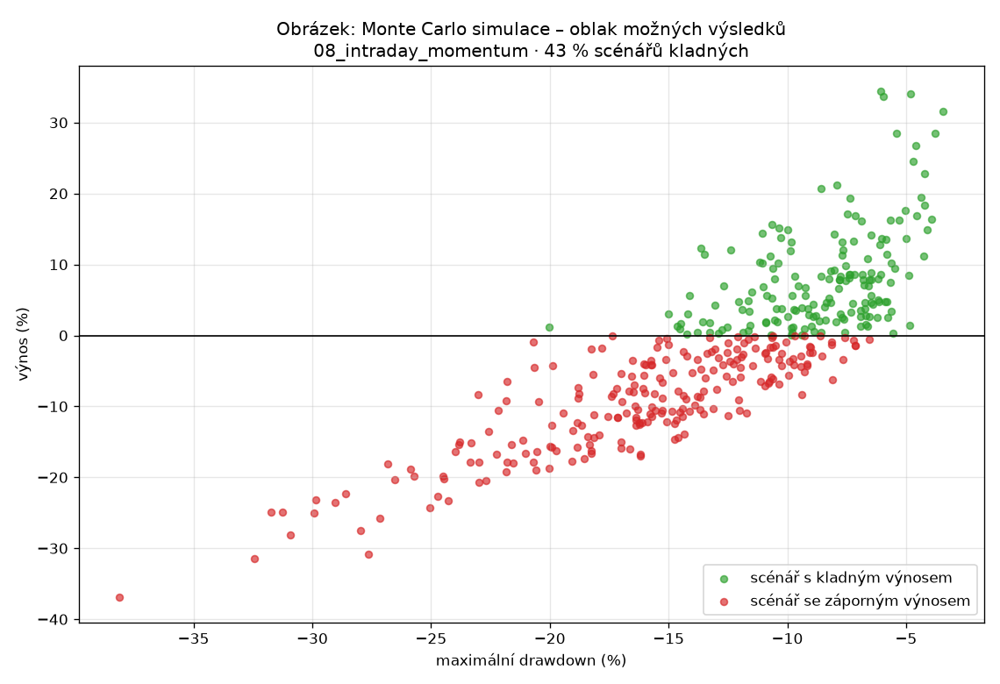

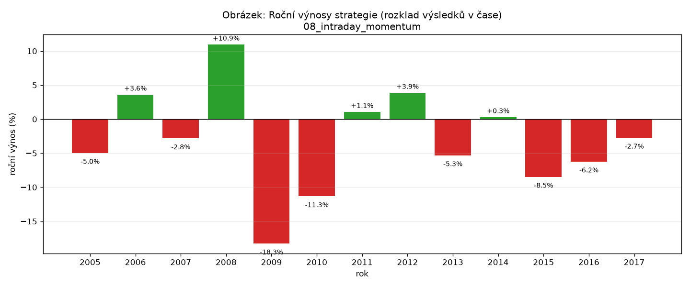

---

### 9. Odpolední reverze — ❌ **nefunguje**

**Rodina:** mean reversion  
**Parametry:** ve 14:30 změř pohyb dne (close/open−1); pokud |pohyb| > 40 bps, vstup proti němu; exit 16:00

**Co to je:** Sázka na to, že vyhrocený denní pohyb se ke konci dne částečně vrací.

**Proč by to mělo fungovat:** Intradenní trend vyčerpá kupce/prodejce; závěrečné vyrovnávání pozic tlačí cenu zpět.

| metrika | hodnota | | metrika | hodnota |
|---|---|---|---|---|
| CAGR | **-2.43 %** | | celkový výnos | -27.3 % |
| Sharpe | **-0.26** | | Calmar | -0.07 |
| Max drawdown | **-33.05 %** | | profit factor | 0.93 |
| win rate | 47.1 % | | průměr / obchod | -1.54 bps |
| počet obchodů | 1798 | | obchodů / rok | 138 |
| MC: kladných scénářů | 35 % | | MC: medián výnosu | -3.5 % |
| MC: 5. percentil výnosu | -14.8 % | | MC: medián MaxDD | -8.6 % |

**Roční výnosy:** 2005: -2.1% · 2006: -1.8% · 2007: -10.3% · 2008: -13.8% · 2009: +12.6% · 2010: -6.5% · 2011: -2.3% · 2012: -4.6% · 2013: +1.4% · 2014: +1.4% · 2015: -3.4% · 2016: +1.8% · 2017: -1.6%  
**Kladných let:** 4/13

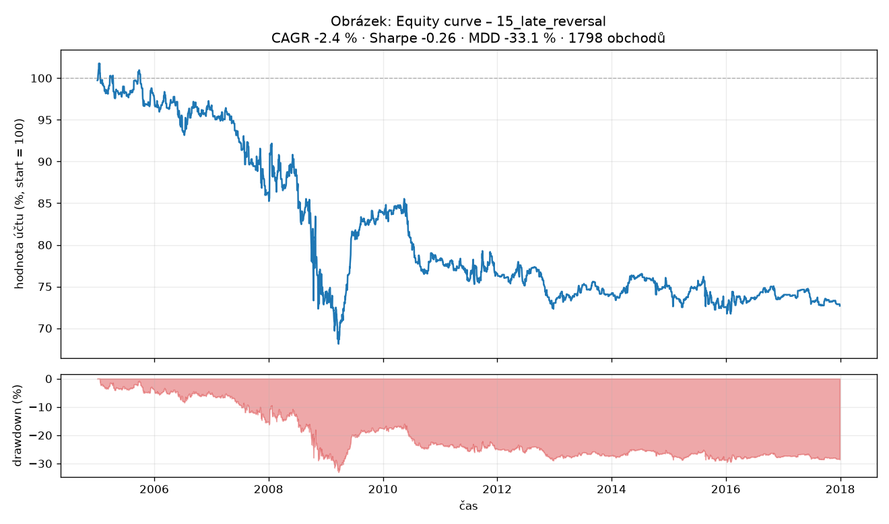

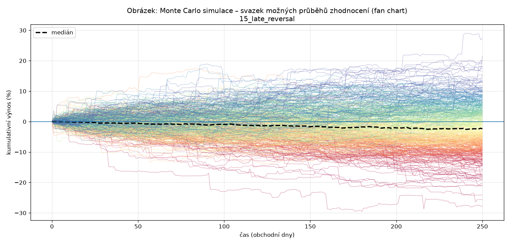

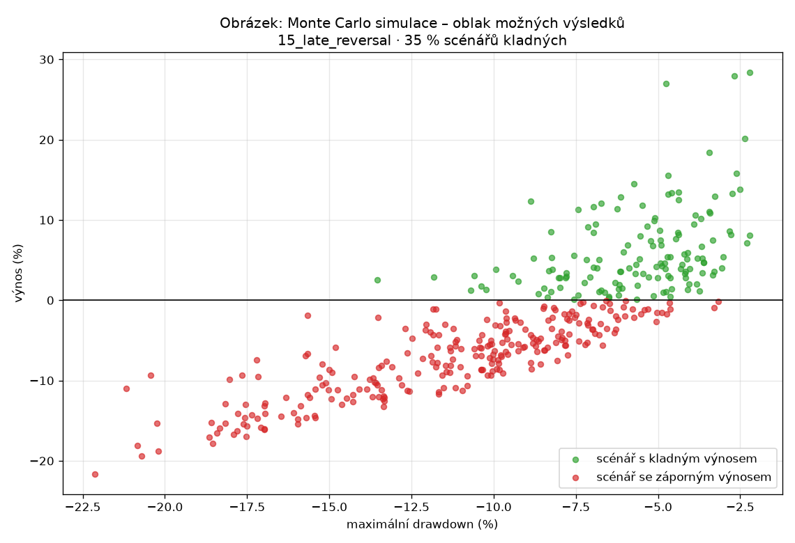

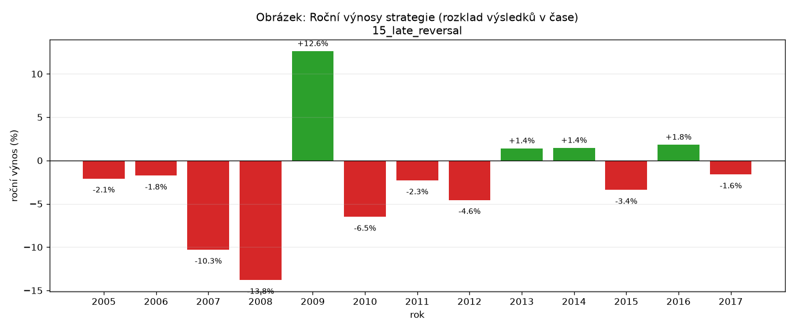

---

### 10. Průraz včerejšího high/low — ❌ **nefunguje**

**Rodina:** trend / breakout  
**Parametry:** vstup při průrazu předchozího denního maxima/minima; stop 0,5×ATR(14); exit 16:00

**Co to je:** Nejstarší breakout myšlenka vůbec — obchoduj průraz úrovně, kterou sleduje celý trh.

**Proč by to mělo fungovat:** PDH/PDL jsou referenční body s nakupenými stop příkazy; jejich průraz spouští kaskádu.

| metrika | hodnota | | metrika | hodnota |
|---|---|---|---|---|
| CAGR | **-4.12 %** | | celkový výnos | -42.1 % |
| Sharpe | **-0.27** | | Calmar | -0.09 |
| Max drawdown | **-46.30 %** | | profit factor | 0.95 |
| win rate | 46.5 % | | průměr / obchod | -1.51 bps |
| počet obchodů | 2953 | | obchodů / rok | 227 |
| MC: kladných scénářů | 33 % | | MC: medián výnosu | -4.8 % |
| MC: 5. percentil výnosu | -21.0 % | | MC: medián MaxDD | -13.7 % |

**Roční výnosy:** 2005: -12.8% · 2006: -6.5% · 2007: -8.0% · 2008: +10.5% · 2009: +2.4% · 2010: -17.1% · 2011: +14.9% · 2012: +0.1% · 2013: -4.7% · 2014: -2.1% · 2015: -4.5% · 2016: -13.4% · 2017: -7.1%  
**Kladných let:** 4/13

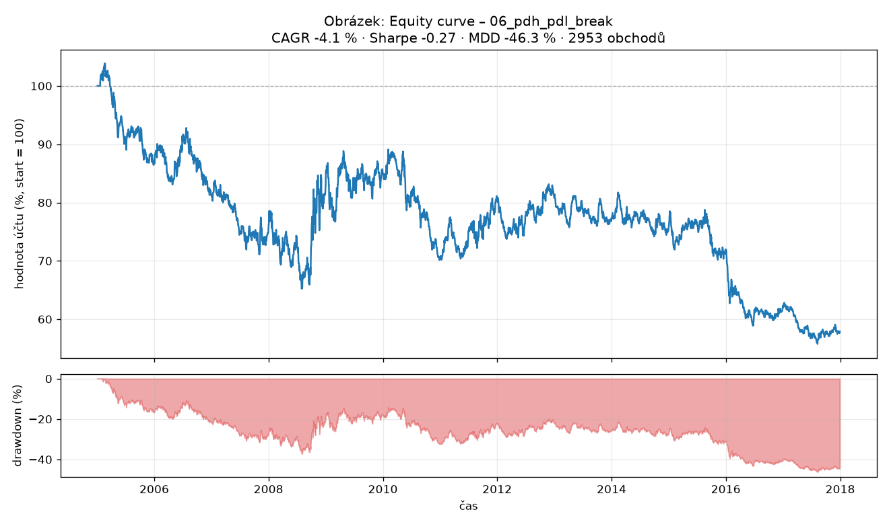

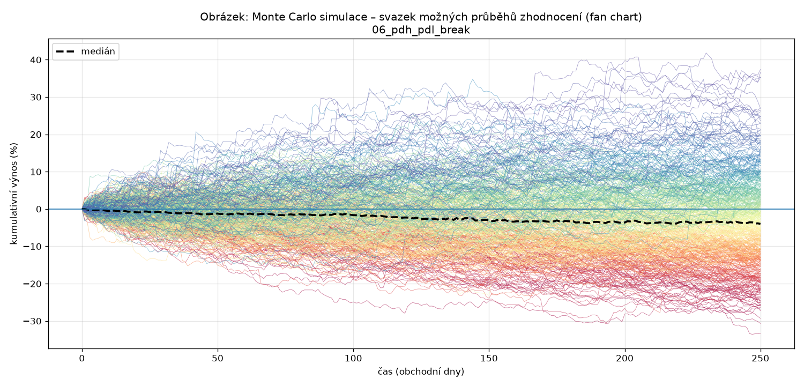

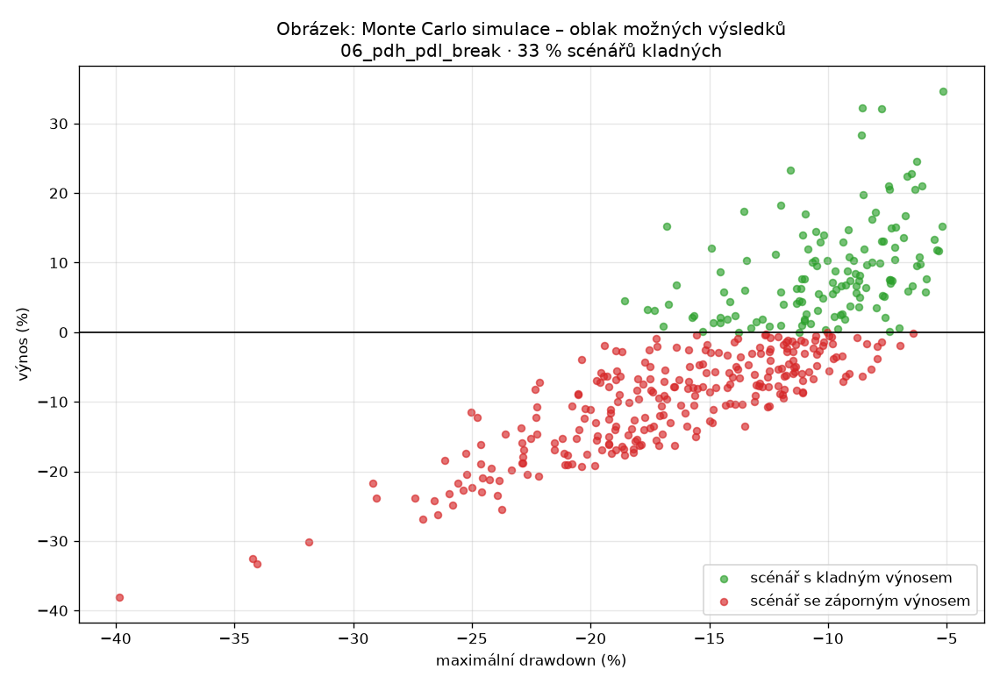

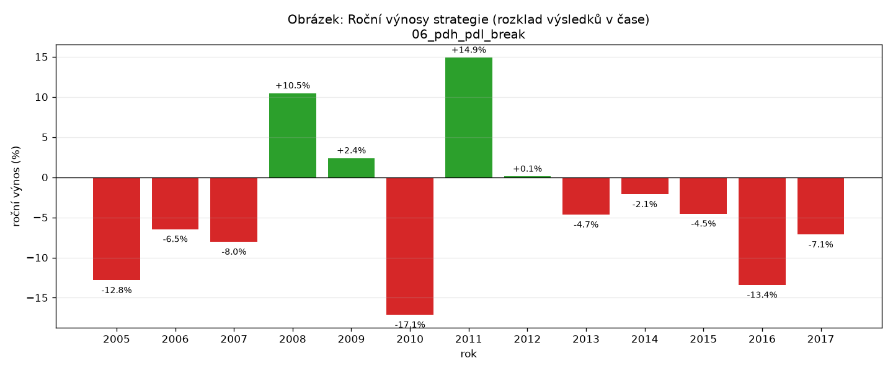

---

### 11. ORB 15 min (3R cíl) — ❌ **nefunguje**

**Rodina:** trend / breakout  
**Parametry:** opening range = 9:30–9:45; stop opačný extrém; cíl 3R; exit 16:00; 1 obchod/den

**Co to je:** Pomalejší varianta ORB — širší rozpětí, méně falešných průrazů, ale horší poměr risk/reward.

**Proč by to mělo fungovat:** Delší okno filtruje ranní šum, ale zároveň zdražuje stop (širší OR = větší R).

| metrika | hodnota | | metrika | hodnota |
|---|---|---|---|---|
| CAGR | **-3.89 %** | | celkový výnos | -40.2 % |
| Sharpe | **-0.37** | | Calmar | -0.08 |
| Max drawdown | **-50.13 %** | | profit factor | 0.94 |
| win rate | 31.7 % | | průměr / obchod | -1.40 bps |
| počet obchodů | 3273 | | obchodů / rok | 252 |
| MC: kladných scénářů | 35 % | | MC: medián výnosu | -3.2 % |
| MC: 5. percentil výnosu | -16.4 % | | MC: medián MaxDD | -10.6 % |

**Roční výnosy:** 2005: -9.2% · 2006: -7.2% · 2007: -0.4% · 2008: +18.7% · 2009: +7.0% · 2010: -17.3% · 2011: -5.0% · 2012: -0.6% · 2013: -2.3% · 2014: -5.0% · 2015: -15.7% · 2016: -2.7% · 2017: -5.6%  
**Kladných let:** 2/13

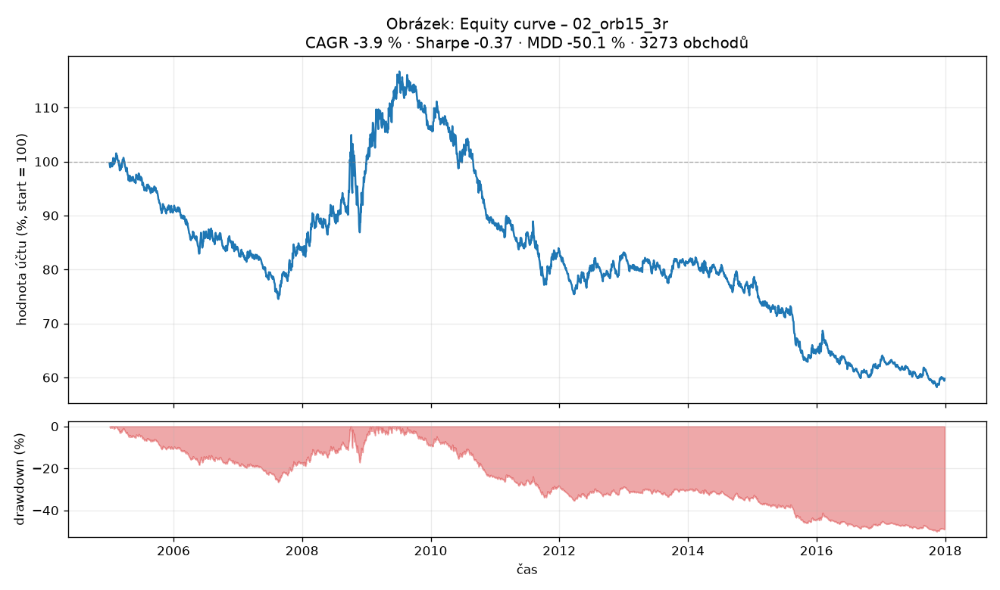

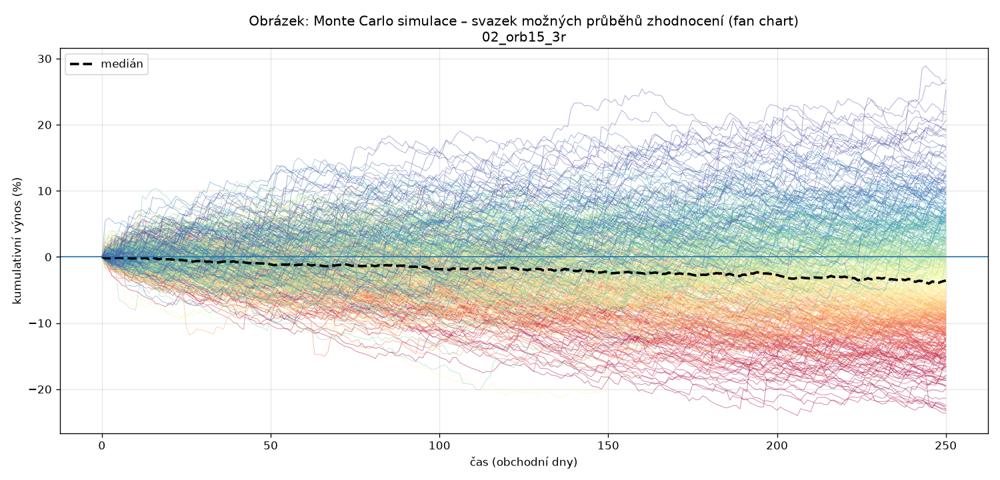

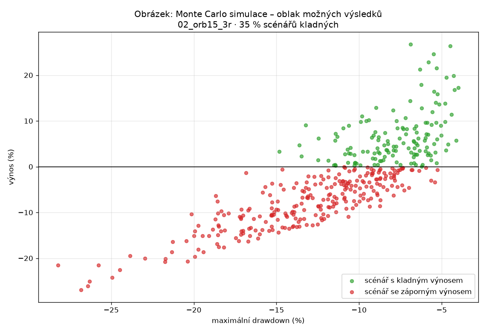

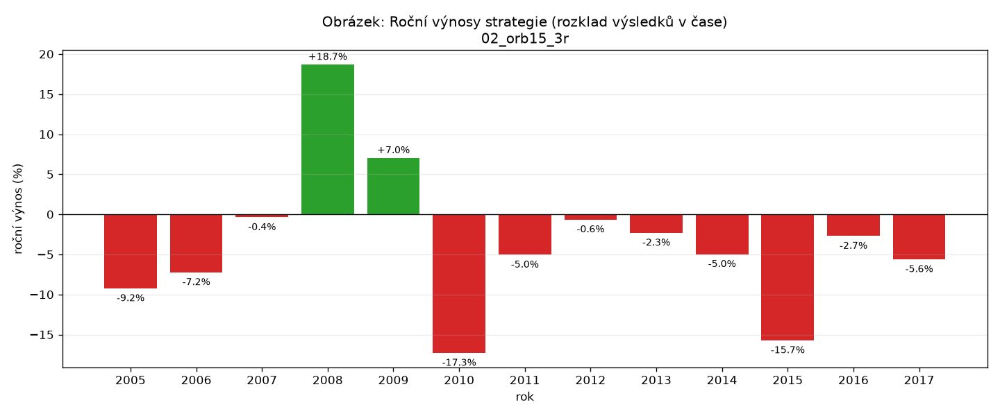

---

### 12. Polední fade (12:00→14:00) — ❌ **nefunguje**

**Rodina:** časová / sezónní  
**Parametry:** ve 12:00 vstup proti rannímu pohybu (pokud |pohyb| > 30 bps); exit ve 14:00

**Co to je:** Obchoduje nejklidnější část dne, kdy podle folklóru trh koriguje ranní přehnanou reakci.

**Proč by to mělo fungovat:** Nízká polední likvidita = mean-reverting režim; institucionální flow se pauzuje.

| metrika | hodnota | | metrika | hodnota |
|---|---|---|---|---|
| CAGR | **-2.66 %** | | celkový výnos | -29.5 % |
| Sharpe | **-0.41** | | Calmar | -0.07 |
| Max drawdown | **-36.83 %** | | profit factor | 0.90 |
| win rate | 47.0 % | | průměr / obchod | -1.70 bps |
| počet obchodů | 1915 | | obchodů / rok | 147 |
| MC: kladných scénářů | 33 % | | MC: medián výnosu | -2.8 % |
| MC: 5. percentil výnosu | -11.6 % | | MC: medián MaxDD | -7.0 % |

**Roční výnosy:** 2005: +2.3% · 2006: -4.9% · 2007: -2.1% · 2008: -23.2% · 2009: +4.6% · 2010: +2.8% · 2011: +2.8% · 2012: -4.9% · 2013: +2.0% · 2014: -3.7% · 2015: +3.9% · 2016: -5.9% · 2017: -4.7%  
**Kladných let:** 6/13

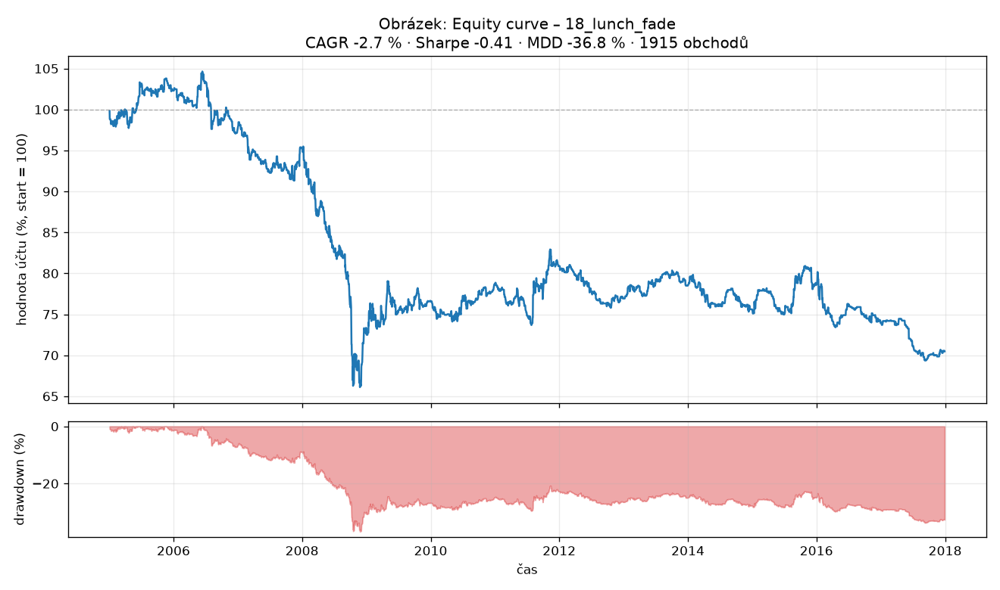

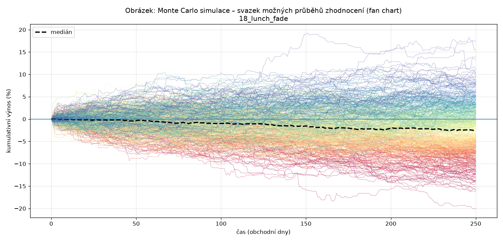

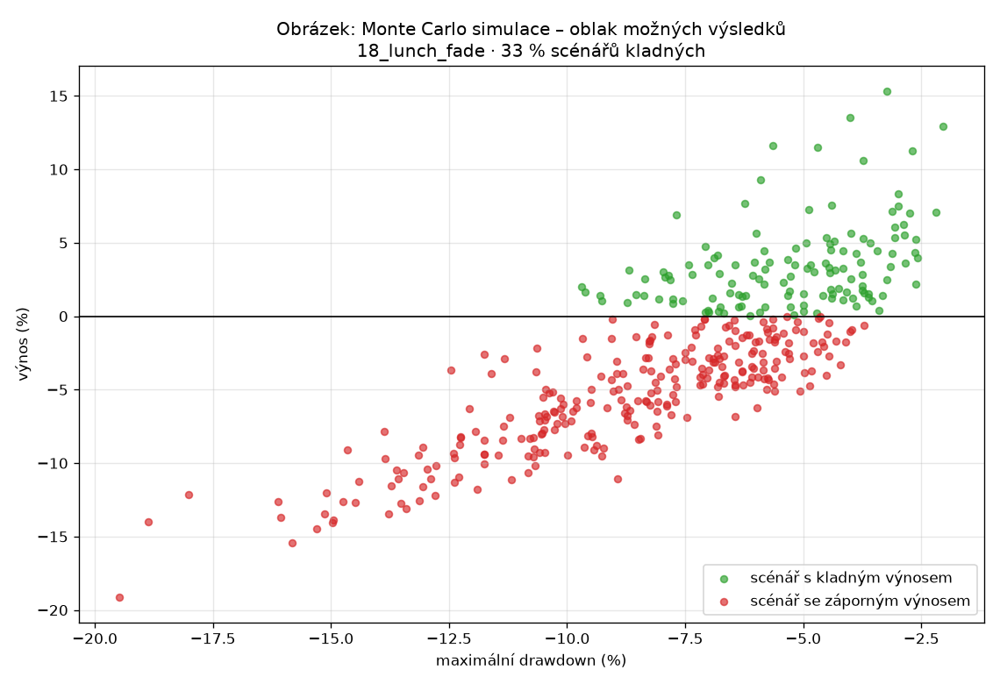

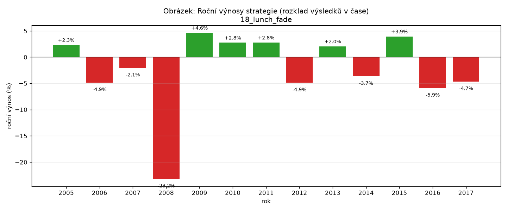

---

### 13. Donchian kanál 20 (5min) — ❌ **nefunguje**

**Rodina:** trend / breakout  
**Parametry:** 5min bary; long při close nad 20-barovým maximem, short pod minimem; exit při 10-barovém protisměrném extrému nebo 16:00

**Co to je:** Vnitrodenní verze klasického Turtle systému.

**Proč by to mělo fungovat:** Nová N-barová extrémní hodnota = pokračování trendu. Funguje na denní úrovni už 40 let.

| metrika | hodnota | | metrika | hodnota |
|---|---|---|---|---|
| CAGR | **-6.75 %** | | celkový výnos | -59.6 % |
| Sharpe | **-0.63** | | Calmar | -0.11 |
| Max drawdown | **-60.01 %** | | profit factor | 0.91 |
| win rate | 37.6 % | | průměr / obchod | -1.33 bps |
| počet obchodů | 6315 | | obchodů / rok | 486 |
| MC: kladných scénářů | 25 % | | MC: medián výnosu | -5.8 % |
| MC: 5. percentil výnosu | -20.6 % | | MC: medián MaxDD | -11.9 % |

**Roční výnosy:** 2005: -7.4% · 2006: -4.6% · 2007: -16.1% · 2008: +24.7% · 2009: -32.6% · 2010: +6.0% · 2011: +0.0% · 2012: -8.8% · 2013: -17.6% · 2014: -4.6% · 2015: +8.9% · 2016: -15.0% · 2017: -7.9%  
**Kladných let:** 4/13

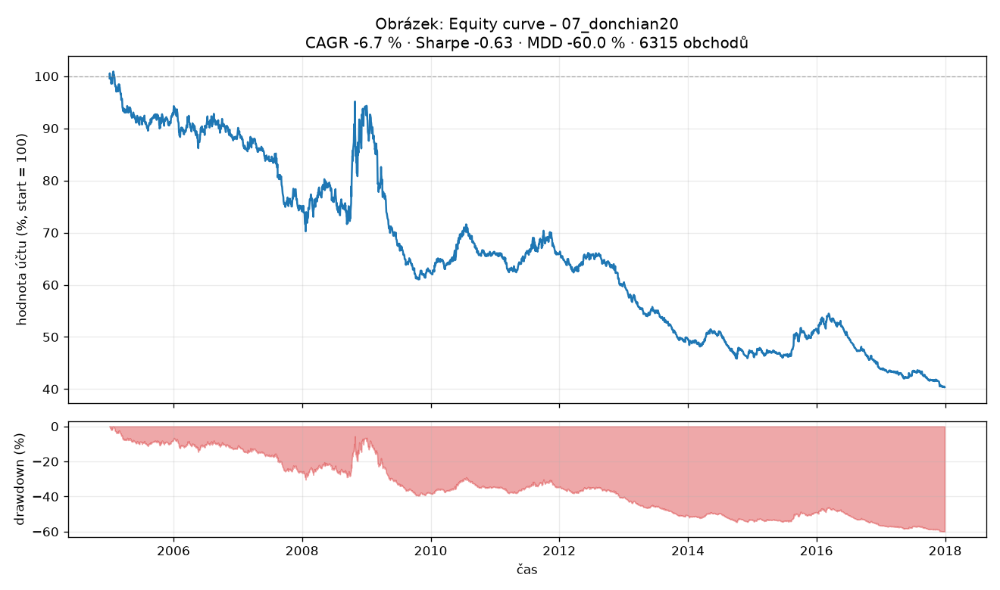

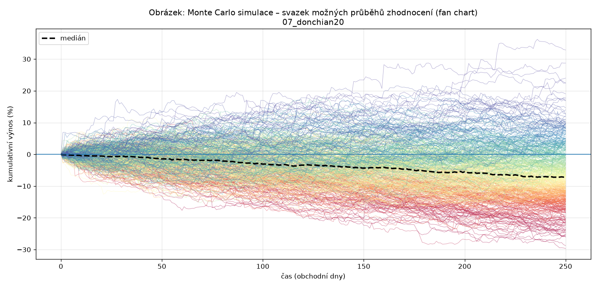

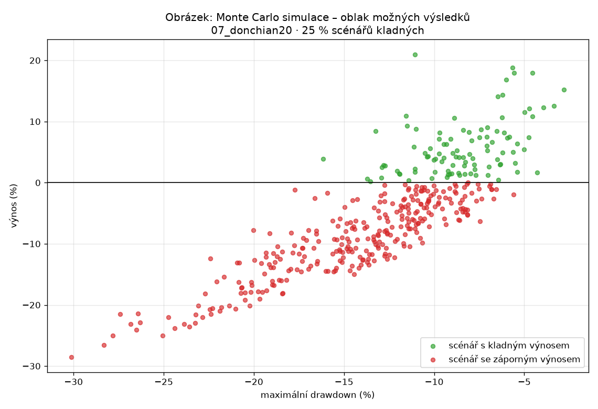

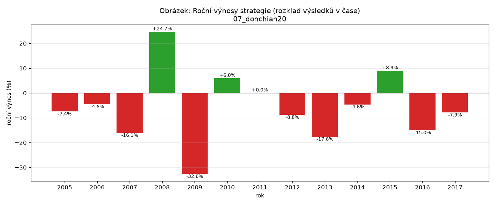

---

### 14. Průraz rozpětí první hodiny — ❌ **nefunguje**

**Rodina:** trend / breakout  
**Parametry:** rozpětí 9:30–10:30; průraz = vstup; stop na opačné straně rozpětí; exit 16:00

**Co to je:** ORB s hodinovým oknem — nejrozšířenější retailová varianta.

**Proč by to mělo fungovat:** První hodina absorbuje overnight nerovnováhu; co se stane potom, je 'skutečný' směr dne.

| metrika | hodnota | | metrika | hodnota |
|---|---|---|---|---|
| CAGR | **-7.91 %** | | celkový výnos | -65.7 % |
| Sharpe | **-0.64** | | Calmar | -0.12 |
| Max drawdown | **-67.19 %** | | profit factor | 0.88 |
| win rate | 45.8 % | | průměr / obchod | -3.11 bps |
| počet obchodů | 3155 | | obchodů / rok | 243 |
| MC: kladných scénářů | 26 % | | MC: medián výnosu | -7.0 % |
| MC: 5. percentil výnosu | -22.9 % | | MC: medián MaxDD | -14.0 % |

**Roční výnosy:** 2005: -9.9% · 2006: -8.8% · 2007: -2.3% · 2008: -7.5% · 2009: -16.5% · 2010: -1.2% · 2011: -4.5% · 2012: -2.6% · 2013: -6.2% · 2014: -7.3% · 2015: -15.7% · 2016: -11.8% · 2017: -6.9%  
**Kladných let:** 0/13

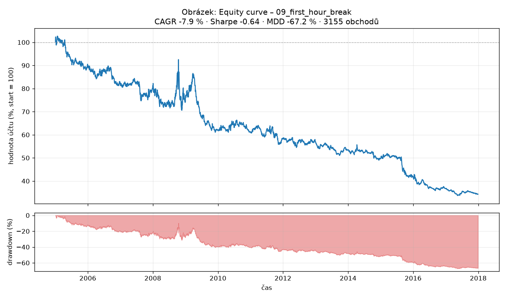

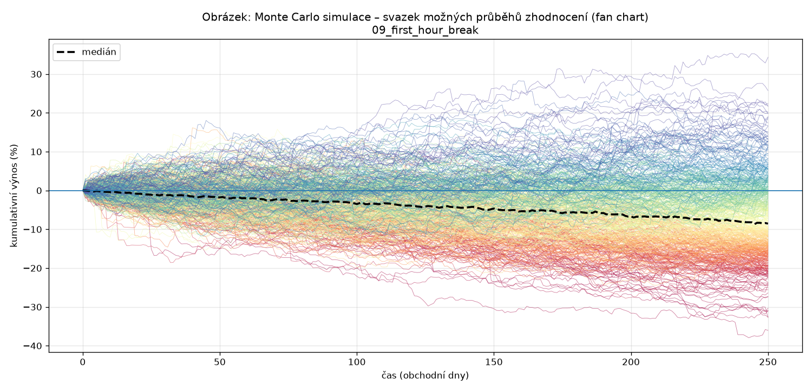

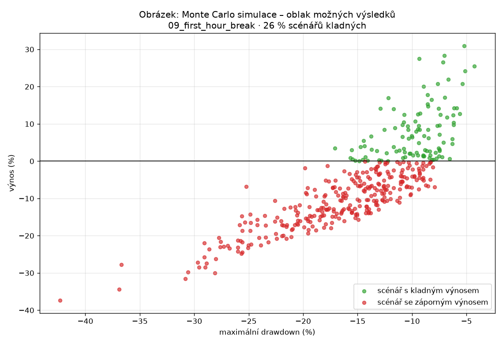

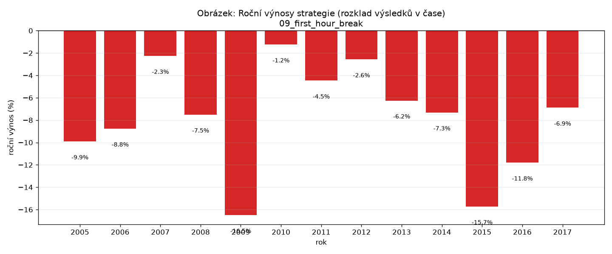

---

### 15. Power hour momentum (15:00→16:00) — ❌ **nefunguje**

**Rodina:** časová / sezónní  
**Parametry:** v 15:00: pokud cena nad VWAP → long, pod VWAP → short; exit na close 16:00

**Co to je:** Obchoduje poslední hodinu, kdy je největší objem a doznívá denní směr.

**Proč by to mělo fungovat:** Závěrečná aukce a rebalancování fondů posiluje převládající denní směr.

| metrika | hodnota | | metrika | hodnota |
|---|---|---|---|---|
| CAGR | **-6.80 %** | | celkový výnos | -59.9 % |
| Sharpe | **-0.83** | | Calmar | -0.11 |
| Max drawdown | **-61.32 %** | | profit factor | 0.83 |
| win rate | 45.4 % | | průměr / obchod | -2.69 bps |
| počet obchodů | 3241 | | obchodů / rok | 250 |
| MC: kladných scénářů | 20 % | | MC: medián výnosu | -6.9 % |
| MC: 5. percentil výnosu | -17.6 % | | MC: medián MaxDD | -11.1 % |

**Roční výnosy:** 2005: -3.2% · 2006: -9.7% · 2007: -0.7% · 2008: -12.1% · 2009: -31.5% · 2010: +0.1% · 2011: -6.3% · 2012: -2.6% · 2013: -7.0% · 2014: -1.6% · 2015: +3.8% · 2016: -6.4% · 2017: -5.7%  
**Kladných let:** 2/13

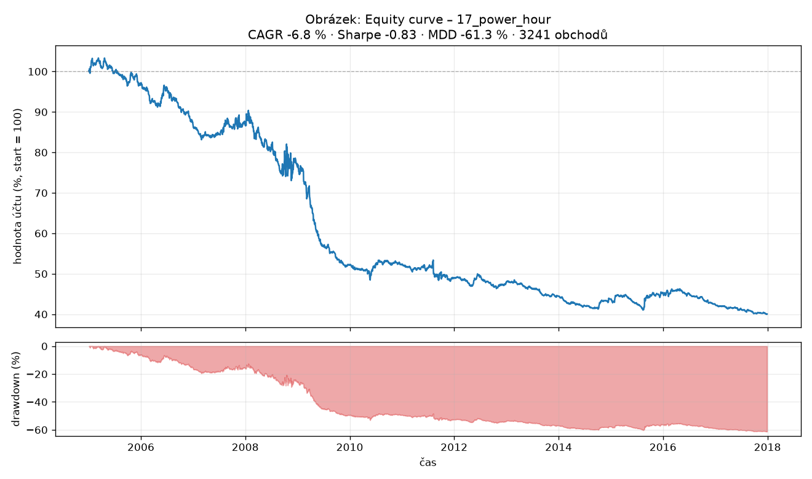

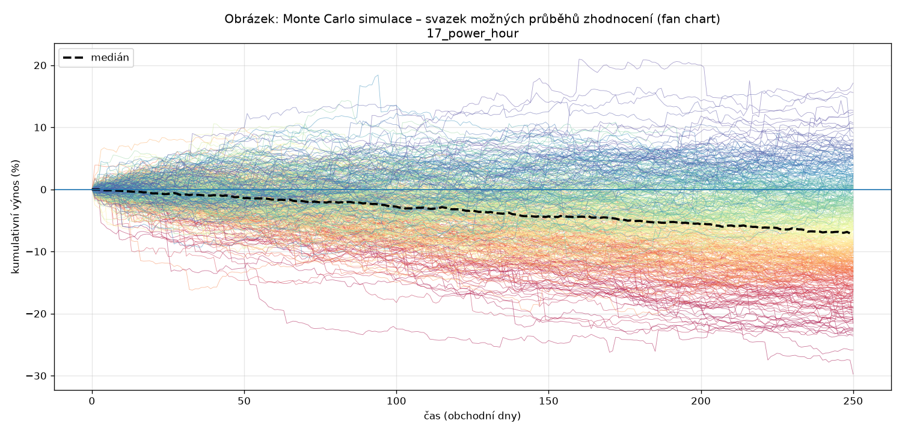

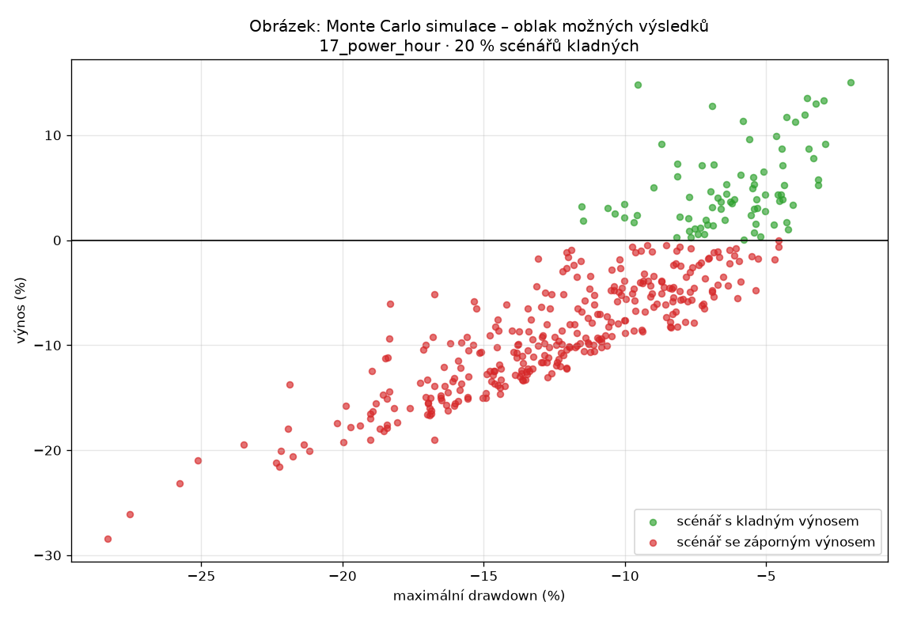

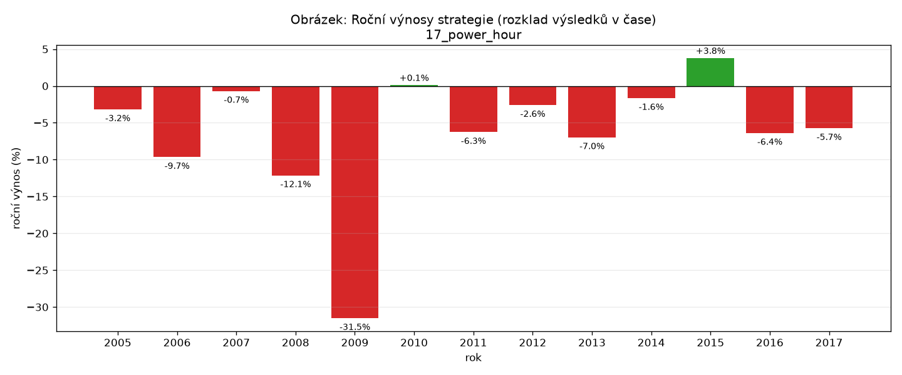

---

### 16. Bollinger fade (5min, 20/2) — ❌ **nefunguje**

**Rodina:** mean reversion  
**Parametry:** 5min bary; close nad horním pásmem = short, pod dolním = long; cíl střední pásmo; exit 16:00

**Co to je:** Učebnicová mean-reversion strategie z každé knihy o technické analýze.

**Proč by to mělo fungovat:** Cena se pohybuje ve statistickém kanálu; dotyk okraje = přestřelení a návrat ke střední hodnotě.

| metrika | hodnota | | metrika | hodnota |
|---|---|---|---|---|
| CAGR | **-15.00 %** | | celkový výnos | -87.9 % |
| Sharpe | **-1.82** | | Calmar | -0.17 |
| Max drawdown | **-88.14 %** | | profit factor | 0.77 |
| win rate | 58.3 % | | průměr / obchod | -2.93 bps |
| počet obchodů | 7038 | | obchodů / rok | 542 |
| MC: kladných scénářů | 3 % | | MC: medián výnosu | -14.3 % |
| MC: 5. percentil výnosu | -25.6 % | | MC: medián MaxDD | -16.8 % |

**Roční výnosy:** 2005: -11.9% · 2006: -17.0% · 2007: -15.4% · 2008: -38.1% · 2009: +1.7% · 2010: -19.4% · 2011: -15.5% · 2012: -8.4% · 2013: -6.2% · 2014: -15.3% · 2015: -23.6% · 2016: -6.7% · 2017: -11.9%  
**Kladných let:** 1/13

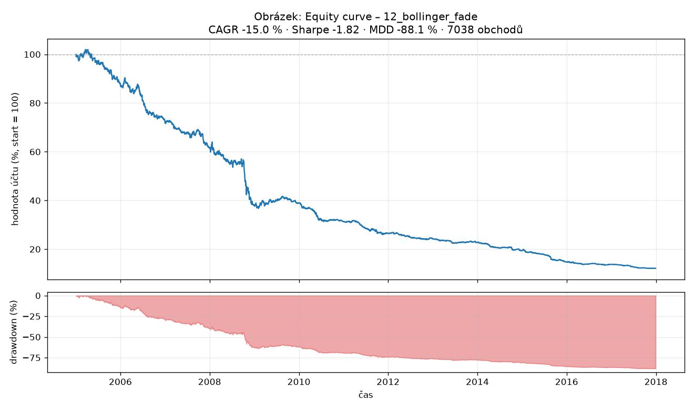

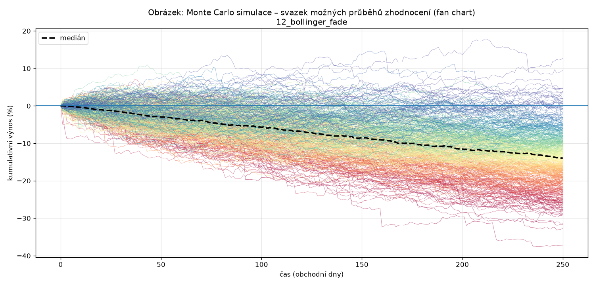

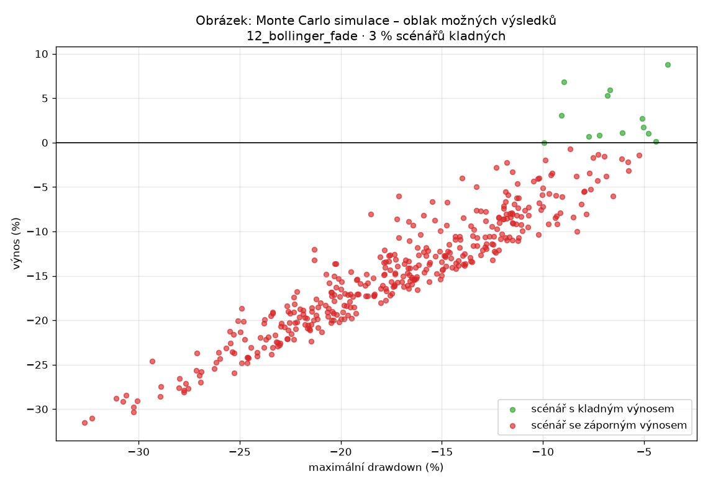

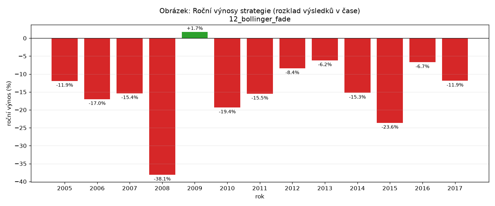

---

### 17. No Wick (Instagram) — ❌ **nefunguje**

**Rodina:** instagram (kontrolní vzorek)  
**Parametry:** 1min; bezknotová svíčka ve směru trendu (EMA50) → označ úroveň; vstup při návratu ceny na úroveň (do 8 svíček); stop poslední swing; TP 1:1

**Co to je:** Strategie z instagramového videa ('founded it 2.5 years ago, everyone becomes profitable').

**Proč by to mělo fungovat:** Bezknotová svíčka má značit institucionální absorpci; návrat na úroveň = vstupní příležitost.

| metrika | hodnota | | metrika | hodnota |
|---|---|---|---|---|
| CAGR | **-23.49 %** | | celkový výnos | -96.9 % |
| Sharpe | **-2.07** | | Calmar | -0.24 |
| Max drawdown | **-96.96 %** | | profit factor | 0.89 |
| win rate | 49.7 % | | průměr / obchod | -1.12 bps |
| počet obchodů | 30093 | | obchodů / rok | 2317 |
| MC: kladných scénářů | 0 % | | MC: medián výnosu | -22.8 % |
| MC: 5. percentil výnosu | -37.0 % | | MC: medián MaxDD | -25.9 % |

**Roční výnosy:** 2005: -23.6% · 2006: -14.5% · 2007: -25.2% · 2008: +26.6% · 2009: -21.2% · 2010: -31.3% · 2011: -23.2% · 2012: -31.5% · 2013: -32.9% · 2014: -18.1% · 2015: -24.1% · 2016: -34.6% · 2017: -35.7%  
**Kladných let:** 1/13

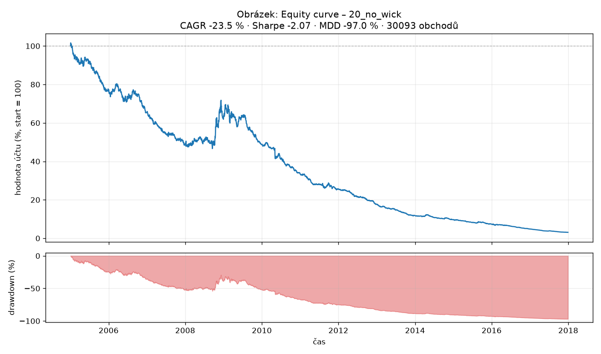

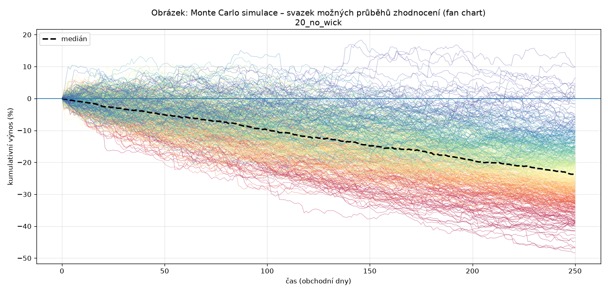

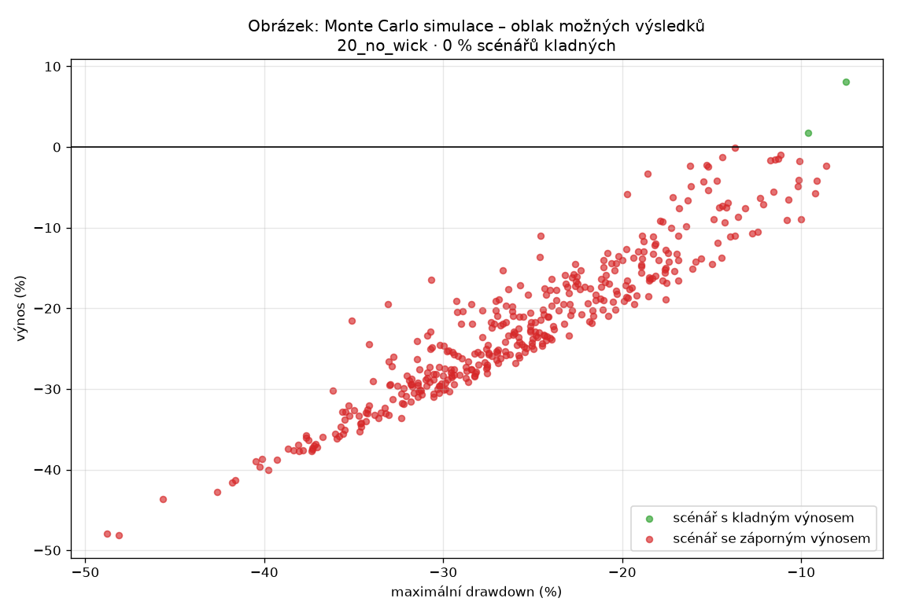

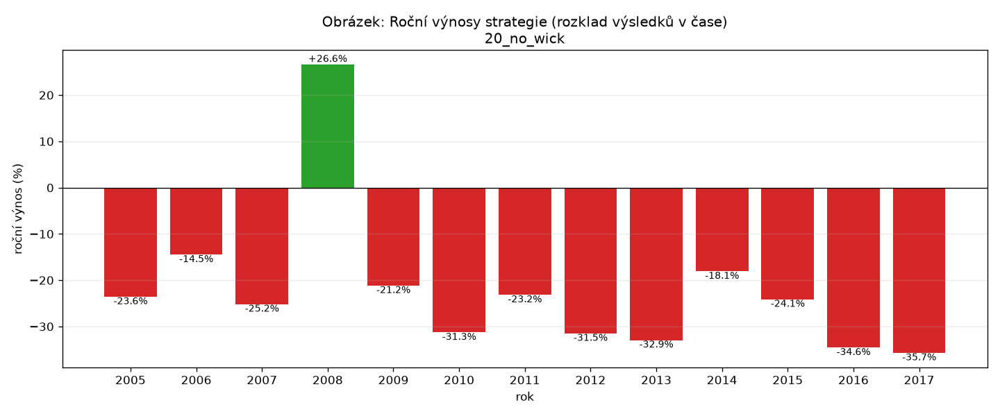

---

### 18. RSI(2) vnitrodenní reverze — ❌ **nefunguje**

**Rodina:** mean reversion  
**Parametry:** 5min bary; RSI(2) < 5 = long, > 95 = short; exit při návratu RSI přes 55/45 nebo 16:00

**Co to je:** Larry Connors RSI(2) — na denních datech legendárně funkční systém, testovaný zde intradenně.

**Proč by to mělo fungovat:** Krátkodobě extrémně přeprodaný/překoupený stav se rychle koriguje.

| metrika | hodnota | | metrika | hodnota |
|---|---|---|---|---|
| CAGR | **-16.60 %** | | celkový výnos | -90.5 % |
| Sharpe | **-2.40** | | Calmar | -0.18 |
| Max drawdown | **-90.60 %** | | profit factor | 0.77 |
| win rate | 58.0 % | | průměr / obchod | -1.60 bps |
| počet obchodů | 14462 | | obchodů / rok | 1114 |
| MC: kladných scénářů | 0 % | | MC: medián výnosu | -15.9 % |
| MC: 5. percentil výnosu | -26.1 % | | MC: medián MaxDD | -17.4 % |

**Roční výnosy:** 2005: -13.6% · 2006: -18.3% · 2007: -9.2% · 2008: +0.9% · 2009: -18.2% · 2010: -14.0% · 2011: -28.5% · 2012: -15.7% · 2013: -16.3% · 2014: -15.5% · 2015: -24.8% · 2016: -20.9% · 2017: -17.9%  
**Kladných let:** 1/13

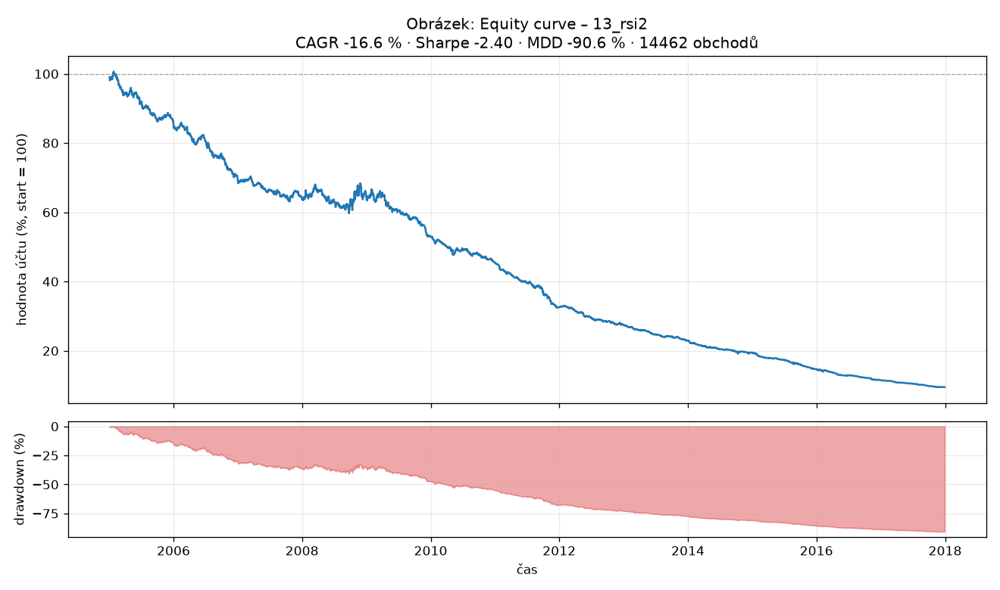

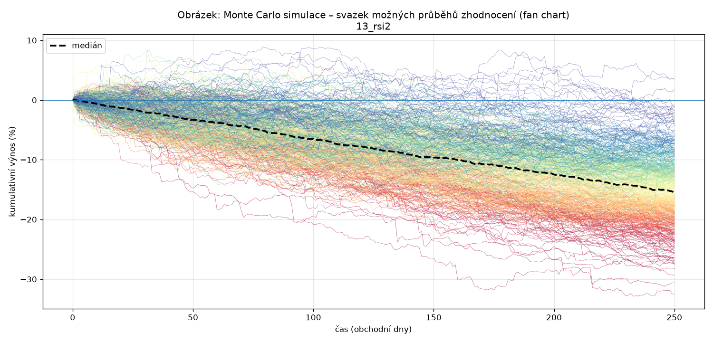

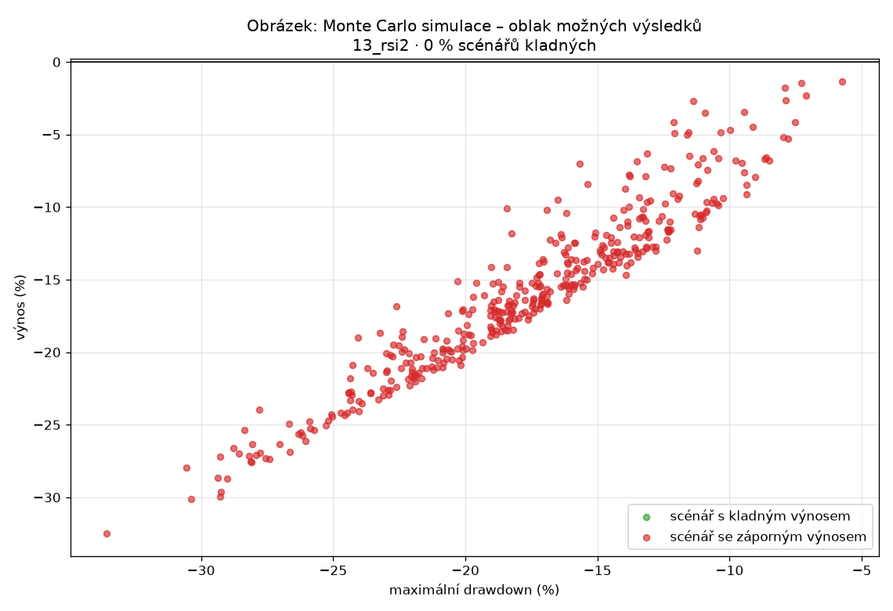

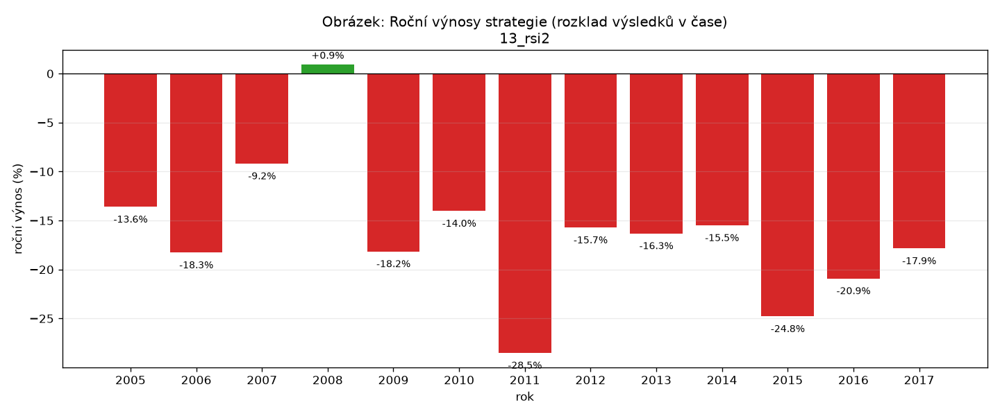

---

### 19. EMA9 + VWAP knot (Instagram) — ❌ **nefunguje**

**Rodina:** instagram (kontrolní vzorek)  
**Parametry:** 3min bary; vstup když svíčka knotem probodne VWAP a zavře zpět; exit když svíčka zavře za EMA9; bez stopu

**Co to je:** Strategie z instagramového videa ('best strategy I've ever used').

**Proč by to mělo fungovat:** Odraz od VWAP jako vstup + EMA jako trailing exit. Ve skutečnosti jde o trend-following v přestrojení.

| metrika | hodnota | | metrika | hodnota |
|---|---|---|---|---|
| CAGR | **-31.88 %** | | celkový výnos | -99.3 % |
| Sharpe | **-3.48** | | Calmar | -0.32 |
| Max drawdown | **-99.33 %** | | profit factor | 0.75 |
| win rate | 28.4 % | | průměr / obchod | -1.83 bps |
| počet obchodů | 26803 | | obchodů / rok | 2064 |
| MC: kladných scénářů | 0 % | | MC: medián výnosu | -30.6 % |
| MC: 5. percentil výnosu | -40.6 % | | MC: medián MaxDD | -31.8 % |

**Roční výnosy:** 2005: -36.4% · 2006: -46.8% · 2007: -48.2% · 2008: -20.1% · 2009: -11.8% · 2010: -23.5% · 2011: -18.2% · 2012: -30.8% · 2013: -34.8% · 2014: -35.5% · 2015: -38.3% · 2016: -29.4% · 2017: -30.2%  
**Kladných let:** 0/13

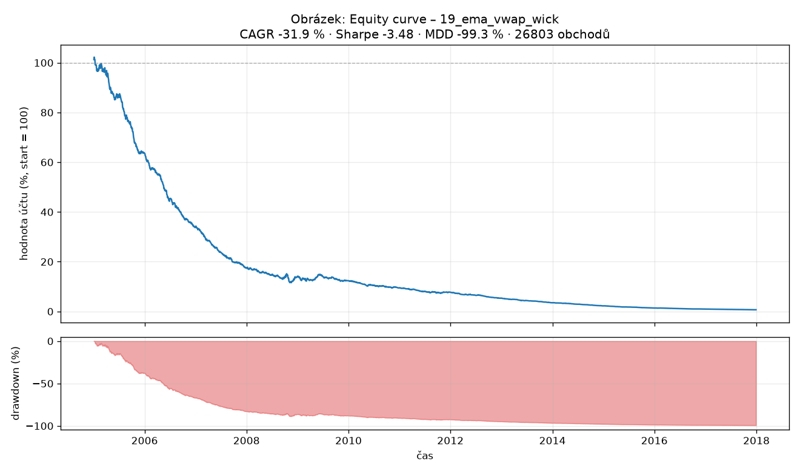

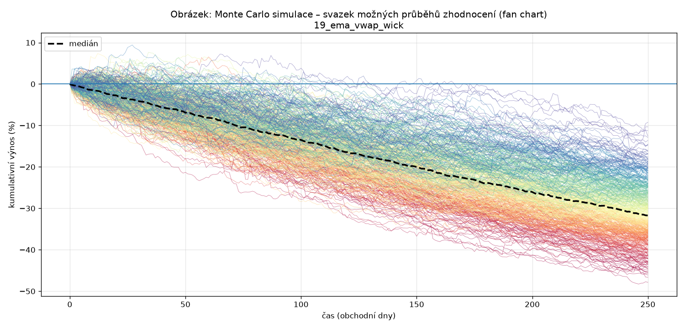

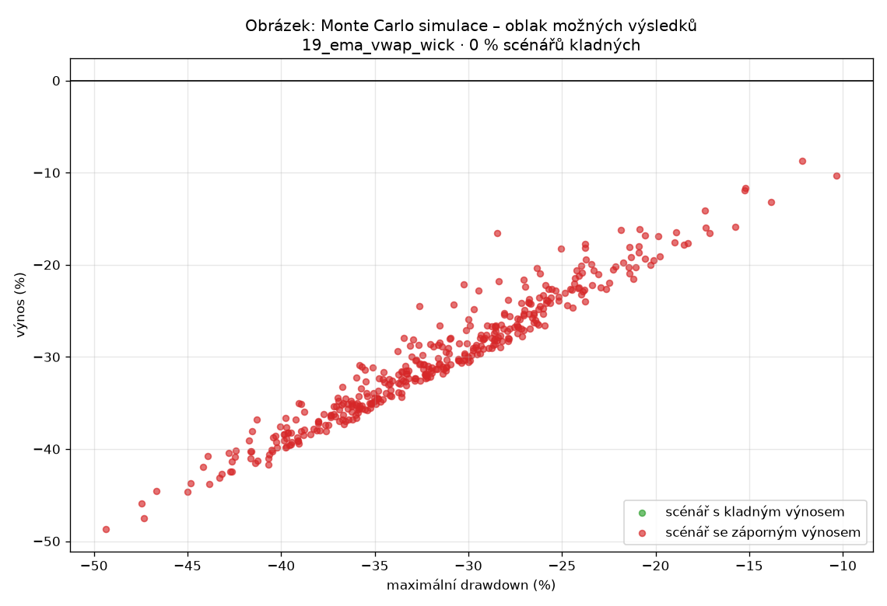

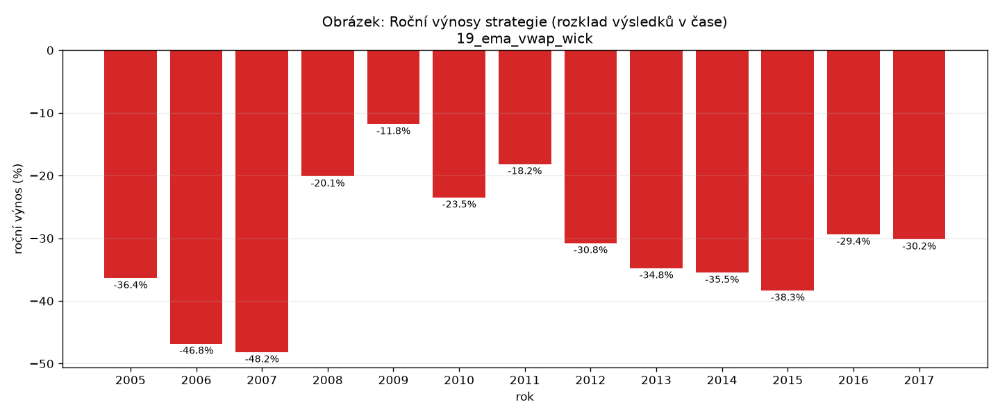

---

### 20. VWAP reverze (fade extrému) — ❌ **nefunguje**

**Rodina:** mean reversion  
**Parametry:** z-skóre = (cena−VWAP)/σ(30 barů); |z|>2 = vstup proti pohybu; cíl VWAP; stop 1,5σ; exit 16:00

**Co to je:** Přesně ten model, který popisuje paper Lee (SSRN 6438039) — jen doplněný o obchodní pravidla, která paper neuvádí.

**Proč by to mělo fungovat:** Cena se má vracet k volume-váženému průměru; extrémní odklon = přestřelení, které se opraví.

| metrika | hodnota | | metrika | hodnota |
|---|---|---|---|---|
| CAGR | **-41.06 %** | | celkový výnos | -99.9 % |
| Sharpe | **-3.94** | | Calmar | -0.41 |
| Max drawdown | **-99.89 %** | | profit factor | 0.80 |
| win rate | 33.7 % | | průměr / obchod | -2.17 bps |
| počet obchodů | 31140 | | obchodů / rok | 2398 |
| MC: kladných scénářů | 0 % | | MC: medián výnosu | -40.4 % |
| MC: 5. percentil výnosu | -52.6 % | | MC: medián MaxDD | -41.5 % |

**Roční výnosy:** 2005: -31.8% · 2006: -37.6% · 2007: -34.1% · 2008: -67.2% · 2009: -25.5% · 2010: -40.2% · 2011: -51.3% · 2012: -40.8% · 2013: -34.8% · 2014: -42.2% · 2015: -44.1% · 2016: -33.6% · 2017: -36.8%  
**Kladných let:** 0/13

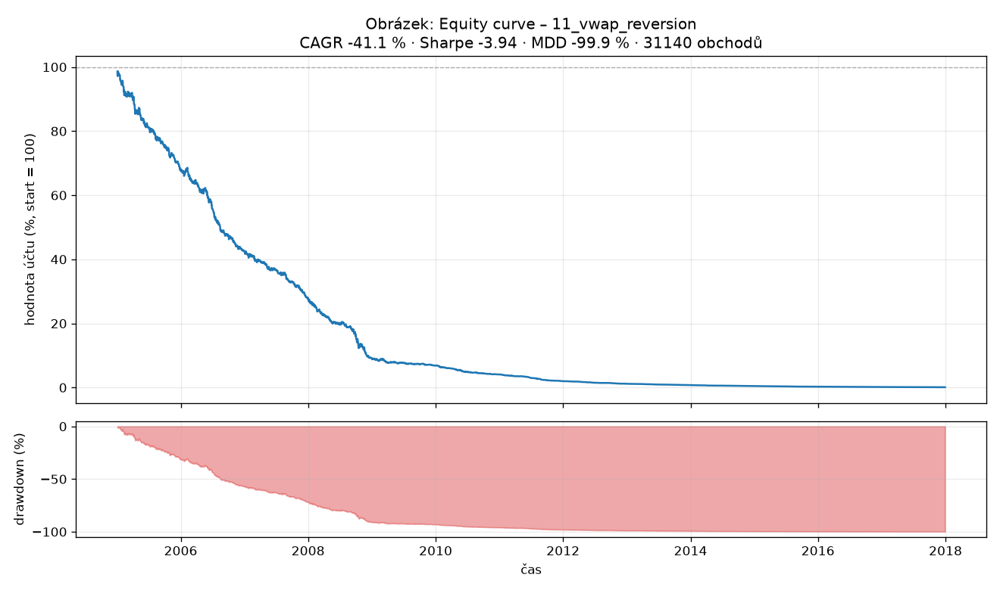

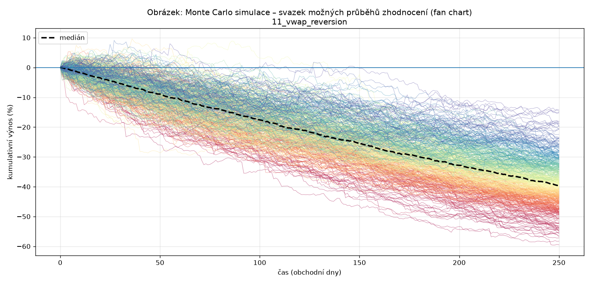

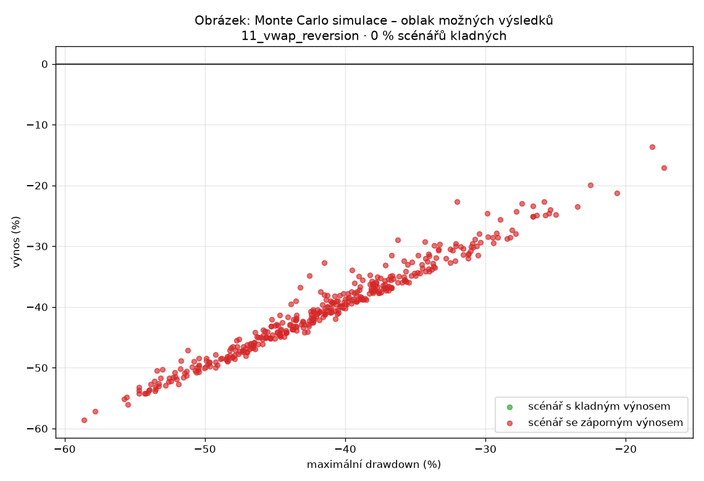

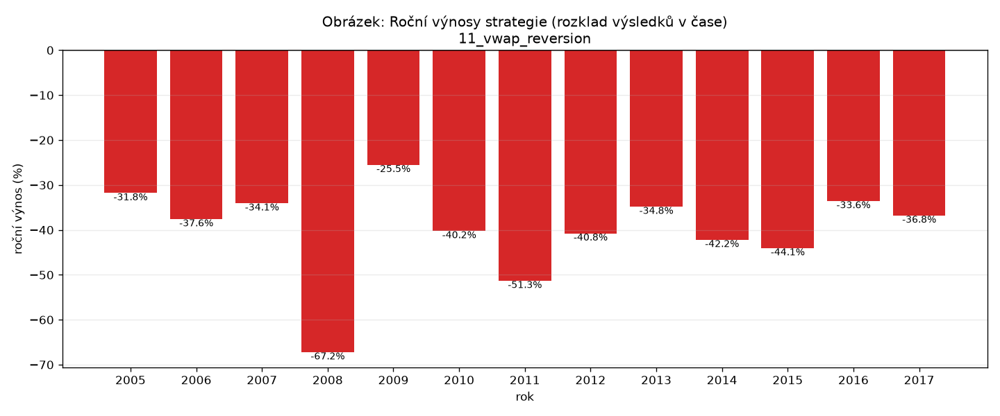

---

## Lekce z celého testu

1. **Náklady rozhodují víc než signál.** Většina testovaných strategií má kladnou hrubou výhodu — a přesto prodělává. Rozdíl dělá počet obchodů.
2. **Filtr je cennější než signál.** VWAP pásmo bez bran: Sharpe 0,15. Se dvěma branami: 0,69. Stejný vstupní signál, čtyřnásobný výsledek — jen se neobchodovalo ve špatné dny.
3. **Podezřele skvělý výsledek = hledej bug.** Jediná strategie se Sharpe > 2 byla chyba v kódu. Než uvěříš dobrému číslu, zkus ho rozbít.
4. **Win rate nic neříká.** Vítěz má win rate 39 %, nejhorší strategie v testu 46 %. Rozhoduje součin četnosti a velikosti.
5. **Slavné indikátorové systémy neobstály.** EMA kříž, Bollinger, RSI(2), Donchian — vše záporné. Populární ≠ funkční.
6. **Monte Carlo neřekne, jestli je strategie přeučená** — jen jak moc záleží na pořadí obchodů. Skutečný test je čerstvý OOS.

## Co dál

- **OOS zůstává nedotčené** (2018 – 2020/05, ~2,4 roku). Doporučení: vybrat **jednu** strategii z první trojky, sepsat předem kritéria úspěchu a spustit jediný OOS běh. Jakmile se OOS použije, přestává být čisté.
- Kandidát č. 1 je jednoznačně **VWAP pásmo s branami**, které navíc má nezávislé potvrzení z odděleného výzkumu (QuantConnect, reálná NQ data, 2018–2025).
- Za zvážení stojí i **kombinace vítěze s overnight efektem** — jsou to prakticky nekorelované zdroje výnosu (jeden vnitrodenní, druhý přesně mimo obchodní hodiny).
